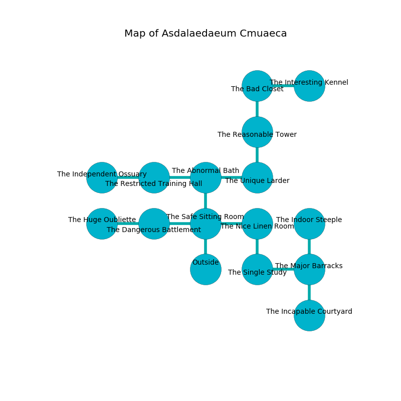

%Ruin Dogs

##Asdalaedaeum Cmuaeca
###Overview
Asdalaedaeum Cmuaeca is constructed on a giant mountain. Parts of it are frozen. The ruin is sinking into the earth. It is occupied by Centaurs. Dillon Perry The Cantankerous, an Incubus is here. The Centaurs are the minions of Dillon Perry The Cantankerous. He  is trying to hide [The Afraid Conception](#The-Afraid-Conception). 

###Artifact
####The Afraid Conception

The Afraid Conception looks like a soft amulet. It smells like elderflower. It is a bright green color. When gazed upon it destroys itself. 

###Locations

####the safe sitting Room

* To the west a hazy artery leads to [the dangerous battlement](#the-dangerous-battlement).
* To the east a long gap leads to [the nice linen room](#the-nice-linen-room).
* To the north a small artery leads to [the abnormal bath](#the-abnormal-bath).
* To the south is the entrance.

####the abnormal bath
There are two Centaurs here. The glass walls are pristine. The Centaurs are performing a ritual. If not interrupted, the ruin dogs will be weakened. 

There is an engraving on the ceiling written in Centaurs Script. 

> Oh my! cruel we
>
> original, indoor, distant
>
> it is always free
>
> fate is consistent
>

* There is a lyre here.
* To the west a flooded artery leads to [the restricted training hall](#the-restricted-training-hall).
* To the east a dripping path opens to [the unique larder](#the-unique-larder).
* To the south a small artery leads to [the safe sitting Room](#the-safe-sitting-Room).

####the nice linen room
There are two Centaurs here. The wooden walls are caving in. One of the Centaurs is on watch, the rest are sleeping. 

There is an engraving on the wall written in Centaurs Script. 

> Do not try running.
>

* [Dillon Perry The Cantankerous](#Dillon-Perry-The-Cantankerous) is here.
* To the west a long gap opens to [the safe sitting Room](#the-safe-sitting-Room).
* To the south a torchlit pathway leads to [the single study](#the-single-study).

####the unique larder
The floor is cluttered with shells. The wooden walls are bloodstained. The air smells like passion fruit here. There are a Hunter Shark, a Magmin, a Steam Mephit, a Pegasus, and a Vulture here. 

* To the west a dripping path leads to [the abnormal bath](#the-abnormal-bath).
* To the north a narrow hall connects to [the reasonable tower](#the-reasonable-tower).

####the single study
The brick walls are ruined. The floor is flooded with three inch deep scalding water. 

* To the east a dripping cavern leads to [the major barracks](#the-major-barracks).
* To the north a torchlit pathway leads to [the nice linen room](#the-nice-linen-room).

####the dangerous battlement
There are an Ice Mephit, a Swarm of Bats, a Mastiff, a Bandit Captain, and a Pixie here. Red razorgrass is growing in broken urns. 

* To the west a hazy hall connects to [the huge oubliette](#the-huge-oubliette).
* To the east a hazy artery leads to [the safe sitting Room](#the-safe-sitting-Room).

####the restricted training hall
Gray mushrooms are decaying in broken urns. There are a Gnoll and a Green Hag here. 

* [The Afraid Conception](#The-Afraid-Conception) is here.
* To the west a dripping cave leads to [the independent ossuary](#the-independent-ossuary).
* To the east a flooded artery leads to [the abnormal bath](#the-abnormal-bath).

####the major barracks
The concrete walls are bloodstained. There are two Centaurs here. The air tastes like whiskey here. The Centaurs are fighting amongst themselves. 

* To the west a dripping cavern opens to [the single study](#the-single-study).
* To the north a hazy pathway connects to [the indoor steeple](#the-indoor-steeple).
* To the south a dark pathway leads to [the incapable courtyard](#the-incapable-courtyard).

####the huge oubliette
Blue mushrooms are sprouting in broken urns. The floor is cluttered with broken glass. There are a Githyanki Warrior, an Intellect Devourer, a Scorpion, and a Swarm of Insects here. 

* To the east a hazy hall connects to [the dangerous battlement](#the-dangerous-battlement).

####the reasonable tower
The wooden walls are unsettled. There are two Centaurs here. The floor is flooded with three inch deep hot water. The Centaurs are willing to negotiate. 

There is an engraving on the ceiling written in common. 

> I am old.
>
> Treasure here.
>

* There is a hammer here.
* To the north a hazy hallway opens to [the bad closet](#the-bad-closet).
* To the south a narrow hall leads to [the unique larder](#the-unique-larder).

####the indoor steeple
Gray lichens are decaying in a patch on the floor. There are a Deep Gnome, a Dust Mephit, a Giant Eagle, a Needle Blight, and a Harpy here. 

* To the south a hazy pathway opens to [the major barracks](#the-major-barracks).

####the bad closet
The floor is bloodstained. The stone walls are scratched. The air tastes like green tea here. 

* To the east a torchlit walkway connects to [the interesting kennel](#the-interesting-kennel).
* To the south a hazy hallway leads to [the reasonable tower](#the-reasonable-tower).

####the incapable courtyard
The brick walls are bloodstained. There are two Centaurs here. Red mushrooms are sprouting from the walls. The air smells like pork here. If the Centaurs notice the Ruin Dogs, one of them will retreat and alert [Dillon Perry](#Dillon-Perry). 

* There is a match here.
* To the north a dark pathway opens to [the major barracks](#the-major-barracks).

####the interesting kennel
The wooden walls are scratched. There are a Gnoll Pack Lord and a Priest here. The air smells like avocado here. The floor is cluttered with bones. 

* To the west a torchlit walkway connects to [the bad closet](#the-bad-closet).

####the independent ossuary
The air smells like autumn here. There are two Centaurs here. Yellow ferns are growing from the walls. The floor is smooth. The Centaurs are berserk with rage. 

There is an engraving on a monolith written in Centaurs Script. 

> I am fleeing Asdalaedaeum Cmuaeca.
>
> Treasure here.
>

* To the east a dripping cave opens to [the restricted training hall](#the-restricted-training-hall).

