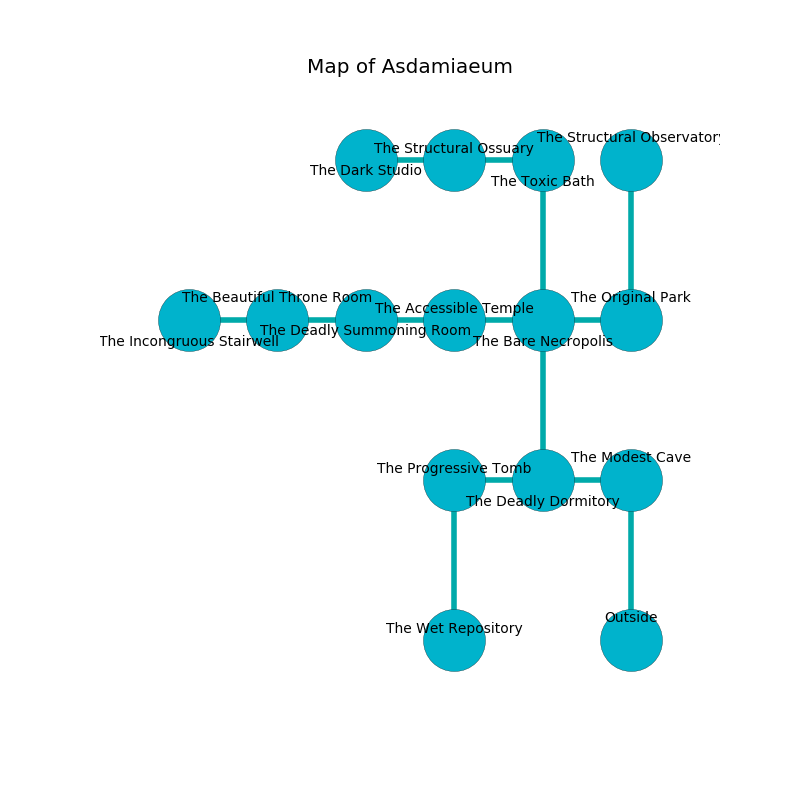

%Ruin Dogs

##Asdamiaeum
###Overview
Asdamiaeum is located under an alien rift. Regions of it are flooded. The ruin is sinking into the earth. It is occupied by Orc. Morris Mcinnis The Changeable, an Incubus is here. The Orc worship Morris Mcinnis The Changeable. He  is founding a new religion. 

###Artifact
####The Frank Division

The Frank Division has the form of a broken doll. It smells like cassia. Cacophony glows away from it. It is a pale blue color. When smelled it becomes lost. 

###Locations

####the modest cave
The floor is sticky. The mirrored walls are scratched. 

* To the west a flooded threshold connects to [the deadly dormitory](#the-deadly-dormitory).
* To the south is the entrance.

####the deadly dormitory
White razorgrass is decaying in a patch on the floor. There are a Mummy, a Cockatrice, a Monodrone, a Flying Sword, and a Gibbering Mouther here. 

* To the west a hazy cave opens to [the progressive tomb](#the-progressive-tomb).
* To the east a flooded threshold connects to [the modest cave](#the-modest-cave).
* To the north a small hall connects to [the bare necropolis](#the-bare-necropolis).

####the bare necropolis
The air tastes like coconut here. The stone walls are covered in mold. 

* To the west a dark passageway opens to [the accessible temple](#the-accessible-temple).
* To the east a dripping artery leads to [the original park](#the-original-park).
* To the north a windy pathway opens to [the toxic bath](#the-toxic-bath).
* To the south a small hall leads to [the deadly dormitory](#the-deadly-dormitory).

####the toxic bath
Blue ferns are swaying from the walls. 

* To the west a hazy gap connects to [the structural ossuary](#the-structural-ossuary).
* To the south a windy pathway opens to [the bare necropolis](#the-bare-necropolis).

####the accessible temple
The concrete walls are caving in. The air smells like melon rind here. The floor is smooth. 

* To the west a torchlit artery connects to [the deadly summoning room](#the-deadly-summoning-room).
* To the east a dark passageway connects to [the bare necropolis](#the-bare-necropolis).

####the deadly summoning room
There is a trap here. When activated, a magical sound detector will launch a swinging block. The air smells like elderberry here. The mirrored walls are covered in mold. There are a Riding Horse, a Swarm of Rats, a Tridrone, a Wolf, a Magma Mephit, a Rug of Smothering, and an Elk here. The floor is bloodstained. 

There is an engraving on the ceiling written in Orc Script. 

> I am alone.
>

* There is a skirt here.
* To the west a dripping cavern leads to [the beautiful throne room](#the-beautiful-throne-room).
* To the east a torchlit artery connects to [the accessible temple](#the-accessible-temple).

####the progressive tomb
The wooden walls are covered in mold. The air tastes like praline here. There is a Nightmare here. 

* [The Frank Division](#The-Frank-Division) is here.
* To the east a hazy cave opens to [the deadly dormitory](#the-deadly-dormitory).
* To the south a narrow hallway opens to [the wet repository](#the-wet-repository).

####the original park
Blue ferns are sprouting from the walls. There are six Orcs here. The floor is cluttered with debris. There is a trap here. When activated, a pressure plate will make the walls close in. The air smells like earth here. The Orc are drunk. 

* To the west a dripping artery opens to [the bare necropolis](#the-bare-necropolis).
* To the north a windy opening opens to [the structural observatory](#the-structural-observatory).

####the structural ossuary
The metallic walls are ruined. The floor is sticky. 

There is an engraving on a stone written in common. 

> Oh sorry god
>
> but never odd
>
> it is always tight
>
> life is white
>

* To the west a dripping gap connects to [the dark studio](#the-dark-studio).
* To the east a hazy gap leads to [the toxic bath](#the-toxic-bath).

####the beautiful throne room
There are a Lion, a Cat, a Giant Owl, and a Bearded Devil here. The air smells like old wood here. White mushrooms are decaying from the walls. 

There is an engraving on the floor written in Orc Script. 

> Leave now.
>

* To the west a hazy walkway opens to [the incongruous stairwell](#the-incongruous-stairwell).
* To the east a dripping cavern opens to [the deadly summoning room](#the-deadly-summoning-room).

####the dark studio
Blue moss is decaying in broken urns. There are six Orcs here. The air tastes like raisin here. If the Orc notice the Ruin Dogs, one of them will retreat and alert the others. 

There is an engraving on a tablet written in common. 

> Oh my! sorry fate
>
> fragrant and straight
>
> but never clean
>
> death is great
>

* There is a wand here.
* There is a cat here.
* To the east a dripping gap opens to [the structural ossuary](#the-structural-ossuary).

####the incongruous stairwell
There are six Orcs here. The air smells like pepper here. The floor is bloodstained. Blue ferns are growing from the walls. The Orc are defending this room from intruders. 

* To the east a hazy walkway connects to [the beautiful throne room](#the-beautiful-throne-room).

####the structural observatory
The air tastes like sarsaparilla here. There is a trap here. When activated, a pressure plate will open a trapdoor in the floor. The floor is glossy. 

* [Morris Mcinnis The Changeable](#Morris-Mcinnis-The-Changeable) is here.
* To the south a windy opening leads to [the original park](#the-original-park).

####the wet repository
The mirrored walls are covered in mold. The floor is sticky. 

* There is a snake here.
* To the north a narrow hallway leads to [the progressive tomb](#the-progressive-tomb).

