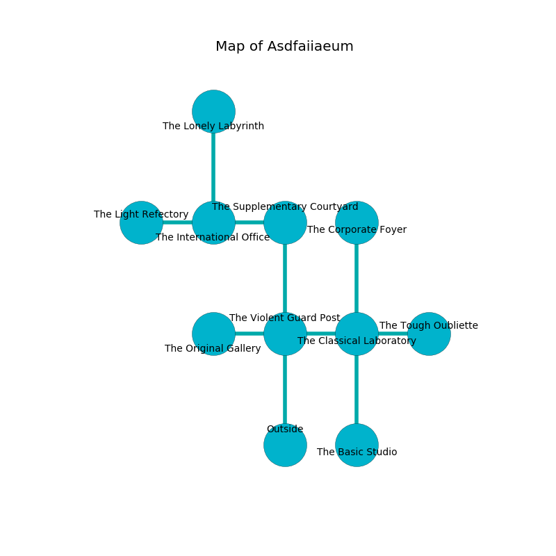

%Ruin Dogs

##Asdfaiiaeum
###Overview
Asdfaiiaeum is located on a ruined city. Parts of it are unbearably hot. The ruin is collapsing slowly. It is occupied by Troglodytes. Beau Dinkins The Belligerent, an Orc War Chief is here. The Troglodytes have been charmed by Beau Dinkins The Belligerent. He  is trying to use [Boicha](#Boicha). 

###Artifact
####Boicha

Boicha has the form of a glassy figurine. It is a dark pink color. It smells like coriander. When rubbed it burns the mind. 

###Locations

####the violent guard post
The glass walls are scratched. The floor is sticky. 

* To the west a torchlit passageway opens to [the original gallery](#the-original-gallery).
* To the east a narrow hallway connects to [the classical laboratory](#the-classical-laboratory).
* To the north a twisted walkway opens to [the supplementary courtyard](#the-supplementary-courtyard).
* To the south is the entrance.

####the supplementary courtyard
Yellow razorgrass is growing from the walls. The mirrored walls are covered in mold. 

* There is a skull here.
* To the west a dark cavern opens to [the international office](#the-international-office).
* To the south a twisted walkway opens to [the violent guard post](#the-violent-guard-post).

####the international office
The air smells like pomegranate here. 

* To the west a long path leads to [the light refectory](#the-light-refectory).
* To the east a dark cavern opens to [the supplementary courtyard](#the-supplementary-courtyard).
* To the north a small passageway leads to [the lonely labyrinth](#the-lonely-labyrinth).

####the classical laboratory
The air smells like caraway here. Red ferns are decaying in broken urns. The obsidion walls are unsettled. There are sixteen Troglodytes here. One of the Troglodytes is pointing a ballista at the entrance. 

There is an engraving on a stone written in common. 

> [Boicha](#Boicha)
>
> daily and fine
>

* [Boicha](#Boicha) is here.
* To the west a narrow hallway connects to [the violent guard post](#the-violent-guard-post).
* To the east a dripping cavern connects to [the tough oubliette](#the-tough-oubliette).
* To the north a narrow cavern opens to [the corporate foyer](#the-corporate-foyer).
* To the south a torchlit walkway opens to [the basic studio](#the-basic-studio).

####the corporate foyer
The stone walls are bloodstained. Gray moss is growing in cracks in the floor. 

* To the south a narrow cavern leads to [the classical laboratory](#the-classical-laboratory).

####the original gallery
There are a Nightmare and a White Dragon Wyrmling here. 

* To the east a torchlit passageway connects to [the violent guard post](#the-violent-guard-post).

####the light refectory
Blue mushrooms are sprouting in broken urns. The floor is glossy. There are sixteen Troglodytes here. The obsidion walls are bloodstained. The Troglodytes are performing a ritual. If not interrupted, [Beau Dinkins](#Beau-Dinkins) will be magically alarmed. 

* To the east a long path connects to [the international office](#the-international-office).

####the basic studio
Red mushrooms are decaying in cracks in the floor. There are sixteen Troglodytes here. One of the Troglodytes is on watch, the rest are feasting. 

* To the north a torchlit walkway leads to [the classical laboratory](#the-classical-laboratory).

####the lonely labyrinth
There are sixteen Troglodytes here. The air tastes like corn here. The Troglodytes are performing a ritual. If not interrupted, [Beau Dinkins](#Beau-Dinkins) will be magically alarmed. 

* To the south a small passageway leads to [the international office](#the-international-office).

####the tough oubliette
There are a Chuul and a Dryad here. The air tastes like tolu here. 

* [Beau Dinkins The Belligerent](#Beau-Dinkins-The-Belligerent) is here.
* To the west a dripping cavern connects to [the classical laboratory](#the-classical-laboratory).

