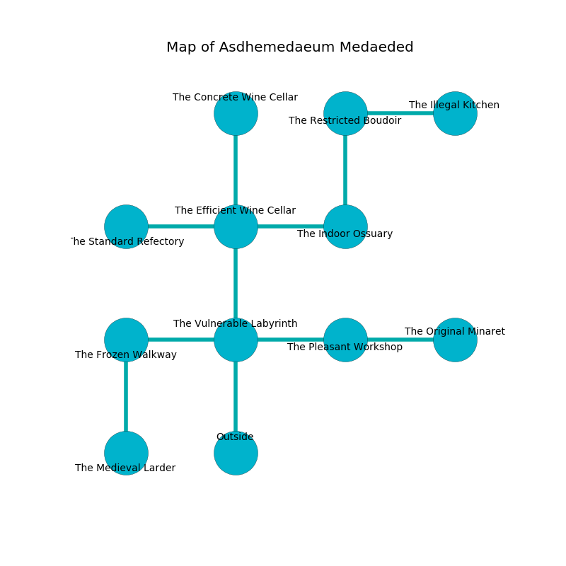

%Ruin Dogs

##Asdhemedaeum Medaeded
###Overview
Asdhemedaeum Medaeded is located under a volcanic city. Parts of it are flooded. The ruin is flooding. It is occupied by Troglodytes. Rashad Huggins The Perverse, a Mage is here. The Troglodytes have been charmed by Rashad Huggins The Perverse. He  is founding a new religion. 

###Artifact
####Idfaemh

Idfaemh is a powerful artifact in the shape of a cold crystal. It is a dark white color. It smells like prune. When cradled it levitates those nearby. 

###Locations

####the vulnerable labyrinth
The floor is smooth. The air smells like seed here. 

* To the west a flooded artery leads to [the frozen walkway](#the-frozen-walkway).
* To the east a narrow path leads to [the pleasant workshop](#the-pleasant-workshop).
* To the north a narrow path connects to [the efficient wine cellar](#the-efficient-wine-cellar).
* To the south is the entrance.

####the efficient wine cellar
There is a Red Slaad here. The floor is glossy. The air tastes like blueberry here. 

* [Rashad Huggins The Perverse](#Rashad-Huggins-The-Perverse) is here.
* To the west a small hall leads to [the standard refectory](#the-standard-refectory).
* To the east a torchlit artery opens to [the indoor ossuary](#the-indoor-ossuary).
* To the north a hazy passageway connects to [the concrete wine cellar](#the-concrete-wine-cellar).
* To the south a narrow path connects to [the vulnerable labyrinth](#the-vulnerable-labyrinth).

####the concrete wine cellar
The floor is glossy. The air tastes like mastic here. 

There is an engraving on the floor written in Troglodytes Script. 

> A pen is a sum
>
> middle-class and secure
>
> nuclear, comparable, informal
>
> addicted, invisible, responsible
>
> you will be joined
>

* To the south a hazy passageway connects to [the efficient wine cellar](#the-efficient-wine-cellar).

####the indoor ossuary
The floor is cluttered with debris. The wooden walls are ruined. The air tastes like peanut butter here. 

* To the west a torchlit artery opens to [the efficient wine cellar](#the-efficient-wine-cellar).
* To the north a torchlit artery connects to [the restricted boudoir](#the-restricted-boudoir).

####the standard refectory
The floor is smooth. Green mushrooms are growing in a patch on the floor. 

There is an engraving on a stone written in Troglodytes Script. 

> [Idfaemh](#Idfaemh)
>
> yet never inner
>
> blonde, talkative, acute
>
> You are sorrowful
>
> yet fragrant
>

* There is an apple here.
* There is a chain here.
* There is a baby here.
* To the east a small hall connects to [the efficient wine cellar](#the-efficient-wine-cellar).

####the restricted boudoir
The floor is bloodstained. There is an Earth Elemental here. 

* To the east a long passageway connects to [the illegal kitchen](#the-illegal-kitchen).
* To the south a torchlit artery opens to [the indoor ossuary](#the-indoor-ossuary).

####the frozen walkway
The air tastes like kiwi here. 

* There is a crossbow here.
* There is a sword here.
* To the east a flooded artery opens to [the vulnerable labyrinth](#the-vulnerable-labyrinth).
* To the south a twisted walkway opens to [the medieval larder](#the-medieval-larder).

####the pleasant workshop
There is a trap here. When activated, a tripwire will launch an arrow. Yellow mushrooms are sprouting in a patch on the floor. The air smells like hawthorn here. The mirrored walls are bloodstained. There are twenty Troglodytes here. The Troglodytes are drunk. 

* [Idfaemh](#Idfaemh) is here.
* To the west a narrow path leads to [the vulnerable labyrinth](#the-vulnerable-labyrinth).
* To the east a dark cavern connects to [the original minaret](#the-original-minaret).

####the illegal kitchen
The air smells like gravy here. The floor is bloodstained. Yellow razorgrass is swaying in broken urns. 

* There is an amulet here.
* There is a feather here.
* To the west a long passageway leads to [the restricted boudoir](#the-restricted-boudoir).

####the medieval larder
Green lichens are growing from the ceiling. The floor is bloodstained. There are a Roper and a Worg here. 

There is an engraving on a monolith written in Troglodytes Script. 

> O cruel you
>
> yet never due
>
> it is always structural
>
> fate is new
>

* To the north a twisted walkway opens to [the frozen walkway](#the-frozen-walkway).

####the original minaret
The mirrored walls are covered in mold. The floor is flooded with eight inch deep cool water. Red razorgrass is sprouting in a patch on the floor. 

There is an engraving on the floor written in common. 

> I want to find [Idfaemh](#Idfaemh).
>
> Leave now.
>

* There is a stamp here.
* There is a finger here.
* To the west a dark cavern leads to [the pleasant workshop](#the-pleasant-workshop).

