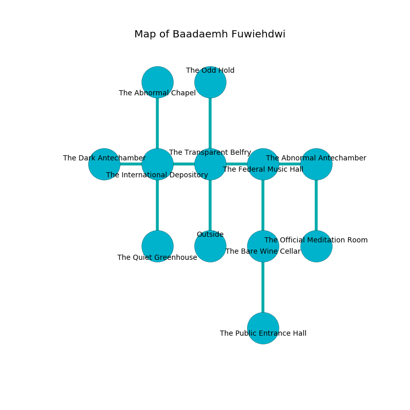

%Ruin Dogs

##Baadaemh Fuwiehdwi
###Overview
Baadaemh Fuwiehdwi is located under a volcanic mountain. Regions of it are frozen. The ruin is collapsing slowly. It is occupied by Goblins. Lance Wisniewski The Patronizing, a Stone Giant is here. The Goblins are the minions of Lance Wisniewski The Patronizing. He  is founding a new religion. 

###Artifact
####Imeaeh

Imeaeh has the form of a glassy rock. When cradled it ignites its surrroundings. 

###Locations

####the transparent belfry
Green razorgrass is swaying in cracks in the floor. The air tastes like sassafrass here. 

* [Lance Wisniewski The Patronizing](#Lance-Wisniewski-The-Patronizing) is here.
* To the west a narrow walkway leads to [the international depository](#the-international-depository).
* To the east a hazy cave leads to [the federal music hall](#the-federal-music-hall).
* To the north a flooded hallway leads to [the odd hold](#the-odd-hold).
* To the south is the entrance.

####the odd hold
White ferns are swaying from the walls. The concrete walls are pristine. The floor is flooded with five inch deep scalding water. The air tastes like roast beef here. 

There is an engraving on the floor written in common. 

> [Imeaeh](#Imeaeh)
>
> incredible, digital, random
>
> [Imeaeh](#Imeaeh)
>

* There is a portrait here.
* There is a portrait here.
* To the south a flooded hallway opens to [the transparent belfry](#the-transparent-belfry).

####the international depository
The mirrored walls are caving in. The floor is flooded with three inch deep scalding water. The air tastes like lily of the valley here. 

There is an engraving on a stone written in common. 

> Dig here.
>

* To the west a hazy hall leads to [the dark antechamber](#the-dark-antechamber).
* To the east a narrow walkway leads to [the transparent belfry](#the-transparent-belfry).
* To the north a twisted cave connects to [the abnormal chapel](#the-abnormal-chapel).
* To the south a small walkway connects to [the quiet greenhouse](#the-quiet-greenhouse).

####the abnormal chapel
Red lichens are growing from the ceiling. The obsidion walls are ruined. There are a Goblin and two Hobgoblin Warlords here. The Goblins are willing to negotiate. 

There is an engraving on a stone written in common. 

> Go away.
>

* To the south a twisted cave leads to [the international depository](#the-international-depository).

####the federal music hall

* To the west a hazy cave leads to [the transparent belfry](#the-transparent-belfry).
* To the east a twisted gap leads to [the abnormal antechamber](#the-abnormal-antechamber).
* To the south a narrow walkway opens to [the bare wine cellar](#the-bare-wine-cellar).

####the quiet greenhouse
The air smells like autumn here. 

* To the north a small walkway connects to [the international depository](#the-international-depository).

####the abnormal antechamber
There are a Goblin, a Hobgoblin Warlord, and a Hobgoblin Captain here. The floor is glossy. The air smells like clover here. The Goblins are crazy with bloodlust. 

* To the west a twisted gap connects to [the federal music hall](#the-federal-music-hall).
* To the south a narrow hallway opens to [the official meditation room](#the-official-meditation-room).

####the dark antechamber
There is a trap here. When activated, a tripwire will collapse a column. The air tastes like corn chip here. The mirrored walls are unsettled. 

* There is a dagger here.
* There is a face here.
* To the east a hazy hall leads to [the international depository](#the-international-depository).

####the bare wine cellar
There are three Goblins, a Hobgoblin Warlord, a Hobgoblin Captain,  here. White mushrooms are sprouting in broken urns. The air tastes like blueberry here. The Goblins are drunk. 

* [Imeaeh](#Imeaeh) is here.
* To the north a narrow walkway connects to [the federal music hall](#the-federal-music-hall).
* To the south a dripping walkway opens to [the public entrance hall](#the-public-entrance-hall).

####the official meditation room
Yellow moss is growing in broken urns. 

* To the north a narrow hallway connects to [the abnormal antechamber](#the-abnormal-antechamber).

####the public entrance hall
The obsidion walls are scratched. There is a trap here. When activated, a magical rune will launch a rolling boulder. Gray razorgrass is sprouting from the ceiling. 

* To the north a dripping walkway connects to [the bare wine cellar](#the-bare-wine-cellar).

