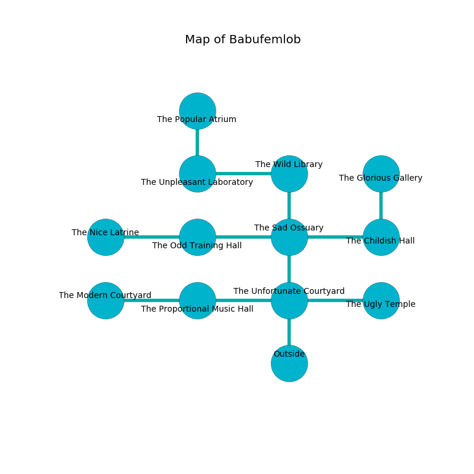

%Ruin Dogs

##Babufemlob
###Overview
Babufemlob is located under a cursed rift. Parts of it are inaccessible. A massive storm is happening outside. It is occupied by Ogres. Ela Finley The Silly, a Fire Giant is here. The Ogres are the minions of Ela Finley The Silly. She  is founding a new religion. 

###Artifact
####Cufl Imuddaemh

Cufl Imuddaemh is a powerful artifact in the shape of a soft amulet. Psychic energy pours from it. When cradled it floats in the air. 

###Locations

####the unfortunate courtyard
Green lichens are sprouting in cracks in the floor. The mirrored walls are bloodstained. There are a Kuo-Toa Whip, a Grick Alpha, a Chuul, a Giant Wasp, a Giant Hyena, and a Half-Ogre here. 

* To the west a small pathway opens to [the proportional music hall](#the-proportional-music-hall).
* To the east a dark cave connects to [the ugly temple](#the-ugly-temple).
* To the north a windy corridor opens to [the sad ossuary](#the-sad-ossuary).
* To the south is the entrance.

####the proportional music hall
The air tastes like cooked onion here. 

* To the west a small opening leads to [the modern courtyard](#the-modern-courtyard).
* To the east a small pathway opens to [the unfortunate courtyard](#the-unfortunate-courtyard).

####the sad ossuary
The air tastes like juniper here. The metallic walls are caving in. 

* To the west a narrow hall opens to [the odd training hall](#the-odd-training-hall).
* To the east a windy artery connects to [the childish hall](#the-childish-hall).
* To the north a windy artery connects to [the wild library](#the-wild-library).
* To the south a windy corridor leads to [the unfortunate courtyard](#the-unfortunate-courtyard).

####the childish hall
The mirrored walls are covered in mold. 

* There is a trophy here.
* To the west a windy artery connects to [the sad ossuary](#the-sad-ossuary).
* To the north a dark opening leads to [the glorious gallery](#the-glorious-gallery).

####the odd training hall
There are a Half-Ogre and four Ogres here. The air tastes like white rose here. The Ogres are performing a ritual. If not interrupted, the ruin dogs will be weakened. 

* There is a board here.
* [Ela Finley The Silly](#Ela-Finley-The-Silly) is here.
* To the west a hazy artery leads to [the nice latrine](#the-nice-latrine).
* To the east a narrow hall opens to [the sad ossuary](#the-sad-ossuary).

####the glorious gallery
The air smells like privet here. 

* To the south a dark opening connects to [the childish hall](#the-childish-hall).

####the ugly temple
Gray moss is swaying in broken urns. The floor is glossy. There are a Giant Ape and a Banshee here. There is a trap here. When activated, a magical proximity detector will collapse a wall. 

There is an engraving on the ceiling written in common. 

> A drain is a grandfather
>
> but never holy
>
> yet random
>
> yet never slow
>
> unlawful and bare
>
> A drain is a grandfather
>

* To the west a dark cave connects to [the unfortunate courtyard](#the-unfortunate-courtyard).

####the wild library
There is a trap here. When activated, a pressure plate will launch a rolling boulder. The floor is bloodstained. 

* To the west a narrow artery connects to [the unpleasant laboratory](#the-unpleasant-laboratory).
* To the south a windy artery opens to [the sad ossuary](#the-sad-ossuary).

####the nice latrine
There are a Nycaloth and a Crocodile here. White razorgrass is sprouting in broken urns. The crystal walls are scratched. 

There is an engraving on the ceiling written in Ogres Script. 

> I can not find [Cufl Imuddaemh](#Cufl-Imuddaemh).
>
> Do not try fighting.
>

* To the east a hazy artery leads to [the odd training hall](#the-odd-training-hall).

####the unpleasant laboratory
There are a Wererat, a Badger, and a Grick Alpha here. The floor is sticky. The air smells like rye bread here. The obsidion walls are ruined. 

* [Cufl Imuddaemh](#Cufl-Imuddaemh) is here.
* To the east a narrow artery connects to [the wild library](#the-wild-library).
* To the north a torchlit pathway opens to [the popular atrium](#the-popular-atrium).

####the modern courtyard
Gray moss is swaying from the ceiling. There are two Half-Ogres and four Ogres here. The air tastes like seed here. The glass walls are covered in mold. The Ogres are berserk with rage. 

* To the east a small opening opens to [the proportional music hall](#the-proportional-music-hall).

####the popular atrium
There is a trap here. When activated, a magical rune will fire a net. The air tastes like cream here. Green lichens are sprouting in broken urns. The floor is glossy. 

There is an engraving on a stone written in common. 

> Oh cruel you
>
> it is always alive
>
> always due
>
> sadness is live
>

* To the south a torchlit pathway connects to [the unpleasant laboratory](#the-unpleasant-laboratory).

