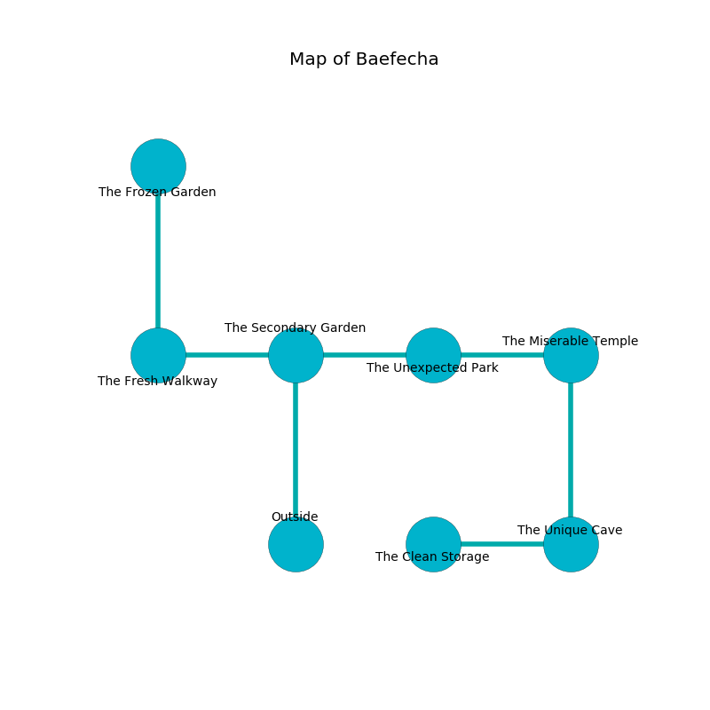

%Ruin Dogs

##Baefecha
###Overview
Baefecha is located in a crystal tree. Regions of it are inaccessible. A massive storm is happening outside. It is occupied by Dryads. Collette Madrid The Narrow-Minded, a Myconid Sprout is here. The Dryads are the soldiers of Collette Madrid The Narrow-Minded. She  is founding a new religion. 

###Artifact
####Heiawiaf

Heiawiaf is a powerful artifact in the shape of a cold sphere. Magic slides towards it. It is a sickly red color. When smelled it liquifies. 

###Locations

####the secondary garden
The metallic walls are caving in. 

There is an engraving on a stone written in common. 

> We are frozen
>
> dangerous and serious
>
> you shall be punished
>

* To the west a small cave opens to [the fresh walkway](#the-fresh-walkway).
* To the east a dripping threshold connects to [the unexpected park](#the-unexpected-park).
* To the south is the entrance.

####the unexpected park
Yellow lichens are swaying in broken urns. The floor is flooded with seven inch deep cold water. 

There is an engraving on a stone written in common. 

> I am lost in Baefecha.
>

* There is an ant here.
* To the west a dripping threshold opens to [the secondary garden](#the-secondary-garden).
* To the east a small gap opens to [the miserable temple](#the-miserable-temple).

####the miserable temple
The floor is glossy. There are two Dryads here. Red razorgrass is swaying from the ceiling. The crystal walls are caving in. The air smells like frankincense here. The Dryads are performing a ritual. If not interrupted, a powerful monster will be summoned. 

* To the west a small gap leads to [the unexpected park](#the-unexpected-park).
* To the south a dark threshold opens to [the unique cave](#the-unique-cave).

####the unique cave
Gray moss is swaying in broken urns. The wooden walls are ruined. The air smells like quince here. 

* To the west a torchlit path connects to [the clean storage](#the-clean-storage).
* To the north a dark threshold connects to [the miserable temple](#the-miserable-temple).

####the clean storage
The air tastes like lemon here. There is a trap here. When activated, a magical proximity detector will cast a curse. The floor is flooded with five inch deep scalding water. 

* [Collette Madrid The Narrow-Minded](#Collette-Madrid-The-Narrow-Minded) is here.
* To the east a torchlit path opens to [the unique cave](#the-unique-cave).

####the fresh walkway
The glass walls are scratched. There are an Ice Mephit, a Deep Gnome, a Mastiff, a Giant Eagle, and a Vulture here. 

* [Heiawiaf](#Heiawiaf) is here.
* To the east a small cave connects to [the secondary garden](#the-secondary-garden).
* To the north a twisted passageway opens to [the frozen garden](#the-frozen-garden).

####the frozen garden
The air tastes like coffee here. 

* To the south a twisted passageway leads to [the fresh walkway](#the-fresh-walkway).

