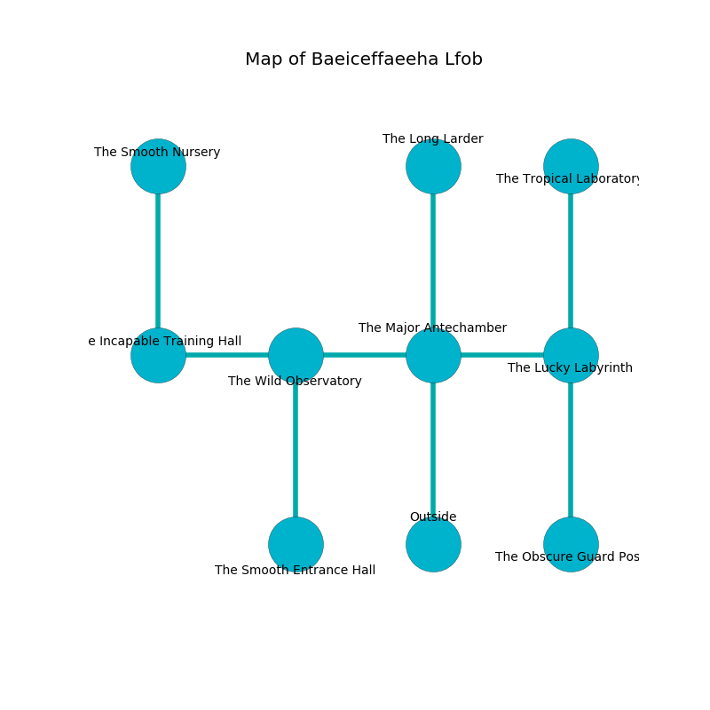

%Ruin Dogs

##Baeiceffaeeha Lfob
###Overview
Baeiceffaeeha Lfob is constructed on a cursed plain. Some areas of it are inaccessible. A windstorm is happening outside. It is occupied by Troglodytes. Deangelo Baez The Vague, a Bearded Devil is here. The Troglodytes have been charmed by Deangelo Baez The Vague. He  is trying to find [Cehamlef](#Cehamlef). 

###Artifact
####Cehamlef

Cehamlef has the form of a transparent crystal. Power incinerates around it. It smells like ozone. When worshipped it projects energy. 

###Locations

####the major antechamber
The floor is bloodstained. 

* To the west a hazy threshold leads to [the wild observatory](#the-wild-observatory).
* To the east a dripping pathway opens to [the lucky labyrinth](#the-lucky-labyrinth).
* To the north a windy walkway opens to [the long larder](#the-long-larder).
* To the south is the entrance.

####the wild observatory
There are a Zombie, a Nightmare, a Bandit, a Mule, and a Warhorse here. The crystal walls are ruined. Yellow razorgrass is growing from the ceiling. 

* To the west a dripping cave connects to [the incapable training hall](#the-incapable-training-hall).
* To the east a hazy threshold connects to [the major antechamber](#the-major-antechamber).
* To the south a narrow path leads to [the smooth entrance hall](#the-smooth-entrance-hall).

####the lucky labyrinth
There are twelve Troglodytes here. The air smells like coriander here. Green razorgrass is growing in cracks in the floor. The Troglodytes are caring for babies. 

There is an engraving on a monolith written in common. 

> Oh my! weak we
>
> it is always expensive
>
> it is always free
>
> nothing is comprehensive
>

* To the west a dripping pathway leads to [the major antechamber](#the-major-antechamber).
* To the north a narrow threshold leads to [the tropical laboratory](#the-tropical-laboratory).
* To the south a torchlit cave connects to [the obscure guard post](#the-obscure-guard-post).

####the long larder
The floor is flooded with nine inch deep cool water. The brick walls are covered in mold. 

* There is a chain here.
* To the south a windy walkway connects to [the major antechamber](#the-major-antechamber).

####the smooth entrance hall
The air smells like cassia here. The floor is cluttered with ashes. The glass walls are caving in. 

There is an engraving on a tablet written in common. 

> I was injured in this place.
>
> I tried running.
>

* [Deangelo Baez The Vague](#Deangelo-Baez-The-Vague) is here.
* To the north a narrow path opens to [the wild observatory](#the-wild-observatory).

####the incapable training hall
There are twelve Troglodytes here. The floor is cluttered with bones. One of the Troglodytes is pointing a ballista at the entrance. 

* [Cehamlef](#Cehamlef) is here.
* To the east a dripping cave opens to [the wild observatory](#the-wild-observatory).
* To the north a dripping walkway leads to [the smooth nursery](#the-smooth-nursery).

####the obscure guard post
There are a Cultist, a Swarm of Poisonous Snakes, and a Gibbering Mouther here. The crystal walls are pristine. The air smells like acorn here. The floor is cluttered with debris. There is a trap here. When activated, a tripwire will open a large pit in the floor. 

* To the north a torchlit cave connects to [the lucky labyrinth](#the-lucky-labyrinth).

####the tropical laboratory
The floor is flooded with one inch deep scalding water. There are a Quipper, a Badger, a Myconid Sovereign, a Black Bear, and a Bugbear Chief here. 

* To the south a narrow threshold leads to [the lucky labyrinth](#the-lucky-labyrinth).

####the smooth nursery
The floor is flooded with seven inch deep scalding water. The mirrored walls are ruined. There is a Basilisk here. 

There is an engraving on the ceiling written in common. 

> Run away.
>

* To the south a dripping walkway connects to [the incapable training hall](#the-incapable-training-hall).

