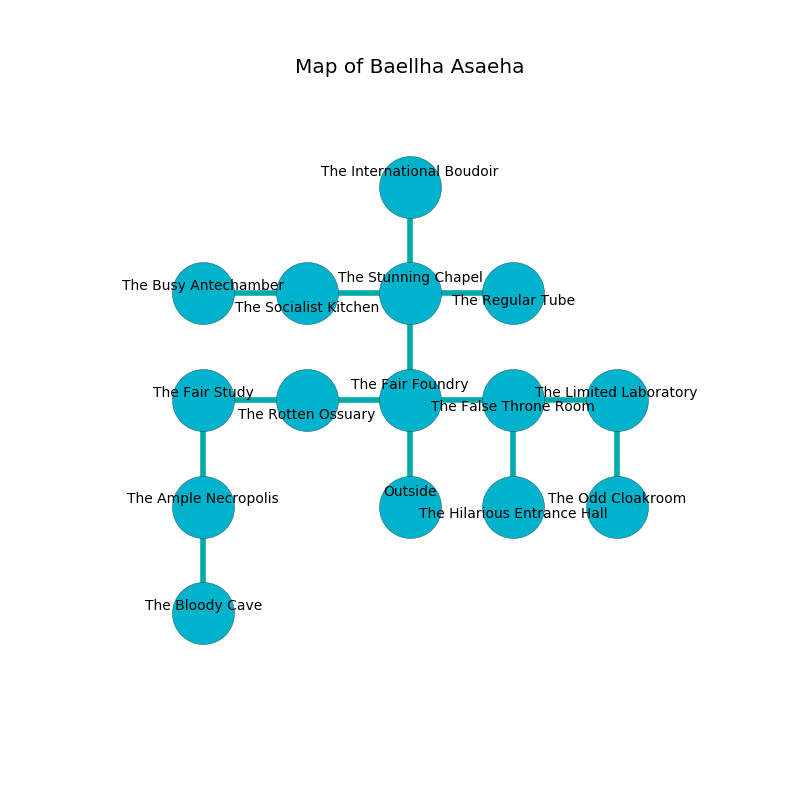

%Ruin Dogs

##Baellha Asaeha
###Overview
Baellha Asaeha is constructed on a ruined mountain. Regions of it are foggy. The ruin is sinking into the earth. It is occupied by Dryads. Shoshana Stephen The Finicky, a Mage is here. The Dryads worship Shoshana Stephen The Finicky. She  is trying to hide [The Clear Hand](#The-Clear-Hand). 

###Artifact
####The Clear Hand

The Clear Hand is a powerful artifact in the shape of a hard monument. Fire glows near it. It smells like hawthorn. When smelled it floats in the air. 

###Locations

####the fair foundry
White moss is growing in a patch on the floor. There is a trap here. When activated, a magical rune will launch a javelin. There are a Death Dog, an Ape, a Worg, a Guard, a Giant Bat, a Werewolf, and a Quadrone here. The floor is cluttered with ashes. The crystal walls are bloodstained. 

* [Shoshana Stephen The Finicky](#Shoshana-Stephen-The-Finicky) is here.
* To the west a narrow corridor opens to [the rotten ossuary](#the-rotten-ossuary).
* To the east a hazy artery opens to [the false throne room](#the-false-throne-room).
* To the north a windy passageway opens to [the stunning chapel](#the-stunning-chapel).
* To the south is the entrance.

####the stunning chapel
The air smells like grape here. There is a trap here. When activated, a magical proximity detector will launch a rolling boulder. There are a Plesiosaurus and a Flameskull here. The floor is bloodstained. The mirrored walls are caving in. 

There is an engraving on a monolith written in Dryads Script. 

> I tried swimming.
>

* To the west a twisted artery connects to [the socialist kitchen](#the-socialist-kitchen).
* To the east a dark pathway leads to [the regular tube](#the-regular-tube).
* To the north a long path leads to [the international boudoir](#the-international-boudoir).
* To the south a windy passageway connects to [the fair foundry](#the-fair-foundry).

####the false throne room
There are six Dryads here. The air tastes like smoked sausage here. The Dryads are willing to negotiate. 

* To the west a hazy artery opens to [the fair foundry](#the-fair-foundry).
* To the east a small pathway connects to [the limited laboratory](#the-limited-laboratory).
* To the south a dripping hall connects to [the hilarious entrance hall](#the-hilarious-entrance-hall).

####the rotten ossuary
There are a Wraith and an Unicorn here. White mushrooms are growing from the walls. 

* To the west a flooded passageway connects to [the fair study](#the-fair-study).
* To the east a narrow corridor opens to [the fair foundry](#the-fair-foundry).

####the socialist kitchen
There are six Dryads here. The floor is glossy. The Dryads are willing to negotiate. 

* To the west a small hallway opens to [the busy antechamber](#the-busy-antechamber).
* To the east a twisted artery leads to [the stunning chapel](#the-stunning-chapel).

####the hilarious entrance hall
The air smells like lettuce here. There are six Dryads here. Gray razorgrass is decaying in cracks in the floor. The Dryads are willing to negotiate. 

There is an engraving on the floor written in common. 

> Poor me! terrible we
>
> but free
>
> yet agricultural
>
> the world is cultural
>

* There is a bird here.
* To the north a dripping hall opens to [the false throne room](#the-false-throne-room).

####the regular tube
The air smells like lobster here. White mushrooms are growing from the ceiling. 

* To the west a dark pathway opens to [the stunning chapel](#the-stunning-chapel).

####the fair study
Red lichens are swaying in a patch on the floor. The floor is sticky. There are six Dryads here. The brick walls are unsettled. The Dryads are willing to negotiate. 

* To the east a flooded passageway opens to [the rotten ossuary](#the-rotten-ossuary).
* To the south a twisted artery opens to [the ample necropolis](#the-ample-necropolis).

####the busy antechamber
The brick walls are covered in mold. The air tastes like fenugreek here. 

* There is a church here.
* To the east a small hallway connects to [the socialist kitchen](#the-socialist-kitchen).

####the limited laboratory
The air smells like honeysuckle here. 

* To the west a small pathway leads to [the false throne room](#the-false-throne-room).
* To the south a dark threshold leads to [the odd cloakroom](#the-odd-cloakroom).

####the international boudoir
The floor is smooth. There are a Giant Wasp, a Mastiff, an Unicorn, and a Will-O’-Wisp here. 

* To the south a long path leads to [the stunning chapel](#the-stunning-chapel).

####the odd cloakroom
The air smells like watercress here. Green razorgrass is sprouting from the ceiling. The floor is sticky. 

* To the north a dark threshold connects to [the limited laboratory](#the-limited-laboratory).

####the ample necropolis
The floor is bloodstained. Yellow moss is growing in a patch on the floor. There is a trap here. When activated, a magical rune will launch a blade. There are a Red Dragon Wyrmling, a Bandit Captain, a Mule, a Half-Ogre, and a Dretch here. 

* [The Clear Hand](#The-Clear-Hand) is here.
* To the north a twisted artery leads to [the fair study](#the-fair-study).
* To the south a small hall opens to [the bloody cave](#the-bloody-cave).

####the bloody cave
White moss is swaying from the walls. 

* There is a trousers here.
* To the north a small hall connects to [the ample necropolis](#the-ample-necropolis).

