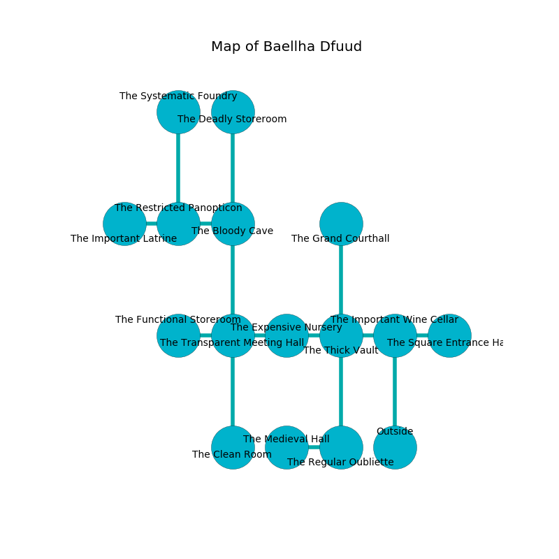

%Ruin Dogs

##Baellha Dfuud
###Overview
Baellha Dfuud is located in a ruined plain. Parts of it are cursed. A massive storm is happening outside. It is occupied by Dryads. Eula Bear The Greedy, a Fire Giant is here. The Dryads are the soldiers of Eula Bear The Greedy. She  is trying to recover [Faiaefcmaf Maeuam](#Faiaefcmaf-Maeuam). 

###Artifact
####Faiaefcmaf Maeuam

Faiaefcmaf Maeuam looks like a transparent sphere. Water slips near it. It is a pale green color. It smells like verbena. When gazed upon it grants power to its owner. 

###Locations

####the important wine cellar
White mushrooms are sprouting in cracks in the floor. The crystal walls are ruined. 

* To the west a long artery opens to [the thick vault](#the-thick-vault).
* To the east a flooded cavern connects to [the square entrance hall](#the-square-entrance-hall).
* To the south is the entrance.

####the thick vault
The air smells like gasoline here. Red razorgrass is decaying in a patch on the floor. 

* To the west a twisted passageway connects to [the expensive nursery](#the-expensive-nursery).
* To the east a long artery leads to [the important wine cellar](#the-important-wine-cellar).
* To the north a dark cavern connects to [the grand courthall](#the-grand-courthall).
* To the south a small hallway leads to [the regular oubliette](#the-regular-oubliette).

####the regular oubliette
There are ten Dryads here. Gray moss is decaying from the ceiling. The mirrored walls are scratched. The floor is flooded with five inch deep cold water. One of the Dryads is on watch, the rest are drunk. 

* [Faiaefcmaf Maeuam](#Faiaefcmaf-Maeuam) is here.
* To the west a torchlit artery leads to [the medieval hall](#the-medieval-hall).
* To the north a small hallway opens to [the thick vault](#the-thick-vault).

####the expensive nursery
The floor is flooded with eight inch deep cold water. The air tastes like black tea here. There are a Myconid Sprout, a Monodrone, a Blood Hawk, a Githzerai Monk, a Chain Devil, and a Magma Mephit here. The metallic walls are covered in mold. 

* There is a door here.
* To the west a long pathway opens to [the transparent meeting hall](#the-transparent-meeting-hall).
* To the east a twisted passageway connects to [the thick vault](#the-thick-vault).

####the transparent meeting hall
The wooden walls are scratched. There are a Druid and a Chain Devil here. 

* [Eula Bear The Greedy](#Eula-Bear-The-Greedy) is here.
* To the west a small opening connects to [the functional storeroom](#the-functional-storeroom).
* To the east a long pathway leads to [the expensive nursery](#the-expensive-nursery).
* To the north a flooded cave opens to [the bloody cave](#the-bloody-cave).
* To the south a dripping cavern opens to [the clean room](#the-clean-room).

####the bloody cave
The concrete walls are bloodstained. 

* There is a key here.
* To the west a hazy threshold opens to [the restricted panopticon](#the-restricted-panopticon).
* To the north a dark passageway connects to [the deadly storeroom](#the-deadly-storeroom).
* To the south a flooded cave opens to [the transparent meeting hall](#the-transparent-meeting-hall).

####the restricted panopticon
The floor is smooth. White razorgrass is swaying from the ceiling. 

* To the west a torchlit passageway opens to [the important latrine](#the-important-latrine).
* To the east a hazy threshold opens to [the bloody cave](#the-bloody-cave).
* To the north a dark path opens to [the systematic foundry](#the-systematic-foundry).

####the clean room
There is a trap here. When activated, a pressure plate will launch a swinging block. 

There is an engraving on the wall written in common. 

> I tried cowering.
>

* To the north a dripping cavern connects to [the transparent meeting hall](#the-transparent-meeting-hall).

####the functional storeroom
The air smells like almond here. Gray razorgrass is decaying from the walls. 

* To the east a small opening connects to [the transparent meeting hall](#the-transparent-meeting-hall).

####the systematic foundry
The floor is cluttered with broken glass. The air tastes like alcohol here. There are a Darkmantle, an Aarakocra, a Merfolk, an Ogre Zombie, a Young Remorhaz, a Copper Dragon Wyrmling, an Orc, a Gibbering Mouther, and a Vulture here. 

* To the south a dark path connects to [the restricted panopticon](#the-restricted-panopticon).

####the grand courthall
Red razorgrass is sprouting in a patch on the floor. There are ten Dryads here. The floor is glossy. The air smells like resin here. The stone walls are unsettled. One of the Dryads is on watch, the rest are meditating. 

* To the south a dark cavern opens to [the thick vault](#the-thick-vault).

####the deadly storeroom
Red mushrooms are decaying in cracks in the floor. The metallic walls are unsettled. 

* There is a tree here.
* To the south a dark passageway leads to [the bloody cave](#the-bloody-cave).

####the square entrance hall
The air smells like chicken here. The crystal walls are ruined. Green razorgrass is decaying from the ceiling. There are ten Dryads here. One of the Dryads is on watch, the rest are celebrating. 

* To the west a flooded cavern leads to [the important wine cellar](#the-important-wine-cellar).

####the important latrine
The floor is glossy. 

* To the east a torchlit passageway leads to [the restricted panopticon](#the-restricted-panopticon).

####the medieval hall
There are ten Dryads here. The floor is glossy. The brick walls are unsettled. The Dryads are willing to fight to the death. 

* To the east a torchlit artery connects to [the regular oubliette](#the-regular-oubliette).

