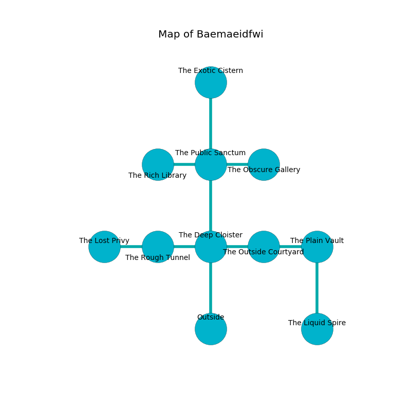

%Ruin Dogs

##Baemaeidfwi
###Overview
Baemaeidfwi is constructed on an obsidion tree. Some areas of it are flooded. The ruin is coming to life. It is occupied by Demons. Reynaldo Floyd The Flirtatious, a Fire Giant is here. The Demons are ruled by Reynaldo Floyd The Flirtatious. He  is founding a new religion. 

###Artifact
####Becaod

Becaod looks like a soft cube. Air slips away from it. When picked up it grants power to its owner. 

###Locations

####the deep cloister
There are a Githyanki Warrior, an Oni, and a Swarm of Insects here. The floor is smooth. Green mushrooms are decaying from the walls. The wooden walls are covered in mold. 

* To the west a small cavern leads to [the rough tunnel](#the-rough-tunnel).
* To the east a windy opening connects to [the outside courtyard](#the-outside-courtyard).
* To the north a narrow path leads to [the public sanctum](#the-public-sanctum).
* To the south is the entrance.

####the public sanctum
There are a Quasit, a Vrock, and a Fomorian here. The air smells like pork here. Red lichens are growing from the walls. 

* To the west a hazy hall opens to [the rich library](#the-rich-library).
* To the east a windy opening leads to [the obscure gallery](#the-obscure-gallery).
* To the north a torchlit artery opens to [the exotic cistern](#the-exotic-cistern).
* To the south a narrow path leads to [the deep cloister](#the-deep-cloister).

####the obscure gallery
The floor is glossy. The air tastes like bouillon here. 

* There is a flag here.
* There is a kettle here.
* There is a carriage here.
* To the west a windy opening leads to [the public sanctum](#the-public-sanctum).

####the outside courtyard
The crystal walls are scratched. 

* To the west a windy opening leads to [the deep cloister](#the-deep-cloister).
* To the east a hazy walkway leads to [the plain vault](#the-plain-vault).

####the plain vault
Green razorgrass is sprouting in cracks in the floor. The glass walls are covered in mold. There is a trap here. When activated, a magical rune will make the walls close in. 

There is an engraving on a tablet written in Demons Script. 

> Maybe try running.
>

* To the west a hazy walkway leads to [the outside courtyard](#the-outside-courtyard).
* To the south a dripping gap opens to [the liquid spire](#the-liquid-spire).

####the rough tunnel
The floor is bloodstained. The obsidion walls are pristine. 

* [Becaod](#Becaod) is here.
* To the west a small gap opens to [the lost privy](#the-lost-privy).
* To the east a small cavern leads to [the deep cloister](#the-deep-cloister).

####the rich library
There is a trap here. When activated, a magical sound detector will extend a spring loaded spear. White ferns are swaying from the walls. The air smells like berry here. 

There is an engraving on the wall written in Demons Script. 

> Poor me! the memory of you is sadistic
>
> it is always optimistic
>
> it is never normal
>
> everything is characteristic
>

* There is a spear here.
* To the east a hazy hall opens to [the public sanctum](#the-public-sanctum).

####the liquid spire
The floor is sticky. Blue moss is decaying in broken urns. 

* [Reynaldo Floyd The Flirtatious](#Reynaldo-Floyd-The-Flirtatious) is here.
* To the north a dripping gap opens to [the plain vault](#the-plain-vault).

####the exotic cistern
Gray razorgrass is growing from the walls. There is a trap here. When activated, a magical rune will open a large pit in the floor. The floor is glossy. 

* To the south a torchlit artery opens to [the public sanctum](#the-public-sanctum).

####the lost privy
There are a Cult Fanatic and a Mind Flayer Arcanist here. The air smells like boysenberry here. 

There is an engraving on a tablet written in common. 

> Run away.
>

* To the east a small gap connects to [the rough tunnel](#the-rough-tunnel).

