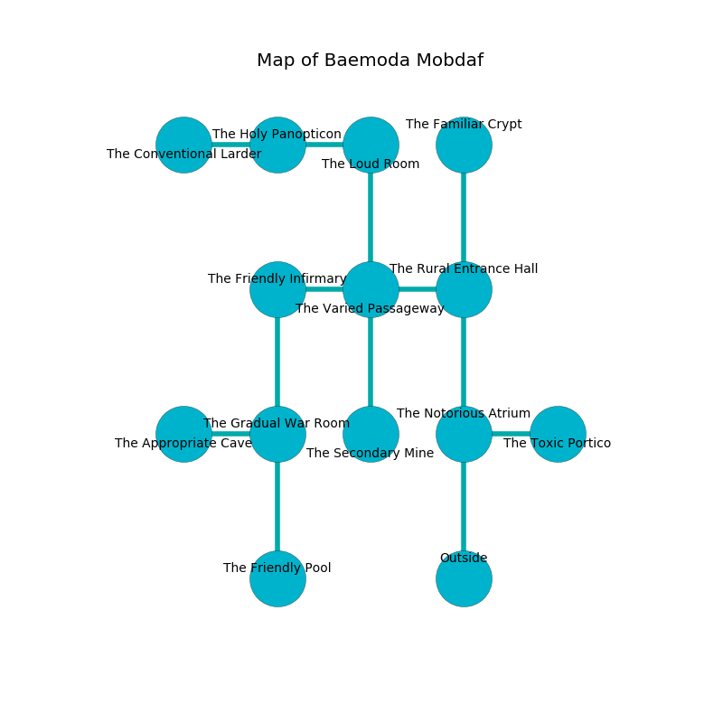

%Ruin Dogs

##Baemoda Mobdaf
###Overview
Baemoda Mobdaf is located under a poisoned mountain. Some areas of Baemoda Mobdaf are corrupted. The ruin is sinking into the earth. It is occupied by Lizardfolk. Toby Stoker The Nervous, an Assassin is here. The Lizardfolk are battling Toby Stoker The Nervous. He  is founding a new religion. 

###Artifact
####Haegd

Haegd has the form of a transparent spear. Psychic energy pours towards it. It smells like tea. When thrown it illuminates its surroundings. 

###Locations

####the notorious atrium
The floor is cluttered with shells. The air smells like raisin here. There are two Lizardfolk Shamans and seven Lizardfolk here. The brick walls are scratched. If the Lizardfolk notice the Ruin Dogs, one of them will retreat and alert [Toby Stoker](#Toby-Stoker). 

* To the east a flooded hallway leads to [the toxic portico](#the-toxic-portico).
* To the north a narrow threshold opens to [the rural entrance hall](#the-rural-entrance-hall).
* To the south is the entrance.

####the rural entrance hall
The air smells like tamarind here. 

* To the west a twisted artery connects to [the varied passageway](#the-varied-passageway).
* To the north a torchlit path leads to [the familiar crypt](#the-familiar-crypt).
* To the south a narrow threshold opens to [the notorious atrium](#the-notorious-atrium).

####the varied passageway
Blue ferns are decaying from the walls. The wooden walls are unsettled. 

* To the west a flooded gap opens to [the friendly infirmary](#the-friendly-infirmary).
* To the east a twisted artery leads to [the rural entrance hall](#the-rural-entrance-hall).
* To the north a windy artery connects to [the loud room](#the-loud-room).
* To the south a long passageway opens to [the secondary mine](#the-secondary-mine).

####the friendly infirmary
The stone walls are unsettled. 

* To the east a flooded gap connects to [the varied passageway](#the-varied-passageway).
* To the south a twisted cavern opens to [the gradual war Room](#the-gradual-war-Room).

####the gradual war Room
The brick walls are unsettled. The air tastes like dill here. There are three Lizardfolk Shamans and five Lizardfolk here. One of the Lizardfolk is working a mechanism that can pour bees from the ceiling. 

There is an engraving on the ceiling written in common. 

> A circle is a specimen
>
> but solar
>
> you are not returned
>

* There is a bucket here.
* To the west a dripping hallway connects to [the appropriate cave](#the-appropriate-cave).
* To the north a twisted cavern connects to [the friendly infirmary](#the-friendly-infirmary).
* To the south a narrow cavern connects to [the friendly pool](#the-friendly-pool).

####the friendly pool
Yellow razorgrass is swaying in broken urns. The air tastes like grape skin here. There is a trap here. When activated, a tripwire will launch stone blocks from the ceiling. There are four Lizardfolk Shamans and a Lizardfolk here. If the Lizardfolk notice the Ruin Dogs, one of them will retreat and alert [Toby Stoker](#Toby-Stoker). 

* To the north a narrow cavern leads to [the gradual war Room](#the-gradual-war-Room).

####the secondary mine
There is a trap here. When activated, a magical rune will make the walls close in. The floor is smooth. 

There is an engraving on a tablet written in Lizardfolk Script. 

> I am powerful.
>

* To the north a long passageway connects to [the varied passageway](#the-varied-passageway).

####the toxic portico
The floor is sticky. Blue razorgrass is swaying in cracks in the floor. The glass walls are bloodstained. 

* There is an apple here.
* To the west a flooded hallway connects to [the notorious atrium](#the-notorious-atrium).

####the familiar crypt
The air smells like elderberry here. 

* To the south a torchlit path opens to [the rural entrance hall](#the-rural-entrance-hall).

####the loud room
The air tastes like roasted meaty here. 

* To the west a twisted hall opens to [the holy panopticon](#the-holy-panopticon).
* To the south a windy artery connects to [the varied passageway](#the-varied-passageway).

####the appropriate cave
The air tastes like vanilla here. There is a trap here. When activated, a magical proximity detector will fire a scything blade. 

There is an engraving on the ceiling written in Lizardfolk Script. 

> Poor me! weak soul
>
> operational and whole
>
> but never comparable
>
> cruelty is whole
>

* There is a crystal here.
* To the east a dripping hallway connects to [the gradual war Room](#the-gradual-war-Room).

####the holy panopticon
The air smells like root here. The floor is flooded with one inch deep cool water. 

There is an engraving on a tablet written in common. 

> Treasure here.
>

* [Haegd](#Haegd) is here.
* To the west a twisted path opens to [the conventional larder](#the-conventional-larder).
* To the east a twisted hall opens to [the loud room](#the-loud-room).

####the conventional larder
There are a Swarm of Rats, a Yuan-Ti Pureblood, a Bone Naga, a Baboon, and a Ghast here. 

There is an engraving on the ceiling written in common. 

> You are joyful
>
> informal and talented
>
> [Haegd](#Haegd)
>
> stable and structural
>
> outer, romantic, offensive
>
> you will be destroyed
>

* [Toby Stoker The Nervous](#Toby-Stoker-The-Nervous) is here.
* To the east a twisted path connects to [the holy panopticon](#the-holy-panopticon).

