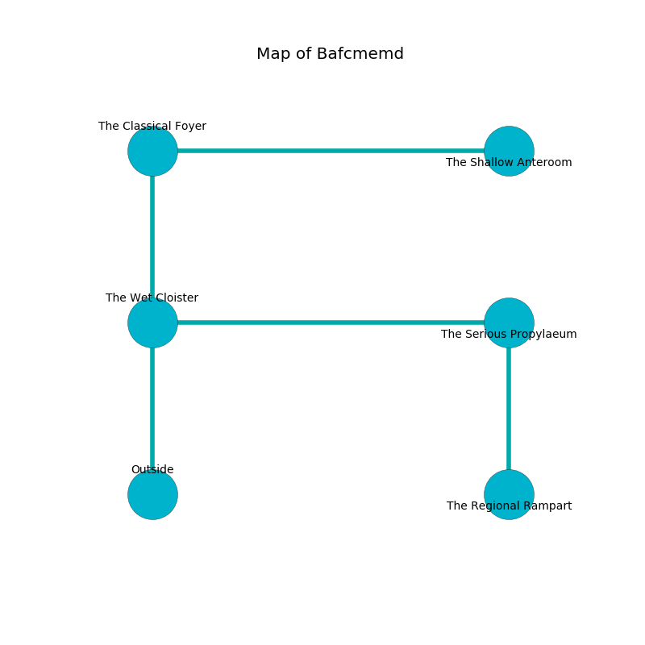

%Ruin Dogs

##Bafcmemd
###Overview
Bafcmemd is located on a volcanic rift. Some areas of Bafcmemd are unbearably cold. A massive flood is happening outside. It is occupied by Yuan-Ti. Emiko Kohler The Unpredictable, a Sahuagin Baron is here. The Yuan-Ti are ruled by Emiko Kohler The Unpredictable. She  is founding a new religion. 

###Artifact
####Fal

Fal is a powerful artifact in the shape of a mushy figurine. It smells like lovage. It is a light white color. When rubbed it becomes lost. 

###Locations

####the wet cloister
The air tastes like eucalyptus here. The brick walls are caving in. 

* There is a wand here.
* To the east a hazy pathway leads to [the serious propylaeum](#the-serious-propylaeum).
* To the north a dripping cave opens to [the classical foyer](#the-classical-foyer).
* To the south is the entrance.

####the classical foyer
The stone walls are pristine. The air smells like toffee here. White mushrooms are swaying in broken urns. There are a Yuan-Ti Malison and four Yuan-Ti Purebloods here. If the Yuan-Ti notice the Ruin Dogs, one of them will retreat and alert the others. 

* To the east a flooded cave opens to [the shallow anteroom](#the-shallow-anteroom).
* To the south a dripping cave connects to [the wet cloister](#the-wet-cloister).

####the shallow anteroom
There are a Stirge, a Zombie, a Triceratops, a Werewolf, and a Bat here. Blue lichens are swaying in cracks in the floor. The crystal walls are pristine. 

* To the west a flooded cave connects to [the classical foyer](#the-classical-foyer).

####the serious propylaeum
The air tastes like oats here. There is a trap here. When activated, a magical rune will make the ceiling slowly lower. 

There is an engraving on a stone written in Yuan-Ti Script. 

> You are love
>
> exclusive and equal
>

* There is a comb here.
* [Fal](#Fal) is here.
* [Emiko Kohler The Unpredictable](#Emiko-Kohler-The-Unpredictable) is here.
* To the west a hazy pathway opens to [the wet cloister](#the-wet-cloister).
* To the south a dark hall leads to [the regional rampart](#the-regional-rampart).

####the regional rampart
The floor is bloodstained. Blue ferns are sprouting from the ceiling. 

* To the north a dark hall connects to [the serious propylaeum](#the-serious-propylaeum).

