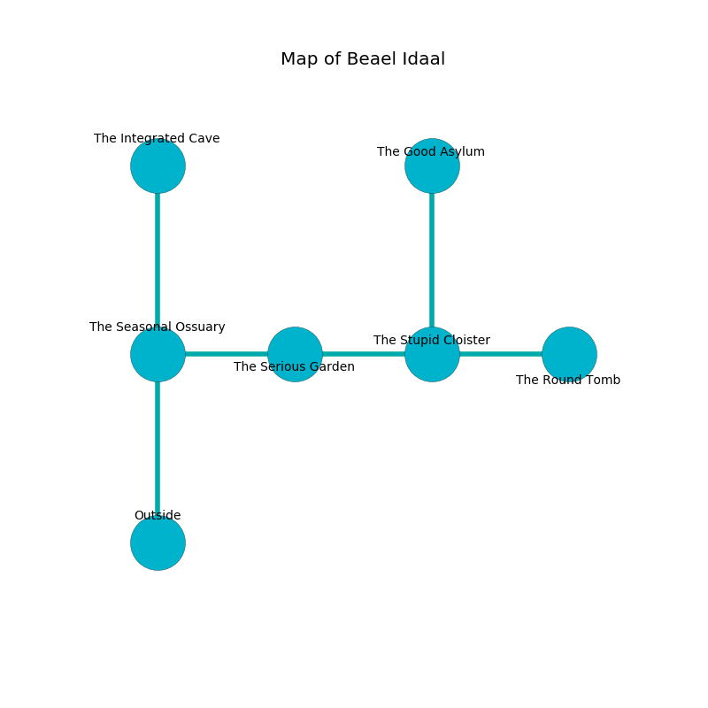

%Ruin Dogs

##Beael Idaal
###Overview
Beael Idaal is located under a volcanic rift. Parts of it are inaccessible. The ruin is coming to life. It is occupied by Githzerai. Rupert Browder The Grumpy, a Cyclops is here. The Githzerai are the soldiers of Rupert Browder The Grumpy. He  is trying to research [Dedaeamd](#Dedaeamd). 

###Artifact
####Dedaeamd

Dedaeamd has the form of a transparent amulet. It smells like black currant. Water slips towards it. When gazed upon it destroys others. 

###Locations

####the seasonal ossuary
The floor is flooded with five inch deep lukewarm water. 

* There is an imp here.
* To the east a windy cavern opens to [the serious garden](#the-serious-garden).
* To the north a windy passageway leads to [the integrated cave](#the-integrated-cave).
* To the south is the entrance.

####the integrated cave
Yellow ferns are sprouting in cracks in the floor. The obsidion walls are bloodstained. The floor is flooded with five inch deep hot water. 

* There is a dagger here.
* To the south a windy passageway connects to [the seasonal ossuary](#the-seasonal-ossuary).

####the serious garden
Blue razorgrass is sprouting in a patch on the floor. The air smells like pork here. The concrete walls are pristine. 

* To the west a windy cavern leads to [the seasonal ossuary](#the-seasonal-ossuary).
* To the east a hazy hallway leads to [the stupid cloister](#the-stupid-cloister).

####the stupid cloister
The brick walls are bloodstained. There are four Githzerai Monks here. The air tastes like stringent here. Blue moss is swaying in broken urns. One of the Githzerai is pointing a ballista at the entrance. 

* [Dedaeamd](#Dedaeamd) is here.
* [Rupert Browder The Grumpy](#Rupert-Browder-The-Grumpy) is here.
* To the west a hazy hallway leads to [the serious garden](#the-serious-garden).
* To the east a windy gap leads to [the round tomb](#the-round-tomb).
* To the north a dripping threshold connects to [the good asylum](#the-good-asylum).

####the round tomb
Blue razorgrass is decaying from the walls. The air smells like bouillon here. There are a Rhinoceros, a Gladiator, and an Octopus here. 

* To the west a windy gap leads to [the stupid cloister](#the-stupid-cloister).

####the good asylum
There is an Oni here. The air smells like coffee here. 

* There is a box here.
* There is a net here.
* To the south a dripping threshold leads to [the stupid cloister](#the-stupid-cloister).

