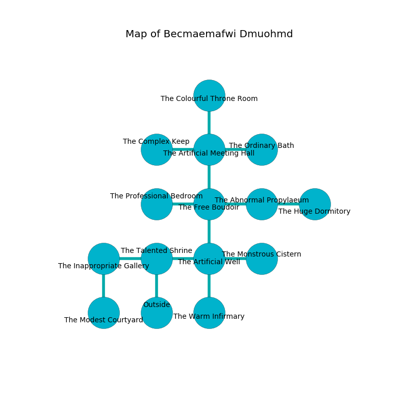

%Ruin Dogs

##Becmaemafwi Dmuohmd
###Overview
Becmaemafwi Dmuohmd is located in a crystal plain. Some rooms of Becmaemafwi Dmuohmd are flooded. A solar eclipse is happening outside. It is occupied by Sprites. Jordan Yoder The Obstinate, a Kuo-Toa Monitor is here. The Sprites are battling Jordan Yoder The Obstinate. He  is trying to recover [The Emotional Expertise](#The-Emotional-Expertise). 

###Artifact
####The Emotional Expertise

The Emotional Expertise is a powerful artifact in the shape of an opaque amulet. It is a shifting pink color. When cradled it sings the hymn of the damned. 

###Locations

####the talented shrine
The air smells like freshly cut hay here. There are a Quasit, a Cockatrice, a Poltergeist, and a Minotaur Skeleton here. The brick walls are ruined. Yellow moss is decaying from the ceiling. 

There is an engraving on the floor written in Sprites Script. 

> All of us are maddened
>
> unlawful, cautious, impossible
>
> All of us are maddened
>

* To the west a small cavern opens to [the inappropriate gallery](#the-inappropriate-gallery).
* To the east a flooded corridor leads to [the artificial well](#the-artificial-well).
* To the south is the entrance.

####the artificial well
The mirrored walls are ruined. The air smells like grilling here. 

* To the west a flooded corridor opens to [the talented shrine](#the-talented-shrine).
* To the east a small hallway leads to [the monstrous cistern](#the-monstrous-cistern).
* To the north a dripping threshold connects to [the free boudoir](#the-free-boudoir).
* To the south a flooded cavern connects to [the warm infirmary](#the-warm-infirmary).

####the free boudoir
The floor is smooth. White moss is decaying in a patch on the floor. 

* There is a dagger here.
* To the west a twisted path opens to [the professional bedroom](#the-professional-bedroom).
* To the east a dark path opens to [the abnormal propylaeum](#the-abnormal-propylaeum).
* To the north a narrow hall opens to [the artificial meeting hall](#the-artificial-meeting-hall).
* To the south a dripping threshold connects to [the artificial well](#the-artificial-well).

####the monstrous cistern
Red mushrooms are decaying in a patch on the floor. The air smells like soup here. The crystal walls are scratched. The floor is glossy. 

* To the west a small hallway opens to [the artificial well](#the-artificial-well).

####the abnormal propylaeum
There are sixteen Sprites here. The Sprites are willing to negotiate. 

There is an engraving on a monolith written in common. 

> Try swimming.
>

* To the west a dark path leads to [the free boudoir](#the-free-boudoir).
* To the east a twisted opening opens to [the huge dormitory](#the-huge-dormitory).

####the artificial meeting hall
There are sixteen Sprites here. Red mushrooms are growing in cracks in the floor. One of the Sprites is on watch, the rest are fighting amongst themselves. 

There is an engraving on a stone written in Sprites Script. 

> I discovered this place.
>
> Dig here.
>

* [The Emotional Expertise](#The-Emotional-Expertise) is here.
* [Jordan Yoder The Obstinate](#Jordan-Yoder-The-Obstinate) is here.
* To the west a long passageway opens to [the complex keep](#the-complex-keep).
* To the east a torchlit hallway leads to [the ordinary bath](#the-ordinary-bath).
* To the north a small walkway leads to [the colourful throne room](#the-colourful-throne-room).
* To the south a narrow hall connects to [the free boudoir](#the-free-boudoir).

####the inappropriate gallery
There is a trap here. When activated, a tripwire will launch a javelin. Gray razorgrass is swaying in broken urns. The wooden walls are pristine. There are a Warhorse, a Yeti, and a Copper Dragon Wyrmling here. The floor is sticky. 

* To the east a small cavern opens to [the talented shrine](#the-talented-shrine).
* To the south a long threshold leads to [the modest courtyard](#the-modest-courtyard).

####the modest courtyard
The air tastes like storax here. The mirrored walls are pristine. There is a trap here. When activated, a magical proximity detector will launch a hail of needles. There are sixteen Sprites here. The Sprites are performing a ritual. If not interrupted, the ruin dogs will be weakened. 

* To the north a long threshold leads to [the inappropriate gallery](#the-inappropriate-gallery).

####the professional bedroom
There is a trap here. When activated, a magical rune will open a trapdoor in the floor. The air tastes like sap here. 

There is an engraving on the ceiling written in common. 

> You are frozen
>
> fashionable and limited
>
> lost, busy, vertical
>
> yet educational
>
> ever marine
>

* To the east a twisted path leads to [the free boudoir](#the-free-boudoir).

####the colourful throne room
White ferns are sprouting in broken urns. The floor is smooth. There is a trap here. When activated, a magical sound detector will launch a ceiling pendulum. 

* To the south a small walkway leads to [the artificial meeting hall](#the-artificial-meeting-hall).

####the complex keep
White moss is sprouting in a patch on the floor. There are sixteen Sprites here. The air smells like freesia here. The obsidion walls are pristine. One of the Sprites is working a mechanism that can engulf the room in a fiery blaze. 

There is an engraving on the floor written in common. 

> Maybe try hiding.
>

* To the east a long passageway connects to [the artificial meeting hall](#the-artificial-meeting-hall).

####the warm infirmary
The air tastes like ginseng here. 

* To the north a flooded cavern connects to [the artificial well](#the-artificial-well).

####the huge dormitory
There are sixteen Sprites here. The air tastes like paint here. The stone walls are scratched. One of the Sprites is on watch, the rest are celebrating. 

* There is a girl here.
* There is a net here.
* To the west a twisted opening connects to [the abnormal propylaeum](#the-abnormal-propylaeum).

####the ordinary bath
The brick walls are scratched. The floor is cluttered with rocks. The air tastes like lemon peel here. Yellow ferns are growing from the walls. 

* To the west a torchlit hallway leads to [the artificial meeting hall](#the-artificial-meeting-hall).

