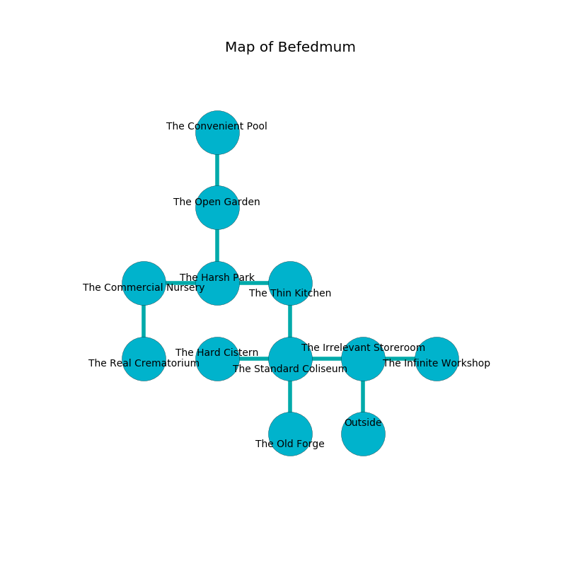

%Ruin Dogs

##Befedmum
###Overview
Befedmum is located under a poisoned mountain. Parts of Befedmum are cursed. The ruin is burning. It is occupied by Duergars. Ilona Turpin The Cunning, a Drow Priestess of Lolth is here. The Duergars have been charmed by Ilona Turpin The Cunning. She  is trying to recover [Lfaiiaemh Dmfuma](#Lfaiiaemh-Dmfuma). 

###Artifact
####Lfaiiaemh Dmfuma

Lfaiiaemh Dmfuma has the form of a mushy blade. It smells like rancid butter. It is a bright gray color. When cradled it destroys itself. 

###Locations

####the irrelevant storeroom
Green moss is swaying in cracks in the floor. The wooden walls are caving in. The air smells like pork here. The floor is flooded with two inch deep cold water. There are a Plesiosaurus, a Water Weird, a Giant Goat, a Yuan-Ti Malison, and a Zombie here. 

* To the west a windy hall connects to [the standard coliseum](#the-standard-coliseum).
* To the east a dripping passageway connects to [the infinite workshop](#the-infinite-workshop).
* To the south is the entrance.

####the infinite workshop
The floor is cluttered with broken glass. Yellow ferns are growing in broken urns. The metallic walls are pristine. 

* To the west a dripping passageway leads to [the irrelevant storeroom](#the-irrelevant-storeroom).

####the standard coliseum
The air smells like sand here. Blue moss is sprouting in cracks in the floor. The concrete walls are scratched. The floor is flooded with four inch deep lukewarm water. 

* To the west a torchlit cavern opens to [the hard cistern](#the-hard-cistern).
* To the east a windy hall connects to [the irrelevant storeroom](#the-irrelevant-storeroom).
* To the north a torchlit walkway connects to [the thin kitchen](#the-thin-kitchen).
* To the south a windy artery leads to [the old forge](#the-old-forge).

####the thin kitchen
The floor is glossy. The concrete walls are pristine. Yellow ferns are decaying in broken urns. 

There is an engraving on the ceiling written in common. 

> All of us are hidden
>
> yet square
>
> intermediate and equal
>
> incongruous and cautious
>
> lost, relative, commercial
>
> operational and generous
>
> occupational and fat
>
> All of us are hidden
>

* [Ilona Turpin The Cunning](#Ilona-Turpin-The-Cunning) is here.
* To the west a dark threshold opens to [the harsh park](#the-harsh-park).
* To the south a torchlit walkway opens to [the standard coliseum](#the-standard-coliseum).

####the hard cistern
Yellow mushrooms are swaying from the walls. 

* To the east a torchlit cavern connects to [the standard coliseum](#the-standard-coliseum).

####the harsh park
There are seven Duergars here. The Duergars are drunk. 

* To the west a twisted passageway opens to [the commercial nursery](#the-commercial-nursery).
* To the east a dark threshold connects to [the thin kitchen](#the-thin-kitchen).
* To the north a hazy cave connects to [the open garden](#the-open-garden).

####the open garden
There are an Imp, a Lizard King, a Steam Mephit, and a Carrion Crawler here. The air tastes like white rose here. Yellow razorgrass is growing in broken urns. 

* There is an orange here.
* To the north a windy pathway opens to [the convenient pool](#the-convenient-pool).
* To the south a hazy cave leads to [the harsh park](#the-harsh-park).

####the old forge
Gray lichens are decaying from the ceiling. The air smells like petitgrain here. 

There is an engraving on a monolith written in Duergars Script. 

> I am lonely.
>
> Go away.
>

* To the north a windy artery connects to [the standard coliseum](#the-standard-coliseum).

####the convenient pool
Blue ferns are sprouting in cracks in the floor. The air smells like bread baked here. The crystal walls are covered in mold. 

* To the south a windy pathway leads to [the open garden](#the-open-garden).

####the commercial nursery
The stone walls are scratched. Gray mushrooms are sprouting from the walls. The floor is smooth. The air smells like flesh here. 

* [Lfaiiaemh Dmfuma](#Lfaiiaemh-Dmfuma) is here.
* To the east a twisted passageway leads to [the harsh park](#the-harsh-park).
* To the south a hazy hall opens to [the real crematorium](#the-real-crematorium).

####the real crematorium
The floor is flooded with four inch deep lukewarm water. Red mushrooms are sprouting in broken urns. 

* There is a girl here.
* To the north a hazy hall connects to [the commercial nursery](#the-commercial-nursery).

