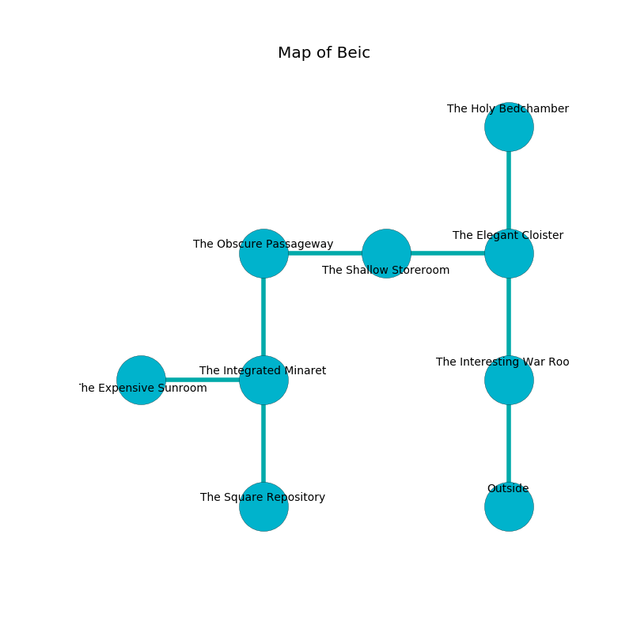

%Ruin Dogs

##Beic
###Overview
Beic is constructed on a poisoned rift. Some areas of it are somewhat cold. A massive storm is happening outside. It is occupied by Myconids. Ralph Rau The Foolish, a Githyanki Warrior is here. The Myconids are the minions of Ralph Rau The Foolish. He  is trying to steal [Dofaeocfecwi](#Dofaeocfecwi). 

###Artifact
####Dofaeocfecwi

Dofaeocfecwi is a powerful artifact in the shape of a wet meteorite. It smells like pumpkin. When picked up it liquifies. 

###Locations

####the interesting war Room
The floor is glossy. The brick walls are covered in mold. There are a Cult Fanatic, a Giant Bat, a Noble, and a Pteranodon here. The air smells like rye bread here. Yellow lichens are sprouting from the ceiling. 

* To the north a dripping opening opens to [the elegant cloister](#the-elegant-cloister).
* To the south is the entrance.

####the elegant cloister
The wooden walls are scratched. White lichens are decaying from the ceiling. The floor is flooded with one inch deep scalding water. 

There is an engraving on a monolith written in common. 

> Maybe try swimming.
>

* There is a dress here.
* [Ralph Rau The Foolish](#Ralph-Rau-The-Foolish) is here.
* To the west a dripping artery leads to [the shallow storeroom](#the-shallow-storeroom).
* To the north a flooded walkway connects to [the holy bedchamber](#the-holy-bedchamber).
* To the south a dripping opening opens to [the interesting war Room](#the-interesting-war-Room).

####the shallow storeroom

* To the west a flooded cavern opens to [the obscure passageway](#the-obscure-passageway).
* To the east a dripping artery leads to [the elegant cloister](#the-elegant-cloister).

####the holy bedchamber
The crystal walls are bloodstained. Yellow mushrooms are swaying from the walls. 

* To the south a flooded walkway connects to [the elegant cloister](#the-elegant-cloister).

####the obscure passageway
The stone walls are bloodstained. The floor is bloodstained. The air tastes like orangeflower here. Yellow razorgrass is sprouting from the ceiling. 

* To the east a flooded cavern connects to [the shallow storeroom](#the-shallow-storeroom).
* To the south a twisted walkway leads to [the integrated minaret](#the-integrated-minaret).

####the integrated minaret
The crystal walls are caving in. Yellow lichens are decaying in broken urns. The air smells like resin here. There are an Awakened Shrub, a Poltergeist, and a Piercer here. 

* [Dofaeocfecwi](#Dofaeocfecwi) is here.
* To the west a twisted pathway connects to [the expensive sunroom](#the-expensive-sunroom).
* To the north a twisted walkway opens to [the obscure passageway](#the-obscure-passageway).
* To the south a hazy cave connects to [the square repository](#the-square-repository).

####the expensive sunroom
The air tastes like avocado here. The floor is bloodstained. The glass walls are unsettled. 

There is an engraving on a stone written in common. 

> I am the best.
>

* To the east a twisted pathway leads to [the integrated minaret](#the-integrated-minaret).

####the square repository
White ferns are decaying from the ceiling. 

There is an engraving on the ceiling written in Myconids Script. 

> I am defending this place.
>
> Try cowering.
>

* To the north a hazy cave leads to [the integrated minaret](#the-integrated-minaret).

