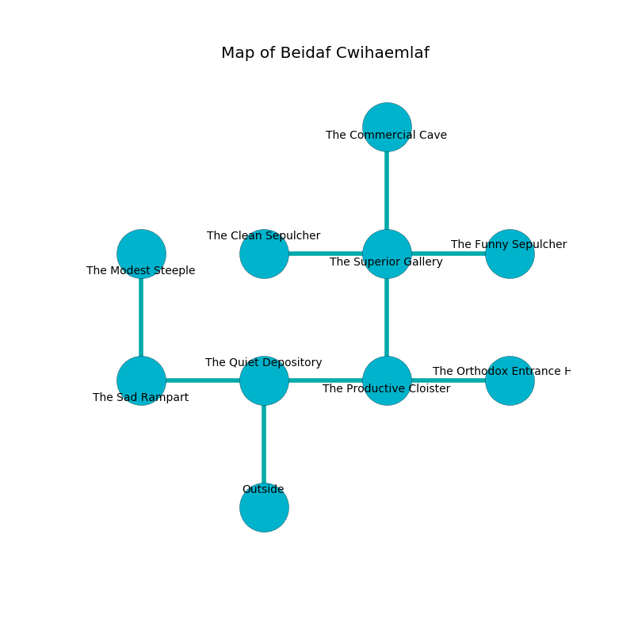

%Ruin Dogs

##Beidaf Cwihaemlaf
###Overview
Beidaf Cwihaemlaf is constructed on a poisoned rift. Some rooms of Beidaf Cwihaemlaf are frozen. A massive flood is happening outside. It is occupied by Kuo-Toa. Paige Dodd The Overemotional, a Frost Giant is here. The Kuo-Toa worship Paige Dodd The Overemotional. She  is founding a new religion. 

###Artifact
####Aehhmaii

Aehhmaii is a powerful artifact in the shape of a hard doll. Power slips from it. It smells like lard. When picked up it changes probabilities. 

###Locations

####the quiet depository
Blue moss is swaying in broken urns. The air tastes like dates here. 

* There is a knot here.
* There is a wand here.
* There is a fish here.
* To the west a hazy gap connects to [the sad rampart](#the-sad-rampart).
* To the east a twisted hall connects to [the productive cloister](#the-productive-cloister).
* To the south is the entrance.

####the productive cloister
Blue lichens are sprouting from the ceiling. The stone walls are covered in mold. The air tastes like clove here. 

* To the west a twisted hall leads to [the quiet depository](#the-quiet-depository).
* To the east a windy pathway opens to [the orthodox entrance hall](#the-orthodox-entrance-hall).
* To the north a hazy hallway leads to [the superior gallery](#the-superior-gallery).

####the orthodox entrance hall
There are two Kuo-Toa Whips, two Kuo-Toa Archpriests, two Kuo-Toa,  here. The Kuo-Toa are willing to negotiate. 

* To the west a windy pathway leads to [the productive cloister](#the-productive-cloister).

####the superior gallery
There is a trap here. When activated, a pressure plate will launch a poison dart. The air tastes like bread baked here. There are a Hawk, two Awakened Shrubs, an Unicorn, a Druid, a Couatl, and  here. The floor is glossy. 

* [Aehhmaii](#Aehhmaii) is here.
* To the west a narrow path leads to [the clean sepulcher](#the-clean-sepulcher).
* To the east a long artery connects to [the funny sepulcher](#the-funny-sepulcher).
* To the north a dark passageway connects to [the commercial cave](#the-commercial-cave).
* To the south a hazy hallway leads to [the productive cloister](#the-productive-cloister).

####the clean sepulcher
There are a Succubus and a Shambling Mound here. Red ferns are swaying in cracks in the floor. 

* To the east a narrow path connects to [the superior gallery](#the-superior-gallery).

####the sad rampart
There are a Kuo-Toa Monitor, a Troll, a Thri-Kreen, and a Swarm of Insects here. The stone walls are ruined. The floor is sticky. Red moss is growing in broken urns. 

* There is a casket here.
* [Paige Dodd The Overemotional](#Paige-Dodd-The-Overemotional) is here.
* To the east a hazy gap leads to [the quiet depository](#the-quiet-depository).
* To the north a twisted hall connects to [the modest steeple](#the-modest-steeple).

####the modest steeple
White moss is growing in cracks in the floor. The floor is smooth. The crystal walls are scratched. 

* To the south a twisted hall leads to [the sad rampart](#the-sad-rampart).

####the funny sepulcher
Yellow lichens are sprouting in broken urns. There are two Kuo-Toa Whips, two Kuo-Toa Archpriests, a Kuo-Toa,  here. The mirrored walls are pristine. The air smells like bitter orange here. The Kuo-Toa are berserk with rage. 

* To the west a long artery opens to [the superior gallery](#the-superior-gallery).

####the commercial cave
There are a Ghast, a Kuo-Toa Archpriest, a Swarm of Poisonous Snakes, and a Reef Shark here. The floor is smooth. White mushrooms are sprouting from the ceiling. The wooden walls are caving in. The air smells like mulberry here. 

There is an engraving on the wall written in Kuo-Toa Script. 

> Go away.
>

* To the south a dark passageway leads to [the superior gallery](#the-superior-gallery).

