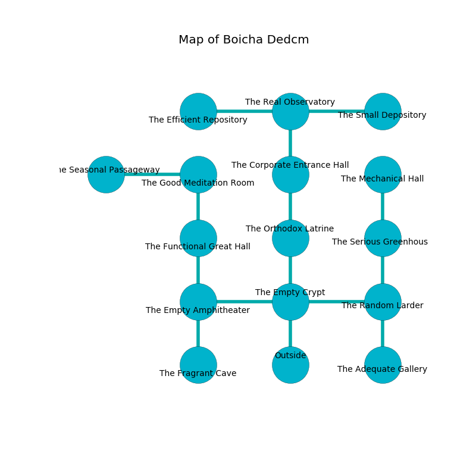

%Ruin Dogs

##Boicha Dedcm
###Overview
Boicha Dedcm is located on a giant plain. Parts of Boicha Dedcm are cursed. The ruin is burning. It is occupied by Deep Gnomes. Ignacio Pepper The Stubborn, a Frost Giant is here. The Deep Gnomes are ruled by Ignacio Pepper The Stubborn. He  is founding a new religion. 

###Artifact
####Deffah Fadodedaeum

Deffah Fadodedaeum looks like a transparent spear. It is a shifting white color. When eaten it glows with an eerie light. 

###Locations

####the empty crypt

* To the west a dark hall connects to [the empty amphitheater](#the-empty-amphitheater).
* To the east a hazy gap connects to [the random larder](#the-random-larder).
* To the north a twisted artery connects to [the orthodox latrine](#the-orthodox-latrine).
* To the south is the entrance.

####the empty amphitheater
Yellow ferns are sprouting in cracks in the floor. There are fourteen Deep Gnomes here. The Deep Gnomes are berserk with rage. 

* To the east a dark hall leads to [the empty crypt](#the-empty-crypt).
* To the north a dripping pathway opens to [the functional great hall](#the-functional-great-hall).
* To the south a dripping cave connects to [the fragrant cave](#the-fragrant-cave).

####the random larder
Blue mushrooms are swaying from the walls. The floor is sticky. 

There is an engraving on the ceiling written in Deep Gnomes Script. 

> A cow is a pier
>
> usual and automatic
>

* To the west a hazy gap leads to [the empty crypt](#the-empty-crypt).
* To the north a twisted passageway leads to [the serious greenhouse](#the-serious-greenhouse).
* To the south a narrow cavern leads to [the adequate gallery](#the-adequate-gallery).

####the serious greenhouse
There are a Wolf, a Hippogriff, a Giant Spider, a Dretch, a Sahuagin, an Axe Beak, two Gold Dragon Wyrmlings, a Kobold, and  here. The metallic walls are ruined. Red moss is sprouting in cracks in the floor. 

There is an engraving on the wall written in Deep Gnomes Script. 

> A map is a jam
>
> passive and unfair
>
> you will be crystalized
>

* There is a cat here.
* [Deffah Fadodedaeum](#Deffah-Fadodedaeum) is here.
* To the north a small hall opens to [the mechanical hall](#the-mechanical-hall).
* To the south a twisted passageway leads to [the random larder](#the-random-larder).

####the functional great hall
Blue lichens are decaying in cracks in the floor. The wooden walls are bloodstained. The floor is sticky. The air smells like cologne here. 

* To the north a hazy gap connects to [the good meditation room](#the-good-meditation-room).
* To the south a dripping pathway opens to [the empty amphitheater](#the-empty-amphitheater).

####the orthodox latrine
The floor is flooded with three inch deep hot water. Yellow razorgrass is swaying in a patch on the floor. The air tastes like mushroom here. 

There is an engraving on a tablet written in common. 

> I am worshipping this place.
>
> I could not try running.
>

* To the north a flooded threshold opens to [the corporate entrance hall](#the-corporate-entrance-hall).
* To the south a twisted artery leads to [the empty crypt](#the-empty-crypt).

####the corporate entrance hall
The air smells like prune here. Green razorgrass is sprouting in cracks in the floor. 

* To the north a dark cave opens to [the real observatory](#the-real-observatory).
* To the south a flooded threshold opens to [the orthodox latrine](#the-orthodox-latrine).

####the adequate gallery
The obsidion walls are covered in mold. 

There is an engraving on a stone written in Deep Gnomes Script. 

> I am free.
>

* To the north a narrow cavern leads to [the random larder](#the-random-larder).

####the real observatory
Blue moss is decaying from the walls. The air tastes like rain here. There are fourteen Deep Gnomes here. The floor is smooth. One of the Deep Gnomes is on watch, the rest are meditating. 

* There is a baby here.
* To the west a twisted cave opens to [the efficient repository](#the-efficient-repository).
* To the east a flooded cavern opens to [the small depository](#the-small-depository).
* To the south a dark cave opens to [the corporate entrance hall](#the-corporate-entrance-hall).

####the good meditation room
The air smells like root here. The brick walls are caving in. Gray mushrooms are swaying from the ceiling. 

* To the west a hazy pathway leads to [the seasonal passageway](#the-seasonal-passageway).
* To the south a hazy gap opens to [the functional great hall](#the-functional-great-hall).

####the efficient repository
There is a trap here. When activated, a tripwire will collapse a column. The concrete walls are bloodstained. The air tastes like turni here. Green moss is sprouting from the walls. The floor is bloodstained. 

There is an engraving on a stone written in common. 

> Poor me! the memory of you is inhumane
>
> it is never vain
>
> tasty, hard, capable
>
> hope is incapable
>

* There is a bottle here.
* To the east a twisted cave leads to [the real observatory](#the-real-observatory).

####the small depository
The floor is bloodstained. There are an Otyugh, an Imp, a Monodrone, a Giant Weasel, and a Green Dragon Wyrmling here. Gray razorgrass is sprouting in cracks in the floor. The air tastes like menthol here. The metallic walls are ruined. 

* There is a skirt here.
* There is a carriage here.
* There is a tree here.
* [Ignacio Pepper The Stubborn](#Ignacio-Pepper-The-Stubborn) is here.
* To the west a flooded cavern connects to [the real observatory](#the-real-observatory).

####the fragrant cave
The floor is smooth. The air tastes like cucumber skin here. Green moss is swaying in a patch on the floor. 

* There is a dress here.
* There is a leprechaun here.
* To the north a dripping cave opens to [the empty amphitheater](#the-empty-amphitheater).

####the seasonal passageway
The floor is bloodstained. 

* To the east a hazy pathway opens to [the good meditation room](#the-good-meditation-room).

####the mechanical hall
The crystal walls are unsettled. The air smells like phenolic here. The floor is bloodstained. 

* To the south a small hall opens to [the serious greenhouse](#the-serious-greenhouse).

