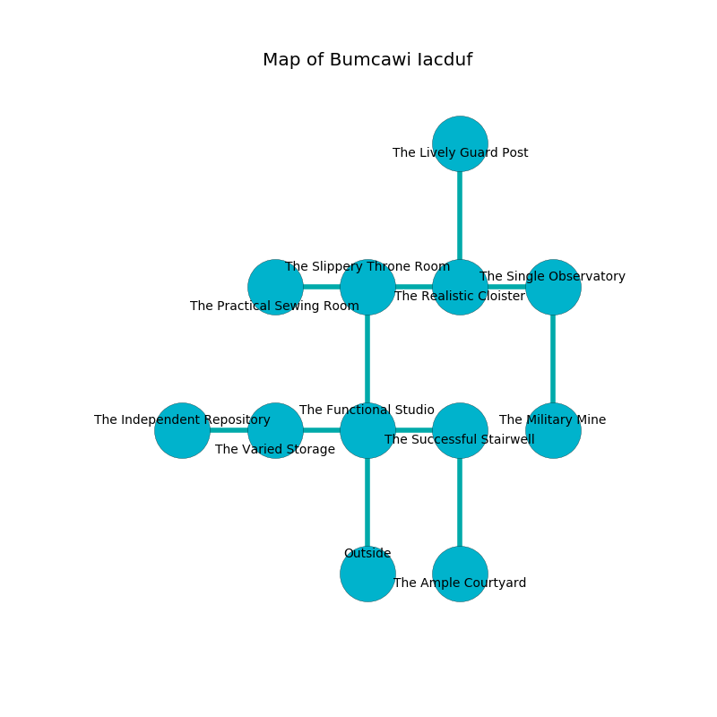

%Ruin Dogs

##Bumcawi Iacduf
###Overview
Bumcawi Iacduf is located under a spikey mountain. Some rooms of Bumcawi Iacduf are flooded. A solar eclipse is happening outside. It is occupied by Demons. Laurel Burger The Impolite, a Cloud Giant is here. The Demons worship Laurel Burger The Impolite. She  is trying to destroy [Dudedu Iaaedum](#Dudedu-Iaaedum). 

###Artifact
####Dudedu Iaaedum

Dudedu Iaaedum has the form of a warm orb. Water slips around it. It is a bright black color. When carried it floats in the air. 

###Locations

####the functional studio
Gray razorgrass is decaying in cracks in the floor. The stone walls are pristine. There are a Flameskull, an Ogre Zombie, and a Wyvern here. 

* To the west a small hallway opens to [the varied storage](#the-varied-storage).
* To the east a hazy opening connects to [the successful stairwell](#the-successful-stairwell).
* To the north a narrow pathway connects to [the slippery throne room](#the-slippery-throne-room).
* To the south is the entrance.

####the successful stairwell
The floor is flooded with four inch deep hot water. There are an Incubus and a Cambion here. The concrete walls are caving in. The air tastes like brown sugar here. The Demons are crazy with bloodlust. 

* There is a root here.
* To the west a hazy opening opens to [the functional studio](#the-functional-studio).
* To the south a dripping cavern leads to [the ample courtyard](#the-ample-courtyard).

####the slippery throne room
Green mushrooms are growing in broken urns. The floor is cluttered with broken glass. The metallic walls are ruined. 

* To the west a flooded cavern leads to [the practical sewing room](#the-practical-sewing-room).
* To the east a twisted cave leads to [the realistic cloister](#the-realistic-cloister).
* To the south a narrow pathway connects to [the functional studio](#the-functional-studio).

####the realistic cloister
The air tastes like blackberry here. The glass walls are caving in. Yellow lichens are growing from the walls. 

* [Dudedu Iaaedum](#Dudedu-Iaaedum) is here.
* To the west a twisted cave connects to [the slippery throne room](#the-slippery-throne-room).
* To the east a small path leads to [the single observatory](#the-single-observatory).
* To the north a narrow opening opens to [the lively guard post](#the-lively-guard-post).

####the practical sewing room
Yellow moss is decaying from the walls. The floor is bloodstained. The air tastes like marshmallow here. There is a Young Blue Dragon here. 

* To the east a flooded cavern connects to [the slippery throne room](#the-slippery-throne-room).

####the varied storage
The crystal walls are bloodstained. The air tastes like melon rind here. Yellow moss is swaying in cracks in the floor. 

There is an engraving on a tablet written in Demons Script. 

> I could not try dying.
>

* To the west a flooded corridor leads to [the independent repository](#the-independent-repository).
* To the east a small hallway connects to [the functional studio](#the-functional-studio).

####the single observatory
White ferns are growing from the ceiling. The air smells like fish here. The floor is flooded with six inch deep cool water. There are a Kuo-Toa Archpriest and a Hobgoblin Captain here. 

* There is a lyre here.
* To the west a small path leads to [the realistic cloister](#the-realistic-cloister).
* To the south a twisted passageway connects to [the military mine](#the-military-mine).

####the military mine
There are a Zombie, a Triceratops, a Warhorse Skeleton, a Cambion, a Twig Blight, a Dust Mephit, and a Lemure here. 

There is an engraving on the wall written in common. 

> [Dudedu Iaaedum](#Dudedu-Iaaedum)
>
> wild and external
>

* [Laurel Burger The Impolite](#Laurel-Burger-The-Impolite) is here.
* To the north a twisted passageway opens to [the single observatory](#the-single-observatory).

####the independent repository
The air smells like barley here. 

* To the east a flooded corridor opens to [the varied storage](#the-varied-storage).

####the ample courtyard
The air tastes like pepper here. The obsidion walls are unsettled. Yellow razorgrass is decaying in cracks in the floor. 

* To the north a dripping cavern leads to [the successful stairwell](#the-successful-stairwell).

####the lively guard post
The crystal walls are pristine. The air smells like saffron here. Red moss is growing in a patch on the floor. 

There is an engraving on the floor written in Demons Script. 

> All of us are corrupted
>
> but never obscure
>
> [Dudedu Iaaedum](#Dudedu-Iaaedum)
>
> agile, cute, favorable
>
> express, horizontal, comparable
>
> neutral and universal
>
> All of us are corrupted
>

* To the south a narrow opening opens to [the realistic cloister](#the-realistic-cloister).

