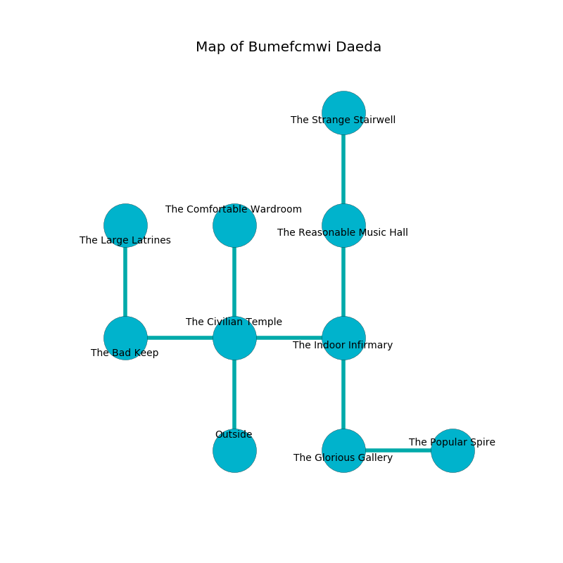

%Ruin Dogs

##Bumefcmwi Daeda
###Overview
Bumefcmwi Daeda is located in a spikey tree. Some areas of Bumefcmwi Daeda are corrupted. A battle between raiders is happening outside. It is occupied by Troglodytes. Andreas Connell The Gullible, an Assassin is here. The Troglodytes are the slaves of Andreas Connell The Gullible. He  is trying to find [Asdfedaffaidfaeeh](#Asdfedaffaidfaeeh). 

###Artifact
####Asdfedaffaidfaeeh

Asdfedaffaidfaeeh has the form of a smooth rock. Fire incinerates near it. It is a sickly purple color. When carried it ignites its surrroundings. 

###Locations

####the civilian temple
The floor is bloodstained. Blue mushrooms are sprouting in a patch on the floor. There are a Giant Ape, an Ogre, and an Acolyte here. 

* [Andreas Connell The Gullible](#Andreas-Connell-The-Gullible) is here.
* To the west a long corridor opens to [the bad keep](#the-bad-keep).
* To the east a twisted passageway opens to [the indoor infirmary](#the-indoor-infirmary).
* To the north a narrow artery connects to [the comfortable wardroom](#the-comfortable-wardroom).
* To the south is the entrance.

####the indoor infirmary
There are a Winter Wolf and a Mind Flayer Arcanist here. 

* There is a basin here.
* To the west a twisted passageway connects to [the civilian temple](#the-civilian-temple).
* To the north a flooded hallway opens to [the reasonable music hall](#the-reasonable-music-hall).
* To the south a dripping pathway leads to [the glorious gallery](#the-glorious-gallery).

####the glorious gallery
There are thirty six Troglodytes here. The floor is cluttered with ashes. The air tastes like prune here. The Troglodytes are willing to negotiate. 

* To the east a narrow gap connects to [the popular spire](#the-popular-spire).
* To the north a dripping pathway connects to [the indoor infirmary](#the-indoor-infirmary).

####the reasonable music hall
There are thirty six Troglodytes here. White lichens are growing from the ceiling. One of the Troglodytes is on watch, the rest are meditating. 

There is an engraving on a stone written in Troglodytes Script. 

> I am lost in Bumefcmwi Daeda.
>

* To the north a dark walkway opens to [the strange stairwell](#the-strange-stairwell).
* To the south a flooded hallway opens to [the indoor infirmary](#the-indoor-infirmary).

####the bad keep
The floor is smooth. 

* [Asdfedaffaidfaeeh](#Asdfedaffaidfaeeh) is here.
* To the east a long corridor opens to [the civilian temple](#the-civilian-temple).
* To the north a torchlit hall connects to [the large latrines](#the-large-latrines).

####the comfortable wardroom
There are an Axe Beak, a Giant Crocodile, a Bone Naga, and a Rust Monster here. The floor is glossy. The glass walls are pristine. 

* To the south a narrow artery leads to [the civilian temple](#the-civilian-temple).

####the popular spire
Green ferns are sprouting in cracks in the floor. The concrete walls are caving in. 

* To the west a narrow gap leads to [the glorious gallery](#the-glorious-gallery).

####the strange stairwell
Green ferns are swaying from the walls. 

There is an engraving on a monolith written in Troglodytes Script. 

> Dear me! sorry you
>
> sophisticated and official
>
> it is never new
>
> all is artificial
>

* To the south a dark walkway opens to [the reasonable music hall](#the-reasonable-music-hall).

####the large latrines
The floor is cluttered with shells. The metallic walls are scratched. The air smells like green peas here. 

* To the south a torchlit hall opens to [the bad keep](#the-bad-keep).

