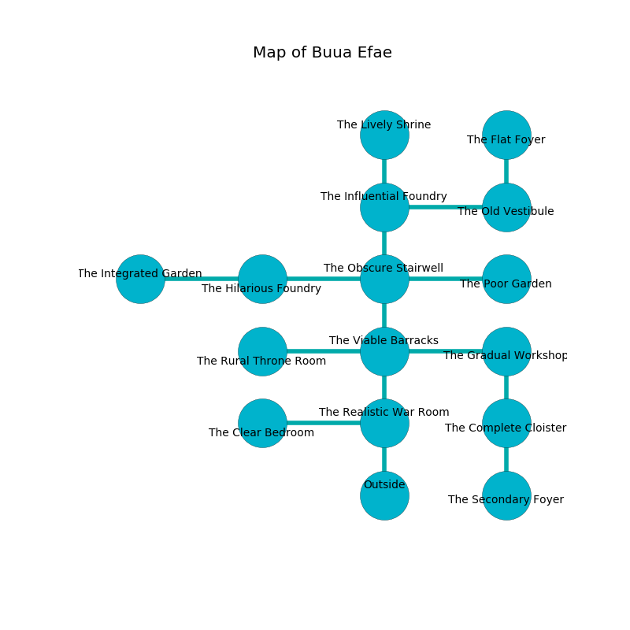

%Ruin Dogs

##Buua Efae
###Overview
Buua Efae is located on a flooded rift. Some areas of Buua Efae are corrupted. A windstorm is happening outside. It is occupied by Sahuagins. Judson Blais The Unpredictable, an Assassin is here. The Sahuagins are the slaves of Judson Blais The Unpredictable. He  is trying to exploit [Cumiobddaeum](#Cumiobddaeum). 

###Artifact
####Cumiobddaeum

Cumiobddaeum looks like a transparent monument. It is a dark blue color. When carried it destroys itself. 

###Locations

####the realistic war Room
Gray ferns are growing in cracks in the floor. The air tastes like naphthyl here. There are five Sahuagin Priestesses here. One of the Sahuagins is on watch, the rest are feasting. 

* There is a dog here.
* There is a key here.
* To the west a torchlit pathway opens to [the clear bedroom](#the-clear-bedroom).
* To the north a small opening connects to [the viable barracks](#the-viable-barracks).
* To the south is the entrance.

####the viable barracks
The air smells like banana here. There are a Shield Guardian, a Ghost, a Peryton, and a Scarecrow here. The floor is sticky. 

* To the west a long pathway opens to [the rural throne room](#the-rural-throne-room).
* To the east a windy opening leads to [the gradual workshop](#the-gradual-workshop).
* To the north a flooded hall leads to [the obscure stairwell](#the-obscure-stairwell).
* To the south a small opening leads to [the realistic war Room](#the-realistic-war-Room).

####the obscure stairwell
The air smells like elderberry here. 

There is an engraving on a monolith written in Sahuagins Script. 

> I am lost in Buua Efae.
>

* There is a shield here.
* To the west a long walkway opens to [the hilarious foundry](#the-hilarious-foundry).
* To the east a windy hallway connects to [the poor garden](#the-poor-garden).
* To the north a windy artery connects to [the influential foundry](#the-influential-foundry).
* To the south a flooded hall connects to [the viable barracks](#the-viable-barracks).

####the poor garden
There are five Sahuagin Priestesses here. Blue mushrooms are decaying in cracks in the floor. The Sahuagins are berserk with rage. 

* To the west a windy hallway connects to [the obscure stairwell](#the-obscure-stairwell).

####the influential foundry
The floor is cluttered with bones. Blue ferns are sprouting in broken urns. There are a Bugbear, an Ochre Jelly, a Gnoll, a Giant Sea Horse, a Bugbear Chief, a Winged Kobold, a Dust Mephit, a Twig Blight, and a Bronze Dragon Wyrmling here. 

* To the east a narrow hallway connects to [the old vestibule](#the-old-vestibule).
* To the north a twisted corridor leads to [the lively shrine](#the-lively-shrine).
* To the south a windy artery connects to [the obscure stairwell](#the-obscure-stairwell).

####the old vestibule
Yellow moss is growing in a patch on the floor. The crystal walls are ruined. The air tastes like sharp here. 

There is an engraving on the floor written in Sahuagins Script. 

> Oh my! terrible god
>
> appropriate, useless, rough
>
> false, colourful, odd
>
> life is tough
>

* There is a bee here.
* To the west a narrow hallway leads to [the influential foundry](#the-influential-foundry).
* To the north a small threshold leads to [the flat foyer](#the-flat-foyer).

####the clear bedroom
The air smells like hazelnut here. There is a trap here. When activated, a magical proximity detector will launch a ceiling pendulum. White mushrooms are decaying in a patch on the floor. 

* To the east a torchlit pathway connects to [the realistic war Room](#the-realistic-war-Room).

####the gradual workshop
There is a trap here. When activated, a magical rune will launch stone blocks from the ceiling. The glass walls are unsettled. There are a Carrion Crawler, an Ochre Jelly, a Baboon, a Bronze Dragon Wyrmling, and a Shambling Mound here. 

* There is a drawer here.
* To the west a windy opening connects to [the viable barracks](#the-viable-barracks).
* To the south a windy artery opens to [the complete cloister](#the-complete-cloister).

####the complete cloister
The air tastes like meat here. The stone walls are covered in mold. Green mushrooms are growing from the walls. There are five Sahuagin Priestesses here. The Sahuagins are willing to negotiate. 

* To the north a windy artery opens to [the gradual workshop](#the-gradual-workshop).
* To the south a long threshold opens to [the secondary foyer](#the-secondary-foyer).

####the hilarious foundry
The stone walls are ruined. Yellow mushrooms are swaying in a patch on the floor. There are a Ghast, a Drow Mage, a Poltergeist, and a Berserker here. The floor is sticky. 

* There is a bag here.
* There is a brooch here.
* [Cumiobddaeum](#Cumiobddaeum) is here.
* To the west a flooded corridor connects to [the integrated garden](#the-integrated-garden).
* To the east a long walkway opens to [the obscure stairwell](#the-obscure-stairwell).

####the rural throne room
The floor is glossy. Red ferns are decaying from the ceiling. 

* [Judson Blais The Unpredictable](#Judson-Blais-The-Unpredictable) is here.
* To the east a long pathway connects to [the viable barracks](#the-viable-barracks).

####the secondary foyer
The brick walls are unsettled. There is a Cloud Giant here. Red moss is growing in cracks in the floor. The floor is glossy. 

* To the north a long threshold opens to [the complete cloister](#the-complete-cloister).

####the flat foyer
Green ferns are swaying from the ceiling. The mirrored walls are covered in mold. The air tastes like sand here. There are a Drow Priestess of Lolth and a Gelatinous Cube here. 

* To the south a small threshold leads to [the old vestibule](#the-old-vestibule).

####the lively shrine
Blue mushrooms are swaying from the walls. The mirrored walls are pristine. 

* There is a button here.
* To the south a twisted corridor connects to [the influential foundry](#the-influential-foundry).

####the integrated garden
There are five Sahuagin Priestesses here. The air tastes like mulberry here. The glass walls are bloodstained. If the Sahuagins notice the Ruin Dogs, one of them will retreat and alert [Judson Blais](#Judson-Blais). 

* There is a fly here.
* There is a rod here.
* To the east a flooded corridor connects to [the hilarious foundry](#the-hilarious-foundry).

