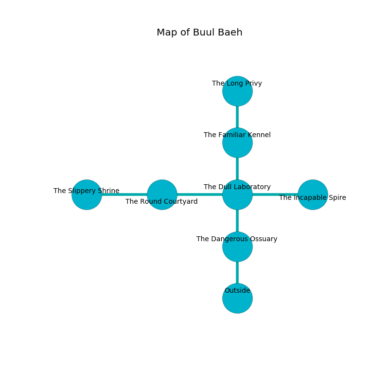

%Ruin Dogs

##Buul Baeh
###Overview
Buul Baeh is located under a flooded rift. Parts of it are corrupted. A massive flood is happening outside. It is occupied by Sahuagin. Kenneth Montague The Perverse, a Mind Flayer Arcanist is here. The Sahuagin are the minions of Kenneth Montague The Perverse. He  is trying to discover [The Optimistic Contrary](#The-Optimistic-Contrary). 

###Artifact
####The Optimistic Contrary

The Optimistic Contrary looks like a broken meteorite. Light pours around it. It smells like raw potato. When gazed upon it becomes a deadly projectile. 

###Locations

####the dangerous ossuary
There are a Quaggoth Thonot, a Saber-Toothed Tiger, an Awakened Shrub, a Bearded Devil, and a Nothic here. The obsidion walls are unsettled. 

* To the north a torchlit pathway leads to [the dull laboratory](#the-dull-laboratory).
* To the south is the entrance.

####the dull laboratory
White lichens are sprouting in a patch on the floor. There is a trap here. When activated, a pressure plate will shoot a lightning bolt. There are a Mammoth and a Basilisk here. 

* To the west a long hall leads to [the round courtyard](#the-round-courtyard).
* To the east a torchlit pathway leads to [the incapable spire](#the-incapable-spire).
* To the north a hazy hall connects to [the familiar kennel](#the-familiar-kennel).
* To the south a torchlit pathway connects to [the dangerous ossuary](#the-dangerous-ossuary).

####the round courtyard
The air tastes like potato here. There are a Gorgon, an Ettin, a Mastiff, and a Scorpion here. 

* [The Optimistic Contrary](#The-Optimistic-Contrary) is here.
* [Kenneth Montague The Perverse](#Kenneth-Montague-The-Perverse) is here.
* To the west a windy corridor connects to [the slippery shrine](#the-slippery-shrine).
* To the east a long hall opens to [the dull laboratory](#the-dull-laboratory).

####the incapable spire
There are two Sahuagin Barons here. There is a trap here. When activated, a pressure plate will open a large pit in the floor. The floor is glossy. The air tastes like pepper here. One of the Sahuagin is pointing a ballista at the entrance. 

* To the west a torchlit pathway opens to [the dull laboratory](#the-dull-laboratory).

####the familiar kennel
Green lichens are growing from the walls. The air smells like quince here. There are a Blink Dog, a Manticore, a Manes, a Giant Frog, a Spined Devil, and a Fire Elemental here. The floor is sticky. 

* To the north a flooded threshold leads to [the long privy](#the-long-privy).
* To the south a hazy hall opens to [the dull laboratory](#the-dull-laboratory).

####the long privy
Green moss is decaying from the walls. The mirrored walls are ruined. The air smells like radish here. 

* To the south a flooded threshold leads to [the familiar kennel](#the-familiar-kennel).

####the slippery shrine
The stone walls are covered in mold. The air tastes like pork here. 

* To the east a windy corridor leads to [the round courtyard](#the-round-courtyard).

