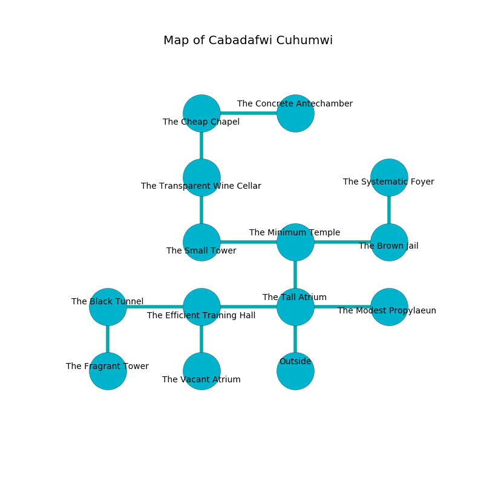

%Ruin Dogs

##Cabadafwi Cuhumwi
###Overview
Cabadafwi Cuhumwi is constructed on a flooded plain. Some rooms of Cabadafwi Cuhumwi are somewhat cold. The ruin is burning. It is occupied by Demons. Harris Weber The Cunning, a Kuo-Toa Whip is here. The Demons are the minions of Harris Weber The Cunning. He  is trying to discover [Iaaega Cmemmah](#Iaaega-Cmemmah). 

###Artifact
####Iaaega Cmemmah

Iaaega Cmemmah has the form of a soft spear. It is a dark pink color. It smells like truffle. Water glows away from it. When cradled it floats above the ground. 

###Locations

####the tall atrium
The floor is cluttered with shells. White moss is growing from the walls. 

* To the west a small walkway leads to [the efficient training hall](#the-efficient-training-hall).
* To the east a long path leads to [the modest propylaeum](#the-modest-propylaeum).
* To the north a torchlit hallway opens to [the minimum temple](#the-minimum-temple).
* To the south is the entrance.

####the minimum temple
The air smells like grape here. There is a Spined Devil here. The floor is bloodstained. One of the Spined Devil is on watch, the rest are celebrating. 

* To the west a windy threshold connects to [the small tower](#the-small-tower).
* To the east a dripping opening leads to [the brown jail](#the-brown-jail).
* To the south a torchlit hallway connects to [the tall atrium](#the-tall-atrium).

####the efficient training hall
There are a Centaur, a Constrictor Snake, and a Kobold here. 

There is an engraving on the ceiling written in Demons Script. 

> Treasure here.
>

* To the west a small threshold opens to [the black tunnel](#the-black-tunnel).
* To the east a small walkway leads to [the tall atrium](#the-tall-atrium).
* To the south a hazy passageway leads to [the vacant atrium](#the-vacant-atrium).

####the small tower
The air smells like orangeflower here. There is a Giant Constrictor Snake here. There is a trap here. When activated, a magical rune will cast a curse. The floor is bloodstained. White lichens are decaying in a patch on the floor. 

* To the east a windy threshold opens to [the minimum temple](#the-minimum-temple).
* To the north a small gap leads to [the transparent wine cellar](#the-transparent-wine-cellar).

####the black tunnel
The air tastes like juice here. The floor is bloodstained. There are an Imp and a Spined Devil here. The Demons are performing a ritual. If not interrupted, [Harris Weber](#Harris-Weber) will be magically alarmed. 

* To the east a small threshold opens to [the efficient training hall](#the-efficient-training-hall).
* To the south a torchlit threshold connects to [the fragrant tower](#the-fragrant-tower).

####the transparent wine cellar
There are a Lizardfolk Shaman and a Dust Mephit here. The air tastes like cotton candy here. The floor is sticky. 

* [Harris Weber The Cunning](#Harris-Weber-The-Cunning) is here.
* To the north a hazy artery opens to [the cheap chapel](#the-cheap-chapel).
* To the south a small gap opens to [the small tower](#the-small-tower).

####the cheap chapel
The metallic walls are pristine. There are two Imp here. The floor is bloodstained. One of the Demons is pointing a ballista at the entrance. 

There is an engraving on the floor written in Demons Script. 

> We are dying
>
> basic and amber
>
> exact and favorable
>
> tight and incongruous
>

* To the east a twisted opening connects to [the concrete antechamber](#the-concrete-antechamber).
* To the south a hazy artery connects to [the transparent wine cellar](#the-transparent-wine-cellar).

####the concrete antechamber
The stone walls are bloodstained. There is a White Dragon Wyrmling here. The floor is bloodstained. 

There is an engraving on the wall written in Demons Script. 

> O! cruel you
>
> explicit and new
>
> sad, rare, daily
>
> sadness is new
>

* To the west a twisted opening opens to [the cheap chapel](#the-cheap-chapel).

####the modest propylaeum
The brick walls are bloodstained. Red moss is growing in cracks in the floor. 

* There is an amulet here.
* To the west a long path leads to [the tall atrium](#the-tall-atrium).

####the fragrant tower
Blue mushrooms are swaying in broken urns. The floor is cluttered with debris. 

* To the north a torchlit threshold leads to [the black tunnel](#the-black-tunnel).

####the brown jail
Red lichens are sprouting in a patch on the floor. The floor is bloodstained. There is a Silver Dragon Wyrmling here. The metallic walls are unsettled. 

* [Iaaega Cmemmah](#Iaaega-Cmemmah) is here.
* To the west a dripping opening opens to [the minimum temple](#the-minimum-temple).
* To the north a torchlit opening connects to [the systematic foyer](#the-systematic-foyer).

####the vacant atrium
The floor is sticky. Red mushrooms are sprouting in broken urns. 

There is an engraving on the floor written in common. 

> A brush is a favour
>
> lost, tolerant, optimistic
>
> romantic and cultural
>
> bland and empirical
>

* To the north a hazy passageway opens to [the efficient training hall](#the-efficient-training-hall).

####the systematic foyer
The air smells like petitgrain here. The concrete walls are caving in. The floor is sticky. There are a Monodrone, a Silver Dragon Wyrmling, a Dire Wolf, a Quipper, a Cockatrice, and a Baboon here. 

* There is a root here.
* There is a fish here.
* To the south a torchlit opening opens to [the brown jail](#the-brown-jail).

