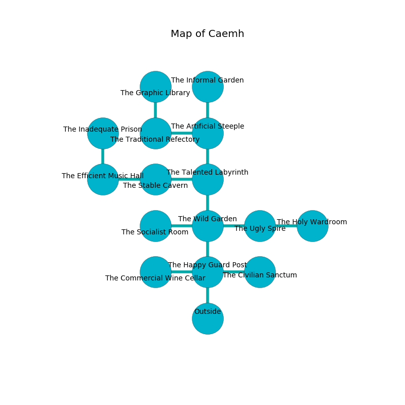

%Ruin Dogs

##Caemh
###Overview
Caemh is located on a crystal mountain. Regions of Caemh are foggy. A windstorm is happening outside. It is occupied by Gnolls. Ismael Carr The Clinging, a Cult Fanatic is here. The Gnolls are battling Ismael Carr The Clinging. He  is founding a new religion. 

###Artifact
####Laduiaed

Laduiaed is a powerful artifact in the shape of a glassy sphere. It smells like yuzu. It is a bright orange color. Air glows near it. When gazed upon it sings the hymn of the damned. 

###Locations

####the happy guard post
The wooden walls are caving in. The floor is sticky. There are two Gnolls and a Gnoll Pack Lord here. The air tastes like verbena here. One of the Gnolls is on watch, the rest are feasting. 

There is an engraving on a stone written in Gnolls Script. 

> Dear me! dire soul
>
> it is never whole
>
> but never flat
>
> nothing is fat
>

* To the west a flooded threshold connects to [the commercial wine cellar](#the-commercial-wine-cellar).
* To the east a windy cave connects to [the civilian sanctum](#the-civilian-sanctum).
* To the north a dripping gap connects to [the wild garden](#the-wild-garden).
* To the south is the entrance.

####the wild garden
The glass walls are caving in. There are a Gnoll and a Gnoll Pack Lord here. Green razorgrass is growing in cracks in the floor. The floor is cluttered with rocks. The Gnolls are sleeping. 

* To the west a dark opening opens to [the socialist room](#the-socialist-room).
* To the east a flooded path opens to [the ugly spire](#the-ugly-spire).
* To the north a long hall opens to [the talented labyrinth](#the-talented-labyrinth).
* To the south a dripping gap opens to [the happy guard post](#the-happy-guard-post).

####the ugly spire
The air tastes like macadamia here. There are a Kenku and an Ogre here. The floor is smooth. 

* To the west a flooded path leads to [the wild garden](#the-wild-garden).
* To the east a hazy pathway leads to [the holy wardroom](#the-holy-wardroom).

####the civilian sanctum
Green mushrooms are sprouting from the ceiling. There are a Vine Blight, a Tiger, and a Fire Snake here. 

* To the west a windy cave leads to [the happy guard post](#the-happy-guard-post).

####the talented labyrinth
The air smells like orangeflower here. Green moss is growing from the ceiling. 

* There is a cow here.
* To the west a dripping passageway leads to [the stable cavern](#the-stable-cavern).
* To the north a long cavern connects to [the artificial steeple](#the-artificial-steeple).
* To the south a long hall opens to [the wild garden](#the-wild-garden).

####the artificial steeple
White lichens are sprouting from the ceiling. The air smells like boysenberry here. There is a Gnoll Pack Lord here. The Gnoll Pack Lord is willing to negotiate. 

* To the west a dripping walkway connects to [the traditional refectory](#the-traditional-refectory).
* To the north a small opening opens to [the informal garden](#the-informal-garden).
* To the south a long cavern leads to [the talented labyrinth](#the-talented-labyrinth).

####the stable cavern
The glass walls are bloodstained. The floor is glossy. The air tastes like root here. There are two Gnolls and a Gnoll Pack Lord here. The Gnolls are crazy with bloodlust. 

* To the west a windy walkway opens to [the efficient music hall](#the-efficient-music-hall).
* To the east a dripping passageway opens to [the talented labyrinth](#the-talented-labyrinth).

####the informal garden
There are a Druid and a Piercer here. There is a trap here. When activated, a magical sound detector will launch a ceiling pendulum. The air tastes like phenolic here. 

* To the south a small opening opens to [the artificial steeple](#the-artificial-steeple).

####the commercial wine cellar
The air tastes like acai here. The crystal walls are bloodstained. There are a Badger, a Dust Mephit, a Commoner, a Baboon, and an Awakened Tree here. Red moss is growing in broken urns. 

There is an engraving on the ceiling written in Gnolls Script. 

> They are love
>
> but never relevant
>

* There is a rail here.
* To the east a flooded threshold connects to [the happy guard post](#the-happy-guard-post).

####the socialist room
Red lichens are sprouting in a patch on the floor. 

* To the east a dark opening leads to [the wild garden](#the-wild-garden).

####the efficient music hall
The concrete walls are covered in mold. The air smells like lemon here. Yellow mushrooms are decaying in a patch on the floor. 

* To the east a windy walkway connects to [the stable cavern](#the-stable-cavern).
* To the north a twisted passageway opens to [the inadequate prison](#the-inadequate-prison).

####the holy wardroom
The stone walls are covered in mold. The air tastes like cinnamon here. There is a trap here. When activated, a pressure plate will fire an acid arrow. Red moss is swaying in cracks in the floor. The floor is smooth. 

* [Ismael Carr The Clinging](#Ismael-Carr-The-Clinging) is here.
* To the west a hazy pathway connects to [the ugly spire](#the-ugly-spire).

####the traditional refectory
The floor is glossy. There is a Gnoll Pack Lord here. The mirrored walls are covered in mold. The Gnoll Pack Lord is willing to negotiate. 

There is an engraving on a stone written in common. 

> I thought about digging.
>

* There is a plow here.
* There is a girl here.
* [Laduiaed](#Laduiaed) is here.
* To the east a dripping walkway connects to [the artificial steeple](#the-artificial-steeple).
* To the north a small threshold connects to [the graphic library](#the-graphic-library).

####the inadequate prison
Red ferns are sprouting in cracks in the floor. The floor is cluttered with bones. The air tastes like lemongrass here. The crystal walls are ruined. 

* There is a wheel here.
* To the south a twisted passageway connects to [the efficient music hall](#the-efficient-music-hall).

####the graphic library
There is a Gnoll Pack Lord here. Blue ferns are swaying from the walls. The crystal walls are ruined. The air tastes like butterscotch here. The Gnoll Pack Lord is performing a ritual. If not interrupted, a powerful monster will be summoned. 

There is an engraving on a tablet written in Gnolls Script. 

> Leave at once.
>

* To the south a small threshold leads to [the traditional refectory](#the-traditional-refectory).

