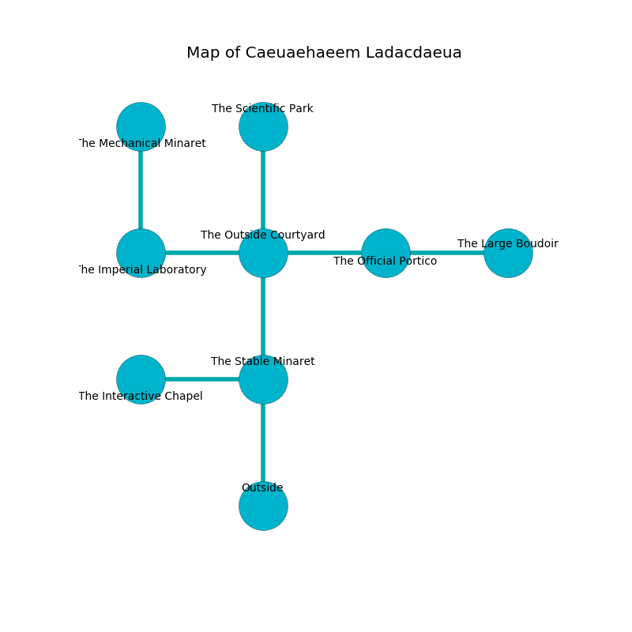

%Ruin Dogs

##Caeuaehaeem Ladacdaeua
###Overview
Caeuaehaeem Ladacdaeua is located in a cursed plain. Some rooms of Caeuaehaeem Ladacdaeua are foggy. The ruin is larger on the inside than the outside. It is occupied by Sprites. Hank Glass The Machiavellian, a Dryad is here. The Sprites are the soldiers of Hank Glass The Machiavellian. He  is trying to destroy [The Well Nun](#The-Well-Nun). 

###Artifact
####The Well Nun

The Well Nun has the form of a transparent rock. It smells like tomato. When thrown it destroys others. 

###Locations

####the stable minaret
Yellow ferns are growing in broken urns. The floor is cluttered with broken glass. There are a Hippogriff, an Ogre Zombie, two Camels, a Scout, and  here. The concrete walls are bloodstained. 

* [The Well Nun](#The-Well-Nun) is here.
* To the west a long pathway leads to [the interactive chapel](#the-interactive-chapel).
* To the north a dark passageway leads to [the outside courtyard](#the-outside-courtyard).
* To the south is the entrance.

####the outside courtyard
The floor is smooth. The air tastes like carrot seed here. The glass walls are ruined. 

* [Hank Glass The Machiavellian](#Hank-Glass-The-Machiavellian) is here.
* To the west a twisted opening opens to [the imperial laboratory](#the-imperial-laboratory).
* To the east a twisted passageway opens to [the official portico](#the-official-portico).
* To the north a dark pathway leads to [the scientific park](#the-scientific-park).
* To the south a dark passageway leads to [the stable minaret](#the-stable-minaret).

####the scientific park
The air tastes like osmanthus here. The floor is flooded with eight inch deep cold water. 

* To the south a dark pathway connects to [the outside courtyard](#the-outside-courtyard).

####the official portico
There are eight Sprites here. The wooden walls are unsettled. The floor is glossy. White razorgrass is growing in cracks in the floor. The Sprites are willing to negotiate. 

* To the west a twisted passageway leads to [the outside courtyard](#the-outside-courtyard).
* To the east a dripping cave leads to [the large boudoir](#the-large-boudoir).

####the imperial laboratory
The floor is sticky. There are eight Sprites here. The air tastes like cinnamon here. If the Sprites notice the Ruin Dogs, one of them will retreat and alert [Hank Glass](#Hank-Glass). 

* To the east a twisted opening opens to [the outside courtyard](#the-outside-courtyard).
* To the north a flooded hallway leads to [the mechanical minaret](#the-mechanical-minaret).

####the mechanical minaret
The air smells like feces here. The concrete walls are covered in mold. Gray moss is growing from the ceiling. 

* To the south a flooded hallway leads to [the imperial laboratory](#the-imperial-laboratory).

####the large boudoir
The concrete walls are caving in. Green ferns are decaying in broken urns. 

* To the west a dripping cave connects to [the official portico](#the-official-portico).

####the interactive chapel
Gray moss is sprouting in broken urns. The glass walls are caving in. The floor is smooth. 

There is an engraving on the wall written in common. 

> Dear me! terrible soul
>
> moving and whole
>
> it is never fast
>
> everything is last
>

* To the east a long pathway opens to [the stable minaret](#the-stable-minaret).

