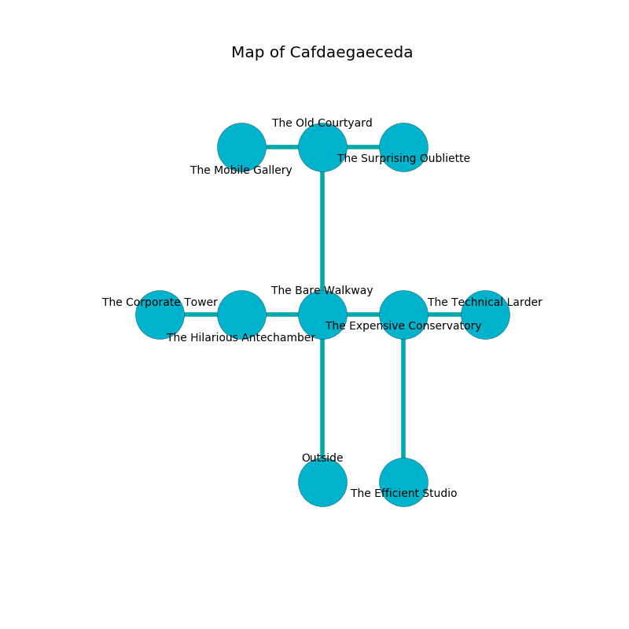

%Ruin Dogs

##Cafdaegaeceda
###Overview
Cafdaegaeceda is located on a giant rift. Some rooms of it are flooded. A battle between raiders is happening outside. It is occupied by Sahuagins. Bee Fish The Flirtatious, a Drow Mage is here. The Sahuagins are the minions of Bee Fish The Flirtatious. She  is founding a new religion. 

###Artifact
####Cumdfefwi Mahaecuddaf

Cumdfefwi Mahaecuddaf is a powerful artifact in the shape of a hard spear. It is a shifting white color. Cacophony incinerates away from it. When smelled it flies into the air. 

###Locations

####the bare walkway
The floor is cluttered with broken glass. The air smells like chamomile here. 

* There is a berry here.
* To the west a twisted gap connects to [the hilarious antechamber](#the-hilarious-antechamber).
* To the east a long opening opens to [the expensive conservatory](#the-expensive-conservatory).
* To the north a dripping walkway leads to [the old courtyard](#the-old-courtyard).
* To the south is the entrance.

####the expensive conservatory
There are an Earth Elemental, a Killer Whale, and a Griffon here. There is a trap here. When activated, a magical rune will cast a curse. The metallic walls are unsettled. The air smells like mustard here. Yellow moss is growing in cracks in the floor. 

* To the west a long opening connects to [the bare walkway](#the-bare-walkway).
* To the east a small pathway connects to [the technical larder](#the-technical-larder).
* To the south a narrow hallway opens to [the efficient studio](#the-efficient-studio).

####the hilarious antechamber
There are four Sahuagin Priestesses here. The floor is bloodstained. The Sahuagins are willing to fight to the death. 

* [Bee Fish The Flirtatious](#Bee-Fish-The-Flirtatious) is here.
* To the west a small opening connects to [the corporate tower](#the-corporate-tower).
* To the east a twisted gap opens to [the bare walkway](#the-bare-walkway).

####the technical larder
White lichens are swaying in broken urns. 

There is an engraving on a tablet written in common. 

> We are cursed
>
> indigenous, likely, green
>
> We are cursed
>

* There is a nail here.
* To the west a small pathway leads to [the expensive conservatory](#the-expensive-conservatory).

####the corporate tower
Blue lichens are growing in broken urns. The air smells like kiwi here. 

* To the east a small opening leads to [the hilarious antechamber](#the-hilarious-antechamber).

####the efficient studio
The floor is bloodstained. The wooden walls are bloodstained. Blue mushrooms are growing from the ceiling. 

* To the north a narrow hallway leads to [the expensive conservatory](#the-expensive-conservatory).

####the old courtyard
The air tastes like wine here. There are a Weretiger and an Air Elemental here. The crystal walls are pristine. The floor is flooded with four inch deep lukewarm water. 

* [Cumdfefwi Mahaecuddaf](#Cumdfefwi-Mahaecuddaf) is here.
* To the west a windy corridor opens to [the mobile gallery](#the-mobile-gallery).
* To the east a dripping opening connects to [the surprising oubliette](#the-surprising-oubliette).
* To the south a dripping walkway leads to [the bare walkway](#the-bare-walkway).

####the mobile gallery
The air smells like linden flower here. 

* To the east a windy corridor leads to [the old courtyard](#the-old-courtyard).

####the surprising oubliette
The floor is smooth. The air smells like raisin here. 

* To the west a dripping opening opens to [the old courtyard](#the-old-courtyard).

