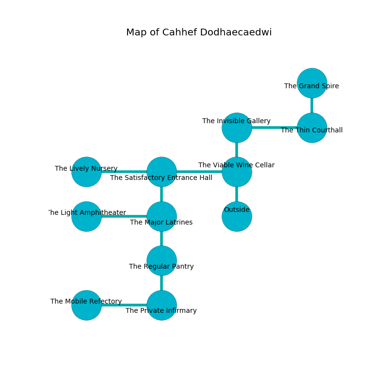

%Ruin Dogs

##Cahhef Dodhaecaedwi
###Overview
Cahhef Dodhaecaedwi is constructed on a ruined tree. Some areas of Cahhef Dodhaecaedwi are cursed. The ruin is sinking into the earth. It is occupied by Orc. Alexander Stuart The Truculent, a Stone Giant is here. The Orc are battling Alexander Stuart The Truculent. He  is founding a new religion. 

###Artifact
####Faiohd Haed

Faiohd Haed is a powerful artifact in the shape of a transparent sphere. It is a pale black color. Fire slides away from it. When worshipped it changes probabilities. 

###Locations

####the viable wine cellar
The obsidion walls are unsettled. The floor is cluttered with shells. 

* To the west a small opening connects to [the satisfactory entrance hall](#the-satisfactory-entrance-hall).
* To the north a hazy pathway connects to [the invisible gallery](#the-invisible-gallery).
* To the south is the entrance.

####the satisfactory entrance hall
The glass walls are bloodstained. The floor is smooth. Green lichens are sprouting in broken urns. There are fourteen Orcs here. One of the Orc is working a mechanism that can flood the room. 

* To the west a twisted walkway opens to [the lively nursery](#the-lively-nursery).
* To the east a small opening connects to [the viable wine cellar](#the-viable-wine-cellar).
* To the south a flooded cavern leads to [the major latrines](#the-major-latrines).

####the invisible gallery
There are a Giant Ape and a Gelatinous Cube here. Yellow moss is sprouting in cracks in the floor. There is a trap here. When activated, a tripwire will launch stone blocks from the ceiling. 

* There is a chain here.
* There is a face here.
* To the east a dark cavern opens to [the thin courthall](#the-thin-courthall).
* To the south a hazy pathway opens to [the viable wine cellar](#the-viable-wine-cellar).

####the thin courthall
The concrete walls are ruined. There are fourteen Orcs here. The air tastes like wax here. If the Orc notice the Ruin Dogs, one of them will retreat and alert the others. 

* There is a crossbow here.
* To the west a dark cavern connects to [the invisible gallery](#the-invisible-gallery).
* To the north a windy gap connects to [the grand spire](#the-grand-spire).

####the lively nursery
The metallic walls are pristine. The air smells like myrrh here. There are a Darkmantle, a Wererat, a Mimic, and a Grick Alpha here. 

* To the east a twisted walkway leads to [the satisfactory entrance hall](#the-satisfactory-entrance-hall).

####the grand spire
Gray mushrooms are sprouting in a patch on the floor. The floor is sticky. The mirrored walls are pristine. There are a Tridrone, a Magmin, an Ice Mephit, a Xorn, a Deer, and a Priest here. The air tastes like lily of the valley here. 

* To the south a windy gap leads to [the thin courthall](#the-thin-courthall).

####the major latrines
The brick walls are bloodstained. The floor is bloodstained. 

* To the west a small artery opens to [the light amphitheater](#the-light-amphitheater).
* To the north a flooded cavern connects to [the satisfactory entrance hall](#the-satisfactory-entrance-hall).
* To the south a narrow pathway connects to [the regular pantry](#the-regular-pantry).

####the regular pantry
The obsidion walls are caving in. Blue moss is growing in a patch on the floor. The air smells like pear here. The floor is smooth. 

* To the north a narrow pathway opens to [the major latrines](#the-major-latrines).
* To the south a twisted opening opens to [the private infirmary](#the-private-infirmary).

####the light amphitheater
The wooden walls are bloodstained. Blue moss is sprouting from the walls. The floor is sticky. 

* [Alexander Stuart The Truculent](#Alexander-Stuart-The-Truculent) is here.
* To the east a small artery connects to [the major latrines](#the-major-latrines).

####the private infirmary
The glass walls are caving in. There are a Veteran, a Hippogriff, a Blood Hawk, a Panther, a Half-Ogre, and a Green Dragon Wyrmling here. The air tastes like honey here. Blue mushrooms are swaying in a patch on the floor. 

* There is a blade here.
* [Faiohd Haed](#Faiohd-Haed) is here.
* To the west a twisted opening connects to [the mobile refectory](#the-mobile-refectory).
* To the north a twisted opening opens to [the regular pantry](#the-regular-pantry).

####the mobile refectory
There are fourteen Orcs here. The air smells like gas here. Yellow lichens are growing from the ceiling. The crystal walls are scratched. If the Orc notice the Ruin Dogs, one of them will retreat and alert [Alexander Stuart](#Alexander-Stuart). 

* To the east a twisted opening connects to [the private infirmary](#the-private-infirmary).

