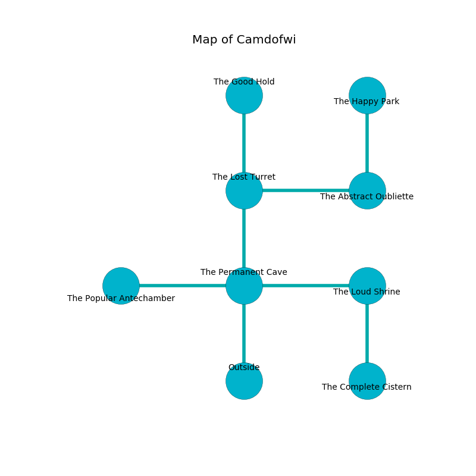

%Ruin Dogs

##Camdofwi
###Overview
Camdofwi is constructed on a poisoned mountain. Some rooms of it are foggy. A massive storm is happening outside. It is occupied by Lizardfolk. Kasandra Thibodeau The Dishonest, a Succubus is here. The Lizardfolk are battling Kasandra Thibodeau The Dishonest. She  is founding a new religion. 

###Artifact
####Dfudafdwi

Dfudafdwi looks like a soft prism. Psychic energy flows around it. When rubbed it become energized with a powerful vibration. 

###Locations

####the permanent cave
The floor is sticky. The concrete walls are scratched. 

There is an engraving on a monolith written in common. 

> All of us are joyful
>
> always jealous
>
> You are envious
>
> yet never gregarious
>
> All of us are joyful
>

* To the west a windy gap connects to [the popular antechamber](#the-popular-antechamber).
* To the east a torchlit walkway leads to [the loud shrine](#the-loud-shrine).
* To the north a small gap leads to [the lost turret](#the-lost-turret).
* To the south is the entrance.

####the popular antechamber
The mirrored walls are ruined. Gray mushrooms are growing from the walls. The floor is sticky. 

* To the east a windy gap leads to [the permanent cave](#the-permanent-cave).

####the lost turret
The air tastes like burnt butter here. There are two Lizardfolk Shamans here. Blue razorgrass is decaying from the walls. The glass walls are bloodstained. The Lizardfolk are berserk with rage. 

* To the east a torchlit cave connects to [the abstract oubliette](#the-abstract-oubliette).
* To the north a flooded walkway connects to [the good hold](#the-good-hold).
* To the south a small gap connects to [the permanent cave](#the-permanent-cave).

####the good hold
The air smells like buttery	cabbage here. The metallic walls are covered in mold. There are a Wererat, a Scorpion, and a Lizardfolk Shaman here. 

* To the south a flooded walkway connects to [the lost turret](#the-lost-turret).

####the abstract oubliette
The air tastes like yuzu here. The crystal walls are bloodstained. 

* [Dfudafdwi](#Dfudafdwi) is here.
* To the west a torchlit cave opens to [the lost turret](#the-lost-turret).
* To the north a twisted cave leads to [the happy park](#the-happy-park).

####the loud shrine
There are a Lizardfolk Shaman and two Lizardfolk here. Blue lichens are decaying in cracks in the floor. The air smells like almond here. The concrete walls are unsettled. The Lizardfolk are willing to negotiate. 

* To the west a torchlit walkway connects to [the permanent cave](#the-permanent-cave).
* To the south a long path opens to [the complete cistern](#the-complete-cistern).

####the complete cistern
The floor is flooded with nine inch deep cool water. 

* There is a tree here.
* [Kasandra Thibodeau The Dishonest](#Kasandra-Thibodeau-The-Dishonest) is here.
* To the north a long path opens to [the loud shrine](#the-loud-shrine).

####the happy park
The air smells like peppermint here. Green ferns are growing in cracks in the floor. The mirrored walls are ruined. 

* There is a hare here.
* To the south a twisted cave opens to [the abstract oubliette](#the-abstract-oubliette).

