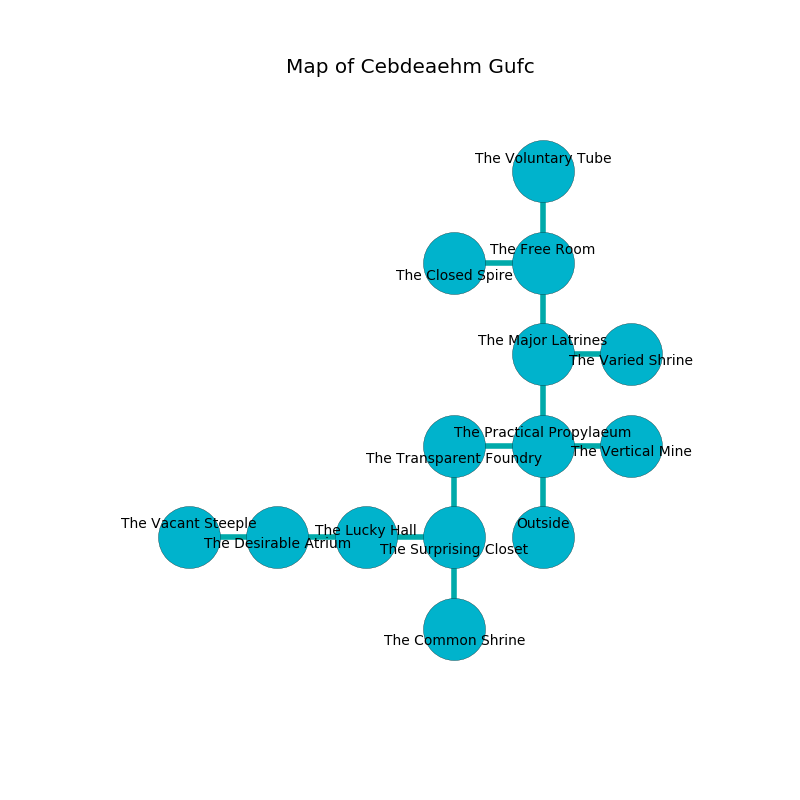

%Ruin Dogs

##Cebdeaehm Gufc
###Overview
Cebdeaehm Gufc is located in an alien plain. Regions of Cebdeaehm Gufc are cursed. The ruin is coming to life. It is occupied by Githzerai. Josue Ferreira The Aggressive, a Fire Giant is here. The Githzerai worship Josue Ferreira The Aggressive. He  is founding a new religion. 

###Artifact
####Cuggaa Dufdfeaed

Cuggaa Dufdfeaed looks like a transparent blade. It smells like whiskey. It is a shifting brown color. When rubbed it changes probabilities. 

###Locations

####the practical propylaeum
The stone walls are ruined. The floor is bloodstained. 

* To the west a twisted threshold leads to [the transparent foundry](#the-transparent-foundry).
* To the east a narrow threshold leads to [the vertical mine](#the-vertical-mine).
* To the north a flooded cave connects to [the major latrines](#the-major-latrines).
* To the south is the entrance.

####the transparent foundry
The floor is sticky. The air smells like cologne here. There is a trap here. When activated, a tripwire will swing a tripping chain. There are five Githzerai Monks here. Yellow razorgrass is sprouting in a patch on the floor. One of the Githzerai is on watch, the rest are meditating. 

* There is an orb here.
* [Josue Ferreira The Aggressive](#Josue-Ferreira-The-Aggressive) is here.
* To the east a twisted threshold connects to [the practical propylaeum](#the-practical-propylaeum).
* To the south a small pathway connects to [the surprising closet](#the-surprising-closet).

####the surprising closet
The air tastes like chamomile here. There are a Ghoul, a Phase Spider, a Giant Crocodile, and a Githzerai Monk here. Blue ferns are growing from the walls. 

* To the west a flooded threshold connects to [the lucky hall](#the-lucky-hall).
* To the north a small pathway connects to [the transparent foundry](#the-transparent-foundry).
* To the south a dripping gap opens to [the common shrine](#the-common-shrine).

####the major latrines
Yellow lichens are sprouting from the ceiling. 

* To the east a twisted cavern opens to [the varied shrine](#the-varied-shrine).
* To the north a twisted corridor opens to [the free room](#the-free-room).
* To the south a flooded cave leads to [the practical propylaeum](#the-practical-propylaeum).

####the varied shrine
The metallic walls are caving in. 

* There is a shoe here.
* To the west a twisted cavern connects to [the major latrines](#the-major-latrines).

####the lucky hall
Blue mushrooms are decaying from the walls. The brick walls are pristine. 

* To the west a flooded walkway opens to [the desirable atrium](#the-desirable-atrium).
* To the east a flooded threshold connects to [the surprising closet](#the-surprising-closet).

####the vertical mine
The floor is sticky. There are a Kuo-Toa Monitor, a Young Gold Dragon, and a Swarm of Ravens here. The mirrored walls are caving in. 

There is an engraving on the ceiling written in Githzerai Script. 

> Poor me! sorry god
>
> it is always democratic
>
> it is always odd
>
> fate is systematic
>

* There is a salamander here.
* To the west a narrow threshold leads to [the practical propylaeum](#the-practical-propylaeum).

####the desirable atrium
The floor is sticky. Gray razorgrass is decaying from the walls. The air smells like foliage here. 

* There is a hammer here.
* To the west a torchlit hallway leads to [the vacant steeple](#the-vacant-steeple).
* To the east a flooded walkway connects to [the lucky hall](#the-lucky-hall).

####the free room
The floor is glossy. Gray razorgrass is decaying in broken urns. The mirrored walls are unsettled. There are a Giant Rat, a Werebear, a Barbed Devil, and a Flying Snake here. 

* [Cuggaa Dufdfeaed](#Cuggaa-Dufdfeaed) is here.
* To the west a twisted hallway leads to [the closed spire](#the-closed-spire).
* To the north a hazy pathway connects to [the voluntary tube](#the-voluntary-tube).
* To the south a twisted corridor leads to [the major latrines](#the-major-latrines).

####the vacant steeple
There are five Githzerai Monks here. The metallic walls are bloodstained. The floor is smooth. White ferns are sprouting from the walls. The air smells like dairy here. If the Githzerai notice the Ruin Dogs, one of them will retreat and alert [Josue Ferreira](#Josue-Ferreira). 

* To the east a torchlit hallway connects to [the desirable atrium](#the-desirable-atrium).

####the common shrine
The air tastes like green tea here. The glass walls are pristine. There are a Blink Dog, a Cult Fanatic, an Old Faerie Dragon, a Giant Spider, a Thri-Kreen, a Quadrone, and a Bearded Devil here. Red moss is swaying from the walls. 

* To the north a dripping gap connects to [the surprising closet](#the-surprising-closet).

####the closed spire
The air smells like frankincense here. There are a Grick Alpha, a Silver Dragon Wyrmling, and a Half-Ogre here. 

* There is a snake here.
* There is a collar here.
* To the east a twisted hallway connects to [the free room](#the-free-room).

####the voluntary tube
The wooden walls are scratched. 

* To the south a hazy pathway opens to [the free room](#the-free-room).

