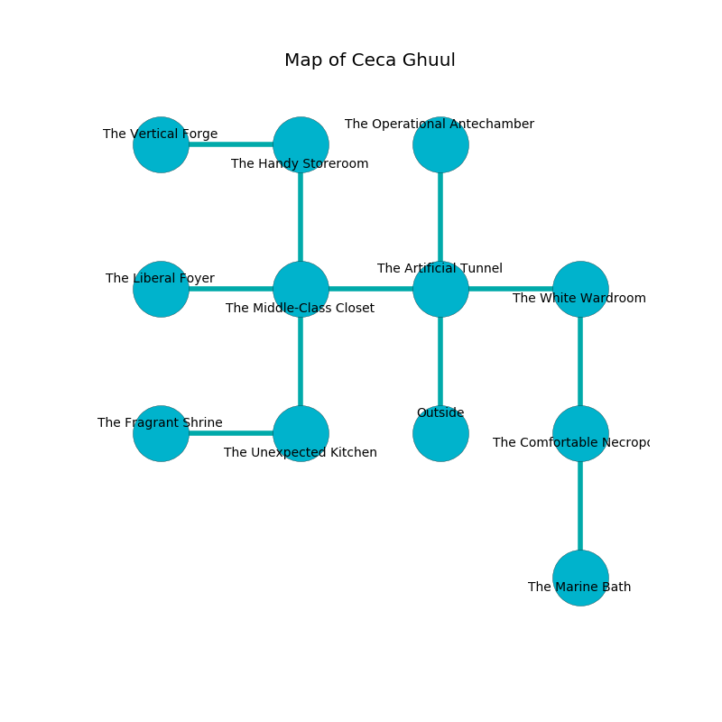

%Ruin Dogs

##Ceca Ghuul
###Overview
Ceca Ghuul is located under an obsidion plain. Regions of Ceca Ghuul are corrupted. The ruin is sinking into the earth. It is occupied by Deep Gnomes. Mason Whyte The Boring, a Knight is here. The Deep Gnomes are battling Mason Whyte The Boring. He  is trying to understand [The Powerful Flavour](#The-Powerful-Flavour). 

###Artifact
####The Powerful Flavour

The Powerful Flavour is a powerful artifact in the shape of a transparent spear. Psychic energy slides around it. It is a medium gray color. When gazed upon it levitates surrounding objects. 

###Locations

####the artificial tunnel
Yellow moss is sprouting from the ceiling. 

* To the west a dark passageway connects to [the middle-class closet](#the-middle-class-closet).
* To the east a flooded hall leads to [the white wardroom](#the-white-wardroom).
* To the north a hazy hallway opens to [the operational antechamber](#the-operational-antechamber).
* To the south is the entrance.

####the operational antechamber
Red razorgrass is growing in a patch on the floor. The air smells like tagette here. 

There is an engraving on a monolith written in common. 

> I am looting Ceca Ghuul.
>

* To the south a hazy hallway connects to [the artificial tunnel](#the-artificial-tunnel).

####the middle-class closet
The floor is sticky. The air tastes like allspice here. There are eight Deep Gnomes here. The Deep Gnomes are fighting amongst themselves. 

* To the west a torchlit path opens to [the liberal foyer](#the-liberal-foyer).
* To the east a dark passageway opens to [the artificial tunnel](#the-artificial-tunnel).
* To the north a dripping gap opens to [the handy storeroom](#the-handy-storeroom).
* To the south a windy threshold connects to [the unexpected kitchen](#the-unexpected-kitchen).

####the liberal foyer
The floor is flooded with one inch deep scalding water. The brick walls are unsettled. 

* [Mason Whyte The Boring](#Mason-Whyte-The-Boring) is here.
* To the east a torchlit path leads to [the middle-class closet](#the-middle-class-closet).

####the white wardroom
The air smells like nut skin here. The floor is bloodstained. Gray lichens are growing in cracks in the floor. 

* There is a bowl here.
* To the west a flooded hall leads to [the artificial tunnel](#the-artificial-tunnel).
* To the south a windy passageway connects to [the comfortable necropolis](#the-comfortable-necropolis).

####the handy storeroom
The air tastes like patchouli here. The floor is glossy. Green moss is swaying in broken urns. 

* There is a hare here.
* To the west a dripping passageway connects to [the vertical forge](#the-vertical-forge).
* To the south a dripping gap connects to [the middle-class closet](#the-middle-class-closet).

####the unexpected kitchen
The air smells like privet here. The floor is smooth. Yellow lichens are swaying in a patch on the floor. The stone walls are unsettled. 

There is an engraving on a stone written in Deep Gnomes Script. 

> I lost [The Powerful Flavour](#The-Powerful-Flavour).
>

* To the west a narrow hallway opens to [the fragrant shrine](#the-fragrant-shrine).
* To the north a windy threshold opens to [the middle-class closet](#the-middle-class-closet).

####the fragrant shrine
The air tastes like petitgrain here. The floor is sticky. The mirrored walls are caving in. 

* To the east a narrow hallway opens to [the unexpected kitchen](#the-unexpected-kitchen).

####the comfortable necropolis
The air smells like peach here. There are eight Deep Gnomes here. Red moss is decaying in a patch on the floor. The floor is sticky. One of the Deep Gnomes is pointing a ballista at the entrance. 

* [The Powerful Flavour](#The-Powerful-Flavour) is here.
* To the north a windy passageway opens to [the white wardroom](#the-white-wardroom).
* To the south a dark pathway connects to [the marine bath](#the-marine-bath).

####the vertical forge
Gray lichens are decaying in a patch on the floor. The crystal walls are ruined. There are eight Deep Gnomes here. If the Deep Gnomes notice the Ruin Dogs, one of them will retreat and alert the others. 

There is an engraving on the ceiling written in common. 

> [The Powerful Flavour](#The-Powerful-Flavour)
>
> unlikely, stunning, still
>
> comprehensive, academic, definite
>
> We are free
>
> empty and joint
>

* There is a bridge here.
* To the east a dripping passageway connects to [the handy storeroom](#the-handy-storeroom).

####the marine bath
The air smells like tea here. Red ferns are decaying from the ceiling. 

There is an engraving on a stone written in common. 

> I worship [The Powerful Flavour](#The-Powerful-Flavour).
>

* To the north a dark pathway opens to [the comfortable necropolis](#the-comfortable-necropolis).

