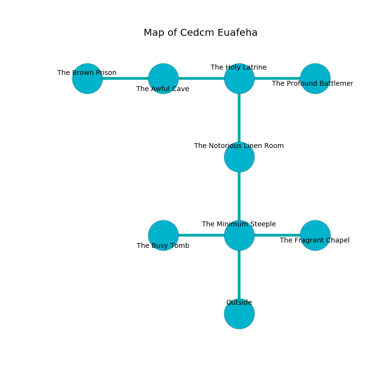

%Ruin Dogs

##Cedcm Euafeha
###Overview
Cedcm Euafeha is located on a cursed city. Some areas of Cedcm Euafeha are inaccessible. A lunar eclipse is happening outside. It is occupied by Quaggoths. Gustavo Lashley The Possessive, a Fire Giant is here. The Quaggoths have been charmed by Gustavo Lashley The Possessive. He  is founding a new religion. 

###Artifact
####Decum

Decum has the form of a hard orb. Psychic energy shifts from it. It smells like sandalwood. When gazed upon it flies into the air. 

###Locations

####the minimum steeple
White lichens are growing in broken urns. The floor is sticky. The air tastes like marjoram here. 

* There is a map here.
* There is a picture here.
* There is a sponge here.
* To the west a small cave connects to [the busy tomb](#the-busy-tomb).
* To the east a dark cavern connects to [the fragrant chapel](#the-fragrant-chapel).
* To the north a dripping passageway leads to [the notorious linen room](#the-notorious-linen-room).
* To the south is the entrance.

####the notorious linen room
Blue moss is sprouting in broken urns. 

* To the north a long path opens to [the holy latrine](#the-holy-latrine).
* To the south a dripping passageway leads to [the minimum steeple](#the-minimum-steeple).

####the holy latrine
The glass walls are pristine. 

There is an engraving on a tablet written in common. 

> Oh meak soul
>
> notorious and whole
>
> appropriate, constitutional, full
>
> all is whole
>

* To the west a dark hallway opens to [the awful cave](#the-awful-cave).
* To the east a long artery leads to [the profound battlement](#the-profound-battlement).
* To the south a long path leads to [the notorious linen room](#the-notorious-linen-room).

####the profound battlement
Yellow razorgrass is swaying in broken urns. The floor is flooded with four inch deep lukewarm water. The air tastes like wine here. There are a Quaggoth Thonot and three Quaggoths here. There is a trap here. When activated, a magical rune will open a large pit in the floor. One of the Quaggoths is on watch, the rest are meditating. 

There is an engraving on the wall written in Quaggoths Script. 

> O sad you
>
> it is never occupational
>
> it is always true
>
> fate is operational
>

* [Gustavo Lashley The Possessive](#Gustavo-Lashley-The-Possessive) is here.
* To the west a long artery leads to [the holy latrine](#the-holy-latrine).

####the awful cave
The floor is flooded with three inch deep lukewarm water. White ferns are growing in a patch on the floor. The glass walls are unsettled. The air smells like wintergreen here. 

* [Decum](#Decum) is here.
* To the west a long hallway opens to [the brown prison](#the-brown-prison).
* To the east a dark hallway opens to [the holy latrine](#the-holy-latrine).

####the fragrant chapel
There is a trap here. When activated, a magical sound detector will open a large pit in the floor. The air tastes like white chocolate here. There are three Quaggoth Thonots and a Quaggoth here. The floor is cluttered with rocks. Green mushrooms are swaying in a patch on the floor. The Quaggoths are willing to negotiate. 

There is an engraving on the floor written in common. 

> You are damned
>
> deadly and monstrous
>
> [Decum](#Decum)
>
> yet never intermediate
>
> yet commercial
>
> [Decum](#Decum)
>
> established and single
>
> [Decum](#Decum)
>
> written, large, comfortable
>

* To the west a dark cavern leads to [the minimum steeple](#the-minimum-steeple).

####the busy tomb
The air smells like tomato here. Blue lichens are growing in broken urns. The mirrored walls are unsettled. The floor is bloodstained. 

* To the east a small cave opens to [the minimum steeple](#the-minimum-steeple).

####the brown prison
Red ferns are growing from the ceiling. The floor is glossy. The air smells like bread crust here. 

* To the east a long hallway opens to [the awful cave](#the-awful-cave).

