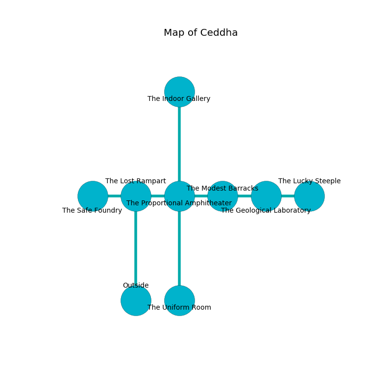

%Ruin Dogs

##Ceddha
###Overview
Ceddha is located in a ruined mountain. Some areas of it are flooded. A massive storm is happening outside. It is occupied by Troglodytes. Felipe Harvey The Moody, a Cloud Giant is here. The Troglodytes are the minions of Felipe Harvey The Moody. He  is trying to find [Mufaesum](#Mufaesum). 

###Artifact
####Mufaesum

Mufaesum has the form of a wet cube. It smells like ozone. Water pours away from it. When worn it floats above the ground. 

###Locations

####the lost rampart
There are a Grick Alpha and a Black Pudding here. The obsidion walls are unsettled. The air smells like corn here. 

* To the west a torchlit cave leads to [the safe foundry](#the-safe-foundry).
* To the east a small opening connects to [the proportional amphitheater](#the-proportional-amphitheater).
* To the south is the entrance.

####the proportional amphitheater
The obsidion walls are covered in mold. 

* To the west a small opening opens to [the lost rampart](#the-lost-rampart).
* To the east a dark hallway connects to [the modest barracks](#the-modest-barracks).
* To the north a dark threshold leads to [the indoor gallery](#the-indoor-gallery).
* To the south a small hallway connects to [the uniform room](#the-uniform-room).

####the uniform room
Blue moss is growing in a patch on the floor. There are forty Troglodytes here. If the Troglodytes notice the Ruin Dogs, one of them will retreat and alert [Felipe Harvey](#Felipe-Harvey). 

* There is a door here.
* To the north a small hallway connects to [the proportional amphitheater](#the-proportional-amphitheater).

####the indoor gallery
The floor is smooth. There are a Badger, a Vampire Spawn, a Merfolk, a Giant Centipede, a Carrion Crawler, a Flumph, and a Shambling Mound here. 

* To the south a dark threshold leads to [the proportional amphitheater](#the-proportional-amphitheater).

####the modest barracks
The glass walls are bloodstained. 

* To the west a dark hallway connects to [the proportional amphitheater](#the-proportional-amphitheater).
* To the east a long gap connects to [the geological laboratory](#the-geological-laboratory).

####the safe foundry

There is an engraving on a tablet written in Troglodytes Script. 

> I tried dying.
>

* To the east a torchlit cave connects to [the lost rampart](#the-lost-rampart).

####the geological laboratory
The floor is bloodstained. There are forty Troglodytes here. The mirrored walls are unsettled. The Troglodytes are fighting amongst themselves. 

* [Mufaesum](#Mufaesum) is here.
* [Felipe Harvey The Moody](#Felipe-Harvey-The-Moody) is here.
* To the west a long gap connects to [the modest barracks](#the-modest-barracks).
* To the east a small gap opens to [the lucky steeple](#the-lucky-steeple).

####the lucky steeple
The air tastes like allspice here. There is a trap here. When activated, a magical rune will open a large pit in the floor. 

There is an engraving on the floor written in common. 

> I found [Mufaesum](#Mufaesum).
>

* There is a church here.
* There is a picture here.
* To the west a small gap leads to [the geological laboratory](#the-geological-laboratory).

