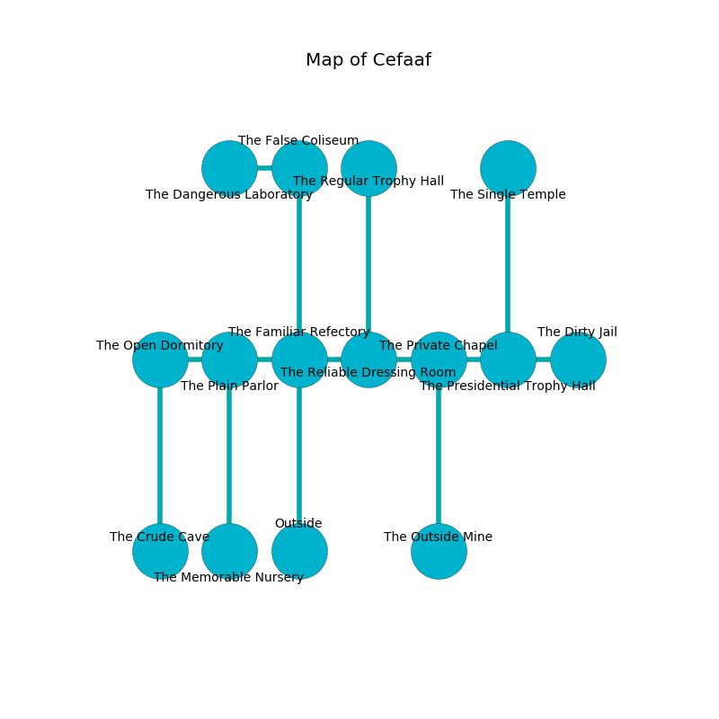

%Ruin Dogs

##Cefaaf
###Overview
Cefaaf is constructed on an obsidion city. Some rooms of it are unbearably cold. The ruin is sinking into the earth. It is occupied by Sprites. Chang Atwell The Clinging, a Cult Fanatic is here. The Sprites are the minions of Chang Atwell The Clinging. He  is founding a new religion. 

###Artifact
####The Noble Issue

The Noble Issue has the form of a warm crystal. When carried it grants a wish. 

###Locations

####the familiar refectory
Red ferns are decaying from the ceiling. The floor is cluttered with debris. The crystal walls are caving in. There are eight Sprites here. The Sprites are performing a ritual. If not interrupted, the ruin dogs will be weakened. 

* To the west a small threshold connects to [the plain parlor](#the-plain-parlor).
* To the east a dark pathway opens to [the reliable dressing room](#the-reliable-dressing-room).
* To the north a small cave opens to [the false coliseum](#the-false-coliseum).
* To the south is the entrance.

####the reliable dressing room
The air smells like lettuce here. The floor is glossy. 

* To the west a dark pathway leads to [the familiar refectory](#the-familiar-refectory).
* To the east a small threshold opens to [the private chapel](#the-private-chapel).
* To the north a small artery connects to [the regular trophy hall](#the-regular-trophy-hall).

####the regular trophy hall
The glass walls are scratched. 

There is an engraving on the floor written in Sprites Script. 

> I discovered [The Noble Issue](#The-Noble-Issue).
>
> Dig here.
>

* To the south a small artery opens to [the reliable dressing room](#the-reliable-dressing-room).

####the plain parlor
The wooden walls are unsettled. There are eight Sprites here. The floor is bloodstained. The Sprites are performing a ritual. If not interrupted, a powerful monster will be summoned. 

* There is a skull here.
* There is a cup here.
* There is a comb here.
* To the west a torchlit corridor opens to [the open dormitory](#the-open-dormitory).
* To the east a small threshold leads to [the familiar refectory](#the-familiar-refectory).
* To the south a small cave opens to [the memorable nursery](#the-memorable-nursery).

####the memorable nursery
The floor is cluttered with broken glass. White moss is swaying in broken urns. 

* To the north a small cave connects to [the plain parlor](#the-plain-parlor).

####the private chapel
The concrete walls are ruined. There are eight Sprites here. The air smells like pumpkin here. The floor is bloodstained. White mushrooms are decaying in a patch on the floor. The Sprites are performing a ritual. If not interrupted, [Chang Atwell](#Chang-Atwell) will be magically alarmed. 

There is an engraving on a tablet written in common. 

> Go away.
>

* To the west a small threshold leads to [the reliable dressing room](#the-reliable-dressing-room).
* To the east a hazy opening opens to [the presidential trophy hall](#the-presidential-trophy-hall).
* To the south a windy gap leads to [the outside mine](#the-outside-mine).

####the outside mine
The air smells like smoke here. There are eight Sprites here. Green lichens are sprouting in cracks in the floor. If the Sprites notice the Ruin Dogs, one of them will retreat and alert [Chang Atwell](#Chang-Atwell). 

* There is a rod here.
* To the north a windy gap connects to [the private chapel](#the-private-chapel).

####the false coliseum
Gray razorgrass is decaying in cracks in the floor. The mirrored walls are scratched. 

* To the west a long passageway connects to [the dangerous laboratory](#the-dangerous-laboratory).
* To the south a small cave leads to [the familiar refectory](#the-familiar-refectory).

####the dangerous laboratory
The glass walls are scratched. The floor is cluttered with rocks. 

There is an engraving on the wall written in common. 

> A circle is a t-shirt
>
> patient and loose
>
> A board is a grandfather
>
> always lively
>

* There is a spear here.
* There is a spear here.
* To the east a long passageway leads to [the false coliseum](#the-false-coliseum).

####the open dormitory
The obsidion walls are scratched. The floor is flooded with one inch deep cool water. Red lichens are sprouting in cracks in the floor. 

* To the east a torchlit corridor leads to [the plain parlor](#the-plain-parlor).
* To the south a hazy walkway leads to [the crude cave](#the-crude-cave).

####the presidential trophy hall
The air smells like clam here. White moss is swaying from the ceiling. There are eight Sprites here. The Sprites are willing to negotiate. 

There is an engraving on the ceiling written in Sprites Script. 

> A lip is a date
>
> tight and color-blind
>
> public and daily
>
> relevant and civilian
>
> valuable and respectable
>

* There is a card here.
* [The Noble Issue](#The-Noble-Issue) is here.
* To the west a hazy opening leads to [the private chapel](#the-private-chapel).
* To the east a long artery leads to [the dirty jail](#the-dirty-jail).
* To the north a small walkway leads to [the single temple](#the-single-temple).

####the crude cave
There are eight Sprites here. The concrete walls are bloodstained. The air tastes like peony here. The Sprites are performing a ritual. If not interrupted, the ruin dogs will be weakened. 

* To the north a hazy walkway opens to [the open dormitory](#the-open-dormitory).

####the dirty jail
The obsidion walls are scratched. White mushrooms are growing in a patch on the floor. 

* There is a leaf here.
* To the west a long artery connects to [the presidential trophy hall](#the-presidential-trophy-hall).

####the single temple
The floor is sticky. The air tastes like fougere here. The stone walls are scratched. 

There is an engraving on a monolith written in common. 

> Hide here.
>

* [Chang Atwell The Clinging](#Chang-Atwell-The-Clinging) is here.
* To the south a small walkway leads to [the presidential trophy hall](#the-presidential-trophy-hall).

