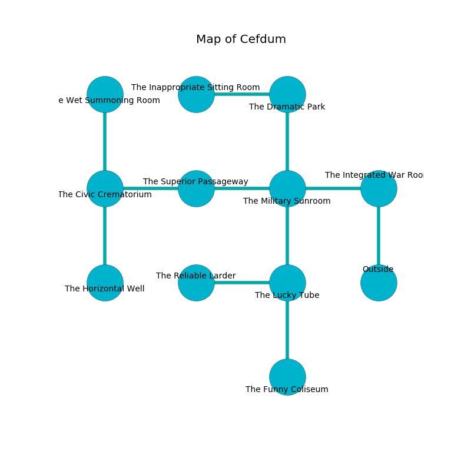

%Ruin Dogs

##Cefdum
###Overview
Cefdum is located in a giant mountain. Parts of Cefdum are cursed. The ruin is sinking into the earth. It is occupied by Sprites. Jarred Albright The Dishonest, a Cloud Giant is here. The Sprites have been charmed by Jarred Albright The Dishonest. He  is founding a new religion. 

###Artifact
####Deiiiaufl Haehwi

Deiiiaufl Haehwi has the form of a soft rock. It smells like kumquat. When rubbed it changes the past. 

###Locations

####the integrated war Room

* There is a dragon here.
* To the west a windy pathway connects to [the military sunroom](#the-military-sunroom).
* To the south is the entrance.

####the military sunroom
The air tastes like hazelnut here. 

* There is a snake here.
* There is a sheep here.
* To the west a flooded hallway connects to [the superior passageway](#the-superior-passageway).
* To the east a windy pathway connects to [the integrated war Room](#the-integrated-war-Room).
* To the north a twisted cave connects to [the dramatic park](#the-dramatic-park).
* To the south a windy cavern connects to [the lucky tube](#the-lucky-tube).

####the lucky tube
The air tastes like wine here. Green lichens are growing from the ceiling. 

* There is a brake here.
* To the west a windy passageway opens to [the reliable larder](#the-reliable-larder).
* To the north a windy cavern opens to [the military sunroom](#the-military-sunroom).
* To the south a small hall opens to [the funny coliseum](#the-funny-coliseum).

####the funny coliseum
There are thirty six Sprites here. The concrete walls are bloodstained. The floor is smooth. The Sprites are performing a ritual. If not interrupted, [Jarred Albright](#Jarred-Albright) will be magically alarmed. 

There is an engraving on a stone written in Sprites Script. 

> We are love
>
> tropical and minor
>

* To the north a small hall connects to [the lucky tube](#the-lucky-tube).

####the superior passageway
The floor is bloodstained. 

* To the west a twisted artery leads to [the civic crematorium](#the-civic-crematorium).
* To the east a flooded hallway connects to [the military sunroom](#the-military-sunroom).

####the civic crematorium
There are two Cloakers here. The floor is flooded with one inch deep cool water. Red razorgrass is sprouting in a patch on the floor. There is a trap here. When activated, a tripwire will shoot a lightning bolt. 

* [Deiiiaufl Haehwi](#Deiiiaufl-Haehwi) is here.
* To the east a twisted artery connects to [the superior passageway](#the-superior-passageway).
* To the north a dripping path leads to [the wet summoning room](#the-wet-summoning-room).
* To the south a hazy hallway leads to [the horizontal well](#the-horizontal-well).

####the dramatic park
There are an Imp, a Flumph, a Pixie, a Cultist, a Hawk, a Barlgura, a Brown Bear, and a Priest here. The air smells like camphoreous here. Red ferns are swaying from the walls. The mirrored walls are pristine. 

There is an engraving on a monolith written in common. 

> Hide here.
>

* To the west a hazy path leads to [the inappropriate sitting Room](#the-inappropriate-sitting-Room).
* To the south a twisted cave opens to [the military sunroom](#the-military-sunroom).

####the wet summoning room
Red moss is growing from the ceiling. The air smells like rosemary here. The stone walls are covered in mold. 

* To the south a dripping path leads to [the civic crematorium](#the-civic-crematorium).

####the reliable larder
There is a trap here. When activated, a tripwire will open a large pit in the floor. The crystal walls are ruined. 

* To the east a windy passageway connects to [the lucky tube](#the-lucky-tube).

####the inappropriate sitting Room
There are a Young Silver Dragon, a Swarm of Bats, a Mastiff, and a Twig Blight here. The air tastes like fudge here. The floor is cluttered with shells. Yellow mushrooms are swaying from the ceiling. 

* To the east a hazy path leads to [the dramatic park](#the-dramatic-park).

####the horizontal well
The floor is bloodstained. There are thirty six Sprites here. The wooden walls are unsettled. The Sprites are willing to negotiate. 

* [Jarred Albright The Dishonest](#Jarred-Albright-The-Dishonest) is here.
* To the north a hazy hallway leads to [the civic crematorium](#the-civic-crematorium).

