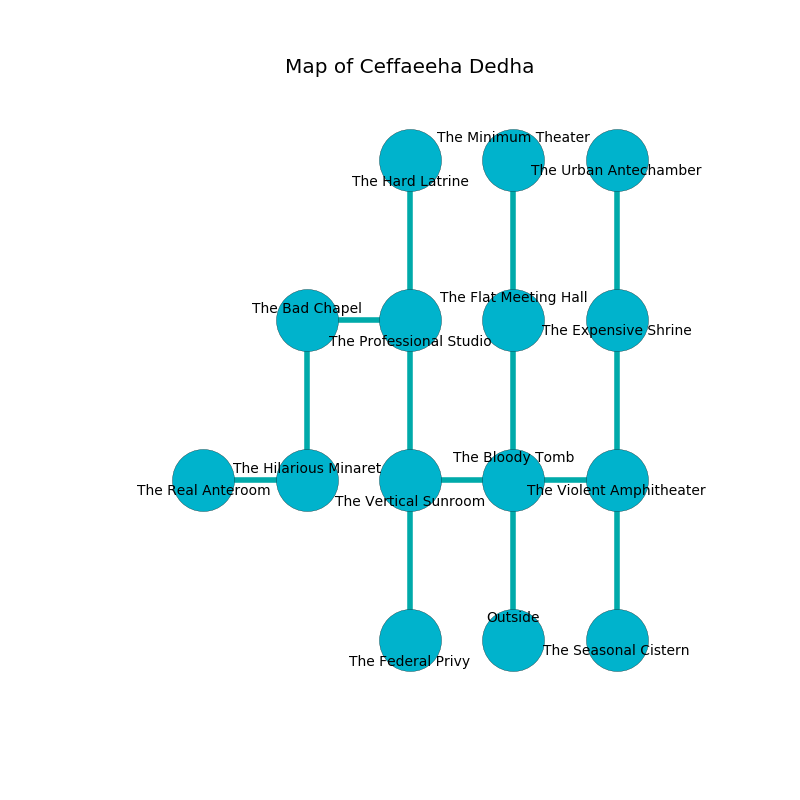

%Ruin Dogs

##Ceffaeeha Dedha
###Overview
Ceffaeeha Dedha is located in a poisoned city. Some rooms of Ceffaeeha Dedha are frozen. A solar eclipse is happening outside. It is occupied by Myconids. Gustavo Woodson The Cunning, a Vampire Spawn is here. The Myconids are the soldiers of Gustavo Woodson The Cunning. He  is founding a new religion. 

###Artifact
####Aemdahfedaeum Ebdaedaeum

Aemdahfedaeum Ebdaedaeum looks like a transparent crystal. It smells like brown sugar. Gravity bends away from it. When worn it changes the past. 

###Locations

####the bloody tomb
The glass walls are pristine. 

There is an engraving on the wall written in common. 

> I hid something in Ceffaeeha Dedha.
>
> Leave at once.
>

* To the west a dripping gap connects to [the vertical sunroom](#the-vertical-sunroom).
* To the east a flooded corridor connects to [the violent amphitheater](#the-violent-amphitheater).
* To the north a narrow threshold opens to [the flat meeting hall](#the-flat-meeting-hall).
* To the south is the entrance.

####the violent amphitheater
The floor is sticky. 

* To the west a flooded corridor leads to [the bloody tomb](#the-bloody-tomb).
* To the north a dripping opening opens to [the expensive shrine](#the-expensive-shrine).
* To the south a hazy hall leads to [the seasonal cistern](#the-seasonal-cistern).

####the vertical sunroom
The floor is smooth. The wooden walls are caving in. 

* To the east a dripping gap connects to [the bloody tomb](#the-bloody-tomb).
* To the north a dripping cavern leads to [the professional studio](#the-professional-studio).
* To the south a flooded opening opens to [the federal privy](#the-federal-privy).

####the expensive shrine
The floor is sticky. White ferns are decaying from the ceiling. There are three Myconid Sovereigns and three Myconid Adults here. The Myconids are performing a ritual. If not interrupted, a powerful monster will be summoned. 

* [Gustavo Woodson The Cunning](#Gustavo-Woodson-The-Cunning) is here.
* To the north a windy cavern opens to [the urban antechamber](#the-urban-antechamber).
* To the south a dripping opening leads to [the violent amphitheater](#the-violent-amphitheater).

####the flat meeting hall
There are a Chasme and an Ankylosaurus here. The air smells like spruce here. The wooden walls are unsettled. The floor is flooded with four inch deep hot water. 

* To the north a long passageway opens to [the minimum theater](#the-minimum-theater).
* To the south a narrow threshold connects to [the bloody tomb](#the-bloody-tomb).

####the urban antechamber
Gray moss is sprouting from the ceiling. There are three Myconid Sovereigns and two Myconid Adults here. The floor is smooth. One of the Myconids is on watch, the rest are caring for babies. 

There is an engraving on a stone written in common. 

> Oh everything is woe
>
> optional and slow
>
> regular, serious, diplomatic
>
> death is democratic
>

* To the south a windy cavern opens to [the expensive shrine](#the-expensive-shrine).

####the professional studio

* To the west a hazy opening connects to [the bad chapel](#the-bad-chapel).
* To the north a narrow cave leads to [the hard latrine](#the-hard-latrine).
* To the south a dripping cavern opens to [the vertical sunroom](#the-vertical-sunroom).

####the minimum theater
There is a trap here. When activated, a magical proximity detector will fire a net. Yellow ferns are decaying in a patch on the floor. The metallic walls are scratched. 

There is an engraving on the floor written in common. 

> All of us are dying
>
> yet stubborn
>
> We are joyful
>
> good and empty
>
> yet lonely
>
> You are maddened
>
> civilian and implicit
>
> always excited
>
> fastidious, steady, available
>
> jealous, tolerant, sad
>
> [Aemdahfedaeum Ebdaedaeum](#Aemdahfedaeum-Ebdaedaeum)
>
> bad, familiar, uniform
>
> representative and objective
>
> All of us are dying
>

* There is a bone here.
* To the south a long passageway opens to [the flat meeting hall](#the-flat-meeting-hall).

####the hard latrine
There is a trap here. When activated, a pressure plate will shoot a lightning bolt. 

* To the south a narrow cave leads to [the professional studio](#the-professional-studio).

####the federal privy
The air tastes like rye bread here. Yellow moss is swaying from the walls. 

* There is a heart here.
* To the north a flooded opening opens to [the vertical sunroom](#the-vertical-sunroom).

####the bad chapel
There are a Githyanki Warrior, a Quasit, a Green Hag, and a Rust Monster here. Gray ferns are growing in a patch on the floor. 

* To the east a hazy opening connects to [the professional studio](#the-professional-studio).
* To the south a dripping opening connects to [the hilarious minaret](#the-hilarious-minaret).

####the seasonal cistern
The floor is cluttered with bones. 

There is an engraving on a monolith written in Myconids Script. 

> I tried hiding.
>

* To the north a hazy hall opens to [the violent amphitheater](#the-violent-amphitheater).

####the hilarious minaret
There are a Mage, a Scorpion, a Harpy, and a Worg here. The crystal walls are scratched. Yellow lichens are decaying in broken urns. The floor is smooth. 

* There is a jewel here.
* [Aemdahfedaeum Ebdaedaeum](#Aemdahfedaeum-Ebdaedaeum) is here.
* To the west a narrow cave opens to [the real anteroom](#the-real-anteroom).
* To the north a dripping opening leads to [the bad chapel](#the-bad-chapel).

####the real anteroom
Yellow moss is sprouting from the ceiling. The wooden walls are pristine. The air tastes like carrot seed here. 

There is an engraving on a monolith written in common. 

> [Aemdahfedaeum Ebdaedaeum](#Aemdahfedaeum-Ebdaedaeum)
>
> ugly and unique
>
> appropriate and useful
>
> A horse is a tooth
>
> alert and alert
>
> always hungry
>

* To the east a narrow cave connects to [the hilarious minaret](#the-hilarious-minaret).

