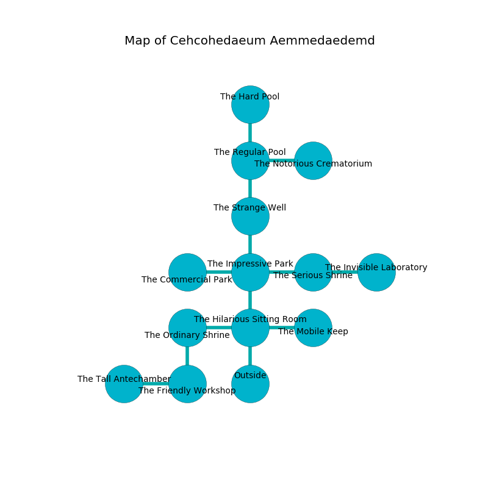

%Ruin Dogs

##Cehcohedaeum Aemmedaedemd
###Overview
Cehcohedaeum Aemmedaedemd is located under a cursed mountain. Some areas of it are flooded. The ruin is burning. It is occupied by Ogres. Anita Riddick The Stubborn, a Cloud Giant is here. The Ogres are the minions of Anita Riddick The Stubborn. She  is trying to discover [The Formal Rest](#The-Formal-Rest). 

###Artifact
####The Formal Rest

The Formal Rest is a powerful artifact in the shape of a smooth cube. When picked up it liquifies. 

###Locations

####the hilarious sitting Room
The floor is cluttered with rocks. There is a Stone Golem here. 

There is an engraving on a monolith written in Ogres Script. 

> Poor me! sorry soul
>
> constitutional, tall, whole
>
> always broken
>
> sadness is whole
>

* To the west a narrow threshold leads to [the ordinary shrine](#the-ordinary-shrine).
* To the east a narrow corridor connects to [the mobile keep](#the-mobile-keep).
* To the north a torchlit threshold leads to [the impressive park](#the-impressive-park).
* To the south is the entrance.

####the ordinary shrine
The floor is glossy. The air smells like grease here. There are a Troglodyte, a Shadow, a Steam Mephit, a Young Gold Dragon, and a Deer here. The obsidion walls are covered in mold. 

* There is a basket here.
* To the east a narrow threshold connects to [the hilarious sitting Room](#the-hilarious-sitting-Room).
* To the south a long hall leads to [the friendly workshop](#the-friendly-workshop).

####the friendly workshop
There are a Harpy, an Orc Eye of Gruumsh, a Berserker, a Hook Horror, a Giant Spider, a Twig Blight, a Hobgoblin Captain, a Pseudodragon, and a Vulture here. The obsidion walls are pristine. Blue mushrooms are sprouting in broken urns. There is a trap here. When activated, a magical rune will launch a swinging block. 

There is an engraving on the ceiling written in Ogres Script. 

> Oh my life is poor
>
> thirsty, legislative, strong
>
> normal, constant, pure
>
> fate is wrong
>

* [Anita Riddick The Stubborn](#Anita-Riddick-The-Stubborn) is here.
* To the west a dripping path connects to [the tall antechamber](#the-tall-antechamber).
* To the north a long hall connects to [the ordinary shrine](#the-ordinary-shrine).

####the tall antechamber
The floor is sticky. The air smells like mutton here. There are a Hippogriff, a Rat, a Copper Dragon Wyrmling, a Cloaker, a Scorpion, and a Griffon here. 

* To the east a dripping path leads to [the friendly workshop](#the-friendly-workshop).

####the impressive park
Yellow moss is decaying in cracks in the floor. The air smells like milk here. There are four Half-Ogres and three Ogres here. The Ogres are sleeping. 

* There is a bell here.
* There is a chain here.
* There is a head here.
* To the west a dripping pathway leads to [the commercial park](#the-commercial-park).
* To the east a windy hallway connects to [the serious shrine](#the-serious-shrine).
* To the north a long hallway opens to [the strange well](#the-strange-well).
* To the south a torchlit threshold connects to [the hilarious sitting Room](#the-hilarious-sitting-Room).

####the strange well
The floor is bloodstained. Gray ferns are decaying in cracks in the floor. There are a Half-Ogre and five Ogres here. One of the Ogres is on watch, the rest are drunk. 

* To the north a torchlit opening opens to [the regular pool](#the-regular-pool).
* To the south a long hallway connects to [the impressive park](#the-impressive-park).

####the commercial park
The air smells like black tea here. Blue mushrooms are decaying in a patch on the floor. There are a Giant Poisonous Snake, a Draft Horse, a Mezzoloth, an Ice Mephit, a Helmed Horror, and a Vulture here. 

* To the east a dripping pathway connects to [the impressive park](#the-impressive-park).

####the serious shrine
Yellow ferns are sprouting from the ceiling. There are six Half-Ogres and two Ogres here. The Ogres are berserk with rage. 

There is an engraving on the wall written in common. 

> An eye is an apparatus
>
> always early
>
> They are free
>
> yet never holy
>
> but sophisticated
>
> emotional, daily, passive
>
> spatial and limited
>
> All of us are envious
>
> prolonged, positive, vacant
>
> foolish and clean
>
> chronic and lucky
>
> you are eaten
>

* To the west a windy hallway leads to [the impressive park](#the-impressive-park).
* To the east a windy artery connects to [the invisible laboratory](#the-invisible-laboratory).

####the invisible laboratory
The air tastes like origanum here. Blue ferns are sprouting from the walls. There are an Imp, a Myconid Sprout, a Bearded Devil, a Magma Mephit, a Triceratops, and a Deer here. 

* To the west a windy artery leads to [the serious shrine](#the-serious-shrine).

####the mobile keep
The floor is cluttered with debris. Green moss is sprouting from the ceiling. The glass walls are bloodstained. There are a Lamia, a Triceratops, and an Ankylosaurus here. 

* To the west a narrow corridor connects to [the hilarious sitting Room](#the-hilarious-sitting-Room).

####the regular pool
The air tastes like cornmint here. 

* [The Formal Rest](#The-Formal-Rest) is here.
* To the east a narrow artery connects to [the notorious crematorium](#the-notorious-crematorium).
* To the north a twisted hall connects to [the hard pool](#the-hard-pool).
* To the south a torchlit opening opens to [the strange well](#the-strange-well).

####the hard pool
There are four Half-Ogres and three Ogres here. The obsidion walls are caving in. Green ferns are decaying from the ceiling. The Ogres are berserk with rage. 

* To the south a twisted hall connects to [the regular pool](#the-regular-pool).

####the notorious crematorium
The floor is smooth. There are a Pony, a Myconid Sprout, a Ghoul, a Silver Dragon Wyrmling, a Cambion, and a Banshee here. 

* To the west a narrow artery leads to [the regular pool](#the-regular-pool).

