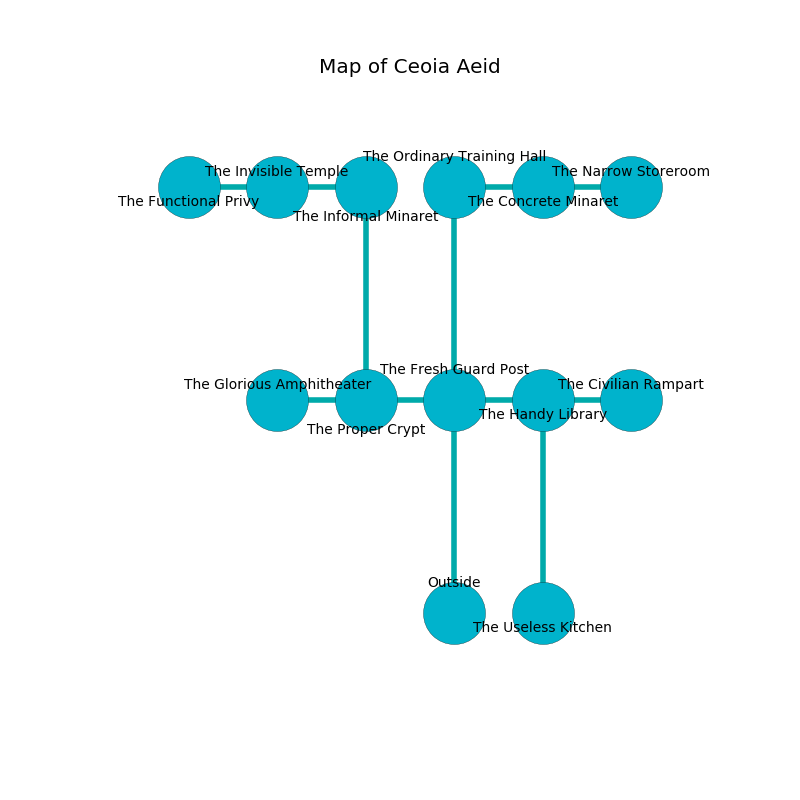

%Ruin Dogs

##Ceoia Aeid
###Overview
Ceoia Aeid is located in a giant rift. Parts of Ceoia Aeid are cursed. The ruin is coming to life. It is occupied by Gnolls. Nola Villareal The Aloof, a Quaggoth Thonot is here. The Gnolls are battling Nola Villareal The Aloof. She  is founding a new religion. 

###Artifact
####Aemiaela

Aemiaela is a powerful artifact in the shape of a warm amulet. Water flows near it. It smells like naphthyl. When eaten it emits dust. 

###Locations

####the fresh guard post
The air smells like rubber here. The floor is sticky. 

* To the west a long passageway connects to [the proper crypt](#the-proper-crypt).
* To the east a long path opens to [the handy library](#the-handy-library).
* To the north a windy threshold leads to [the ordinary training hall](#the-ordinary-training-hall).
* To the south is the entrance.

####the ordinary training hall
White razorgrass is decaying in cracks in the floor. There are two Gnolls and a Gnoll Pack Lord here. The floor is cluttered with ashes. One of the Gnolls is on watch, the rest are sleeping. 

* To the east a small walkway opens to [the concrete minaret](#the-concrete-minaret).
* To the south a windy threshold connects to [the fresh guard post](#the-fresh-guard-post).

####the handy library
The air tastes like bell pepper here. The crystal walls are unsettled. 

There is an engraving on the wall written in common. 

> Oh meak god
>
> viable, efficient, effective
>
> but odd
>
> fate is objective
>

* There is a sponge here.
* There is a cup here.
* To the west a long path opens to [the fresh guard post](#the-fresh-guard-post).
* To the east a torchlit passageway connects to [the civilian rampart](#the-civilian-rampart).
* To the south a dark path leads to [the useless kitchen](#the-useless-kitchen).

####the useless kitchen
The air tastes like lovage here. The floor is flooded with nine inch deep scalding water. The metallic walls are caving in. 

There is an engraving on a monolith written in common. 

> [Aemiaela](#Aemiaela)
>
> yet hostile
>
> confident and general
>
> [Aemiaela](#Aemiaela)
>

* To the north a dark path connects to [the handy library](#the-handy-library).

####the proper crypt
Green lichens are decaying from the ceiling. The floor is sticky. The air tastes like char here. The wooden walls are bloodstained. 

* To the west a narrow threshold leads to [the glorious amphitheater](#the-glorious-amphitheater).
* To the east a long passageway connects to [the fresh guard post](#the-fresh-guard-post).
* To the north a long cavern opens to [the informal minaret](#the-informal-minaret).

####the informal minaret
The mirrored walls are unsettled. There are a Constrictor Snake and a Giant Boar here. The air tastes like rosemary here. The floor is smooth. Gray mushrooms are decaying in broken urns. 

There is an engraving on the ceiling written in Gnolls Script. 

> Dear me! our fate is sadistic
>
> yet artistic
>
> but never dead
>
> fate is characteristic
>

* To the west a small hallway leads to [the invisible temple](#the-invisible-temple).
* To the south a long cavern opens to [the proper crypt](#the-proper-crypt).

####the concrete minaret
The air tastes like cocoa here. 

* [Aemiaela](#Aemiaela) is here.
* To the west a small walkway opens to [the ordinary training hall](#the-ordinary-training-hall).
* To the east a torchlit hallway connects to [the narrow storeroom](#the-narrow-storeroom).

####the invisible temple
There is a trap here. When activated, a pressure plate will launch a fusillade of darts. 

* To the west a small walkway leads to [the functional privy](#the-functional-privy).
* To the east a small hallway leads to [the informal minaret](#the-informal-minaret).

####the glorious amphitheater
The floor is smooth. 

* To the east a narrow threshold connects to [the proper crypt](#the-proper-crypt).

####the functional privy
The wooden walls are ruined. The air tastes like rye bread here. Green razorgrass is decaying in a patch on the floor. 

* [Nola Villareal The Aloof](#Nola-Villareal-The-Aloof) is here.
* To the east a small walkway opens to [the invisible temple](#the-invisible-temple).

####the civilian rampart
The glass walls are scratched. White ferns are sprouting in a patch on the floor. 

There is an engraving on a monolith written in Gnolls Script. 

> Do not try digging.
>

* There is a spring here.
* To the west a torchlit passageway leads to [the handy library](#the-handy-library).

####the narrow storeroom
The floor is cluttered with bones. There is a Merrow here. The air tastes like foliage here. Yellow lichens are sprouting in broken urns. 

There is an engraving on the floor written in Gnolls Script. 

> Dear me! meak you
>
> but married
>
> deadly and true
>
> death is varied
>

* To the west a torchlit hallway leads to [the concrete minaret](#the-concrete-minaret).

