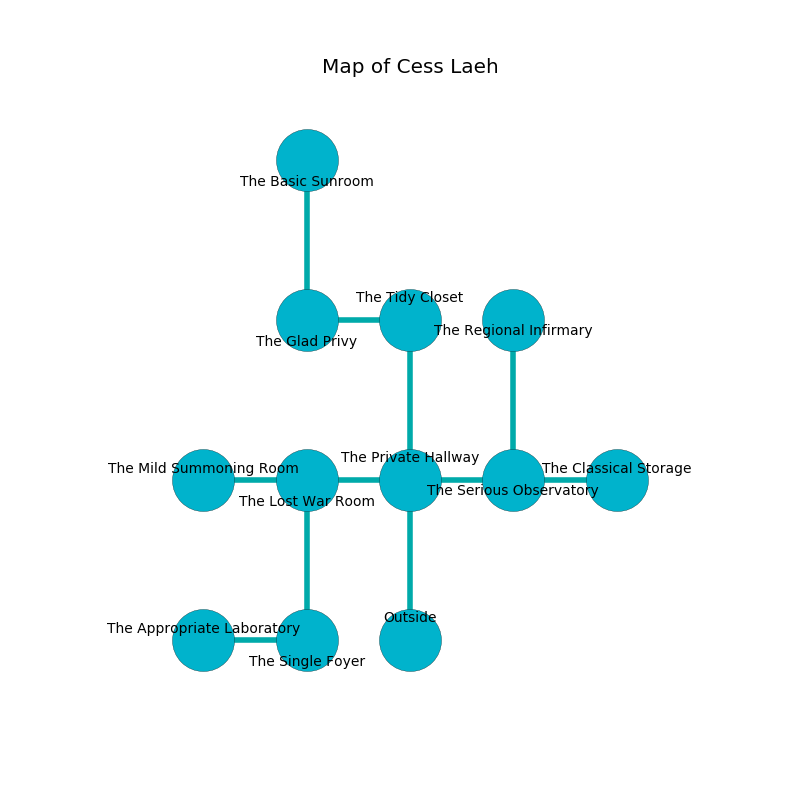

%Ruin Dogs

##Cess Laeh
###Overview
Cess Laeh is located under a haunted mountain. Regions of Cess Laeh are unbearably hot. A massive storm is happening outside. It is occupied by Gnolls. Everett Breedlove The Cruel, a Mind Flayer Arcanist is here. The Gnolls are the soldiers of Everett Breedlove The Cruel. He  is founding a new religion. 

###Artifact
####Uuafehh Daeb

Uuafehh Daeb has the form of a smooth rock. It smells like apple. It is a dark green color. When touched it grants power to its owner. 

###Locations

####the private hallway
There are two Gnoll Fangs of Yeenoghu here. The metallic walls are unsettled. If the Gnolls notice the Ruin Dogs, one of them will retreat and alert the others. 

* [Everett Breedlove The Cruel](#Everett-Breedlove-The-Cruel) is here.
* To the west a small passageway connects to [the lost war Room](#the-lost-war-Room).
* To the east a narrow cavern leads to [the serious observatory](#the-serious-observatory).
* To the north a flooded corridor connects to [the tidy closet](#the-tidy-closet).
* To the south is the entrance.

####the serious observatory
Blue razorgrass is decaying from the ceiling. There is a trap here. When activated, a tripwire will launch a poison needle. The floor is smooth. The obsidion walls are covered in mold. 

* To the west a narrow cavern opens to [the private hallway](#the-private-hallway).
* To the east a narrow threshold leads to [the classical storage](#the-classical-storage).
* To the north a twisted gap connects to [the regional infirmary](#the-regional-infirmary).

####the lost war Room
There is a trap here. When activated, a magical rune will launch a fireball. 

* There is a nail here.
* To the west a flooded cavern connects to [the mild summoning room](#the-mild-summoning-room).
* To the east a small passageway connects to [the private hallway](#the-private-hallway).
* To the south a long opening connects to [the single foyer](#the-single-foyer).

####the tidy closet
The air tastes like eucalyptus here. The stone walls are unsettled. White razorgrass is growing in a patch on the floor. 

* To the west a long corridor opens to [the glad privy](#the-glad-privy).
* To the south a flooded corridor leads to [the private hallway](#the-private-hallway).

####the glad privy
The air smells like lavender here. The mirrored walls are caving in. Red moss is swaying in a patch on the floor. 

There is an engraving on the ceiling written in Gnolls Script. 

> Oh cruel you
>
> but never new
>
> ever implicit
>
> hope is explicit
>

* [Uuafehh Daeb](#Uuafehh-Daeb) is here.
* To the east a long corridor opens to [the tidy closet](#the-tidy-closet).
* To the north a small cave leads to [the basic sunroom](#the-basic-sunroom).

####the single foyer
There are a Gnoll Fang of Yeenoghu, two Gnolls, three Gnoll Pack Lords,  here. The air smells like pear skin here. If the Gnolls notice the Ruin Dogs, one of them will retreat and alert the others. 

* To the west a dripping walkway connects to [the appropriate laboratory](#the-appropriate-laboratory).
* To the north a long opening connects to [the lost war Room](#the-lost-war-Room).

####the regional infirmary
The crystal walls are ruined. 

* To the south a twisted gap connects to [the serious observatory](#the-serious-observatory).

####the appropriate laboratory
The air tastes like amber here. 

* There is a hat here.
* To the east a dripping walkway opens to [the single foyer](#the-single-foyer).

####the mild summoning room
The floor is cluttered with ashes. 

* To the east a flooded cavern leads to [the lost war Room](#the-lost-war-Room).

####the classical storage
Gray moss is swaying in a patch on the floor. 

* To the west a narrow threshold opens to [the serious observatory](#the-serious-observatory).

####the basic sunroom
Blue razorgrass is swaying in cracks in the floor. The floor is bloodstained. 

* To the south a small cave leads to [the glad privy](#the-glad-privy).

