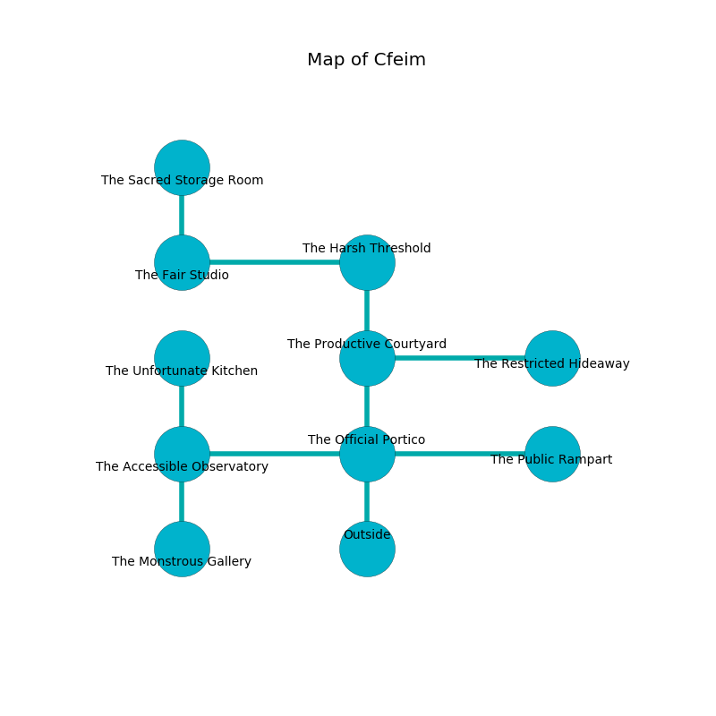

%Ruin Dogs

##Cfeim
###Overview
Cfeim is located in a spikey city. Some areas of it are frozen. The ruin is collapsing slowly. It is occupied by Mind Flayers. Antonetta Cheatham The Untidy, a Drow Priestess of Lolth is here. The Mind Flayers worship Antonetta Cheatham The Untidy. She  is trying to use [Asdfaba Icaem](#Asdfaba-Icaem). 

###Artifact
####Asdfaba Icaem

Asdfaba Icaem has the form of a transparent sphere. It smells like kumquat. When carried it floats in the air. 

###Locations

####the official portico
The air smells like marigold here. The floor is bloodstained. 

* To the west a long path leads to [the accessible observatory](#the-accessible-observatory).
* To the east a dark threshold opens to [the public rampart](#the-public-rampart).
* To the north a dripping path leads to [the productive courtyard](#the-productive-courtyard).
* To the south is the entrance.

####the productive courtyard
There are two Mind Flayers here. The concrete walls are bloodstained. Red razorgrass is sprouting in cracks in the floor. The Mind Flayers are willing to fight to the death. 

There is an engraving on the ceiling written in Mind Flayers Script. 

> O my fate is woe
>
> it is never wild
>
> nuclear and slow
>
> everything is mild
>

* To the east a hazy pathway opens to [the restricted hideaway](#the-restricted-hideaway).
* To the north a twisted opening leads to [the harsh threshold](#the-harsh-threshold).
* To the south a dripping path opens to [the official portico](#the-official-portico).

####the public rampart
There are two Mind Flayer Arcanists here. One of the Mind Flayers is pointing a ballista at the entrance. 

* There is a wand here.
* There is a trousers here.
* To the west a dark threshold opens to [the official portico](#the-official-portico).

####the harsh threshold
The concrete walls are unsettled. The floor is smooth. Green mushrooms are swaying from the ceiling. 

* To the west a twisted cavern opens to [the fair studio](#the-fair-studio).
* To the south a twisted opening connects to [the productive courtyard](#the-productive-courtyard).

####the accessible observatory
The air tastes like mulberry here. The mirrored walls are pristine. Red mushrooms are growing in cracks in the floor. 

* [Asdfaba Icaem](#Asdfaba-Icaem) is here.
* To the east a long path leads to [the official portico](#the-official-portico).
* To the north a dripping walkway connects to [the unfortunate kitchen](#the-unfortunate-kitchen).
* To the south a flooded path connects to [the monstrous gallery](#the-monstrous-gallery).

####the fair studio
The brick walls are covered in mold. The floor is cluttered with ashes. There are a Mind Flayer Arcanist and a Mind Flayer here. One of the Mind Flayers is working a mechanism that can launch acid at the Ruin Dogs. 

* To the east a twisted cavern connects to [the harsh threshold](#the-harsh-threshold).
* To the north a flooded passageway connects to [the sacred storage room](#the-sacred-storage-room).

####the restricted hideaway
Gray razorgrass is growing in cracks in the floor. The floor is flooded with two inch deep cool water. The air smells like grilling here. 

* There is a brick here.
* To the west a hazy pathway connects to [the productive courtyard](#the-productive-courtyard).

####the unfortunate kitchen
The air tastes like elderflower here. The floor is sticky. 

There is an engraving on the wall written in Mind Flayers Script. 

> I am seeking [Asdfaba Icaem](#Asdfaba-Icaem).
>
> I tried hiding.
>

* To the south a dripping walkway opens to [the accessible observatory](#the-accessible-observatory).

####the sacred storage room
The obsidion walls are scratched. The air smells like lard here. 

* There is a ghost here.
* [Antonetta Cheatham The Untidy](#Antonetta-Cheatham-The-Untidy) is here.
* To the south a flooded passageway connects to [the fair studio](#the-fair-studio).

####the monstrous gallery

There is an engraving on a tablet written in common. 

> O terrible god
>
> it is never odd
>
> ever serious
>
> fate is odd
>

* To the north a flooded path leads to [the accessible observatory](#the-accessible-observatory).

