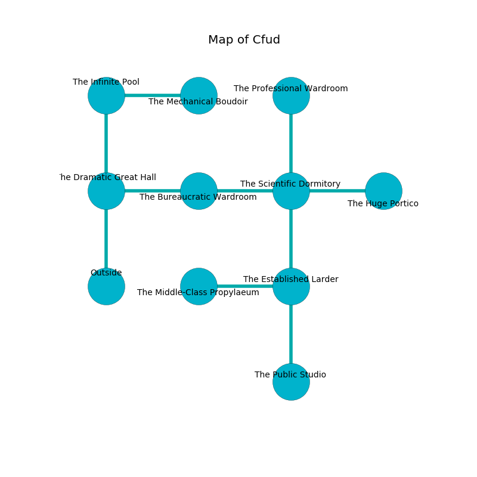

%Ruin Dogs

##Cfud
###Overview
Cfud is located under a volcanic plain. Parts of it are cursed. The ruin is coming to life. It is occupied by Kuo-Toa. Neil Reaves The Unpredictable, a Drow Elite Warrior is here. The Kuo-Toa worship Neil Reaves The Unpredictable. He  is trying to discover [Deiadehh](#Deiadehh). 

###Artifact
####Deiadehh

Deiadehh looks like a smooth meteorite. It is a pale brown color. Psychic energy incinerates towards it. When eaten it changes the past. 

###Locations

####the dramatic great hall
Green lichens are sprouting in broken urns. There are a Kuo-Toa Whip, a Kuo-Toa Monitor, four Kuo-Toa,  here. The mirrored walls are ruined. The floor is smooth. The air smells like cilantro here. The Kuo-Toa are berserk with rage. 

There is an engraving on a monolith written in Kuo-Toa Script. 

> I am young.
>

* To the east a dark pathway leads to [the bureaucratic wardroom](#the-bureaucratic-wardroom).
* To the north a small hallway leads to [the infinite pool](#the-infinite-pool).
* To the south is the entrance.

####the bureaucratic wardroom
There are a Wolf, a Kuo-Toa, a Ghast, an Ice Mephit, a Quaggoth, and a Swarm of Insects here. The stone walls are bloodstained. 

* To the west a dark pathway leads to [the dramatic great hall](#the-dramatic-great-hall).
* To the east a hazy artery opens to [the scientific dormitory](#the-scientific-dormitory).

####the infinite pool
The metallic walls are ruined. 

There is an engraving on the ceiling written in common. 

> I am fleeing Cfud.
>

* To the east a small cavern leads to [the mechanical boudoir](#the-mechanical-boudoir).
* To the south a small hallway connects to [the dramatic great hall](#the-dramatic-great-hall).

####the scientific dormitory
There are two Kuo-Toa Monitors and a Kuo-Toa here. Red ferns are sprouting in a patch on the floor. If the Kuo-Toa notice the Ruin Dogs, one of them will retreat and alert [Neil Reaves](#Neil-Reaves). 

* To the west a hazy artery opens to [the bureaucratic wardroom](#the-bureaucratic-wardroom).
* To the east a dripping artery opens to [the huge portico](#the-huge-portico).
* To the north a torchlit hallway opens to [the professional wardroom](#the-professional-wardroom).
* To the south a dark walkway leads to [the established larder](#the-established-larder).

####the established larder
There are a Kuo-Toa Whip and two Kuo-Toa Monitors here. Red razorgrass is swaying from the ceiling. The floor is sticky. One of the Kuo-Toa is pointing a ballista at the entrance. 

* There is a frame here.
* [Deiadehh](#Deiadehh) is here.
* To the west a small cavern leads to [the middle-class propylaeum](#the-middle-class-propylaeum).
* To the north a dark walkway connects to [the scientific dormitory](#the-scientific-dormitory).
* To the south a windy hall connects to [the public studio](#the-public-studio).

####the professional wardroom
Red ferns are decaying in a patch on the floor. 

* There is a casket here.
* To the south a torchlit hallway leads to [the scientific dormitory](#the-scientific-dormitory).

####the middle-class propylaeum
The floor is glossy. The wooden walls are unsettled. The air tastes like licorice here. There is a trap here. When activated, a magical rune will fire an acid arrow. 

* There is a cow here.
* [Neil Reaves The Unpredictable](#Neil-Reaves-The-Unpredictable) is here.
* To the east a small cavern leads to [the established larder](#the-established-larder).

####the huge portico
The glass walls are pristine. The air tastes like filbert here. 

* To the west a dripping artery connects to [the scientific dormitory](#the-scientific-dormitory).

####the mechanical boudoir
Green ferns are growing in cracks in the floor. There is a trap here. When activated, a tripwire will open a large pit in the floor. The air tastes like vanilla here. The glass walls are scratched. 

* To the west a small cavern leads to [the infinite pool](#the-infinite-pool).

####the public studio
The air tastes like rosemary here. The wooden walls are bloodstained. Red moss is growing in broken urns. The floor is cluttered with broken glass. 

* To the north a windy hall connects to [the established larder](#the-established-larder).

