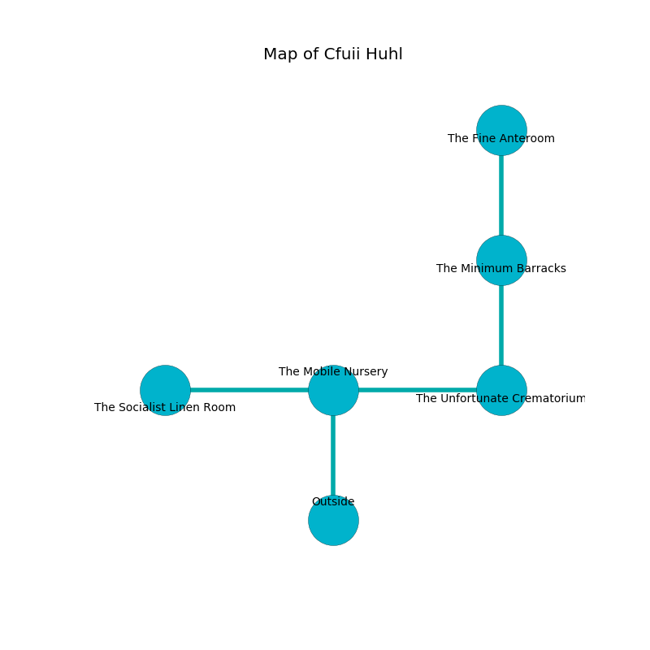

%Ruin Dogs

##Cfuii Huhl
###Overview
Cfuii Huhl is located under an alien rift. Some rooms of Cfuii Huhl are inaccessible. A blizzard is happening outside. It is occupied by Sahuagins. Adelaida Galindo The Belligerent, a Spined Devil is here. The Sahuagins are ruled by Adelaida Galindo The Belligerent. She  is trying to recover [Gfaccha](#Gfaccha). 

###Artifact
####Gfaccha

Gfaccha looks like a hard crystal. When smelled it sings the hymn of the damned. 

###Locations

####the mobile nursery
There are two Sahuagin Priestesses here. The brick walls are caving in. The floor is smooth. The Sahuagins are fighting amongst themselves. 

There is an engraving on a stone written in Sahuagins Script. 

> I tried dying.
>

* There is a scissors here.
* There is a button here.
* To the west a small gap leads to [the socialist linen room](#the-socialist-linen-room).
* To the east a long corridor leads to [the unfortunate crematorium](#the-unfortunate-crematorium).
* To the south is the entrance.

####the socialist linen room
The air smells like fruit here. 

* [Adelaida Galindo The Belligerent](#Adelaida-Galindo-The-Belligerent) is here.
* To the east a small gap connects to [the mobile nursery](#the-mobile-nursery).

####the unfortunate crematorium
There are two Sahuagin Priestesses here. The air smells like apple here. The concrete walls are scratched. One of the Sahuagins is on watch, the rest are meditating. 

There is an engraving on a stone written in common. 

> I am lost in Cfuii Huhl.
>

* To the west a long corridor opens to [the mobile nursery](#the-mobile-nursery).
* To the north a flooded pathway connects to [the minimum barracks](#the-minimum-barracks).

####the minimum barracks
There are two Sahuagin Priestesses here. The floor is sticky. The air smells like ginseng here. The glass walls are covered in mold. The Sahuagins are meditating. 

* [Gfaccha](#Gfaccha) is here.
* To the north a small path connects to [the fine anteroom](#the-fine-anteroom).
* To the south a flooded pathway connects to [the unfortunate crematorium](#the-unfortunate-crematorium).

####the fine anteroom
The floor is smooth. The air smells like orangeflower here. 

* To the south a small path opens to [the minimum barracks](#the-minimum-barracks).

