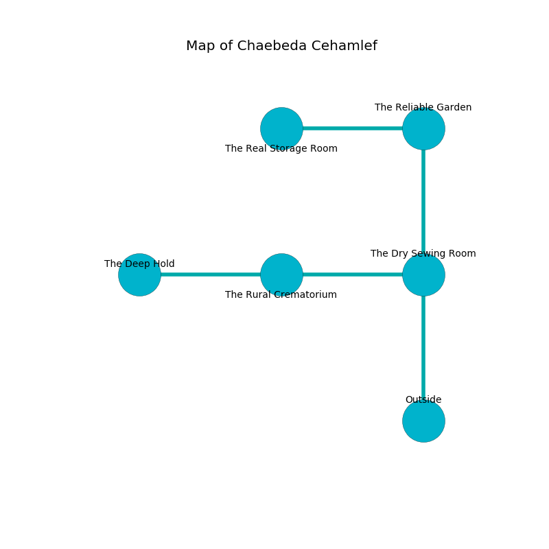

%Ruin Dogs

##Chaebeda Cehamlef
###Overview
Chaebeda Cehamlef is constructed on a giant rift. Some areas of it are corrupted. A battle between raiders is happening outside. It is occupied by Giants. Elizbeth Sturgis The Quick-Tempered, a Frost Giant is here. The Giants are the soldiers of Elizbeth Sturgis The Quick-Tempered. She  is founding a new religion. 

###Artifact
####The Liquid Diameter

The Liquid Diameter has the form of an opaque prism. It smells like pomegranate. When carried it projects energy. 

###Locations

####the dry sewing room
The air tastes like soap here. 

* To the west a long cavern connects to [the rural crematorium](#the-rural-crematorium).
* To the north a dripping hall leads to [the reliable garden](#the-reliable-garden).
* To the south is the entrance.

####the rural crematorium
The air tastes like unripe banana here. The stone walls are scratched. Blue mushrooms are sprouting from the ceiling. 

* [The Liquid Diameter](#The-Liquid-Diameter) is here.
* To the west a dark artery leads to [the deep hold](#the-deep-hold).
* To the east a long cavern connects to [the dry sewing room](#the-dry-sewing-room).

####the reliable garden
The floor is glossy. The concrete walls are bloodstained. Gray ferns are sprouting in a patch on the floor. The air smells like white chocolate here. 

* [Elizbeth Sturgis The Quick-Tempered](#Elizbeth-Sturgis-The-Quick-Tempered) is here.
* To the west a long corridor connects to [the real storage room](#the-real-storage-room).
* To the south a dripping hall opens to [the dry sewing room](#the-dry-sewing-room).

####the real storage room
There are a Hook Horror, a Githzerai Zerth, and a Succubus here. The air smells like acerola here. The floor is flooded with four inch deep cool water. 

* There is a spoon here.
* There is a coat here.
* To the east a long corridor connects to [the reliable garden](#the-reliable-garden).

####the deep hold
White ferns are growing in a patch on the floor. There are a Frost Giant and a Stone Giant here. The Giants are celebrating. 

* To the east a dark artery opens to [the rural crematorium](#the-rural-crematorium).

