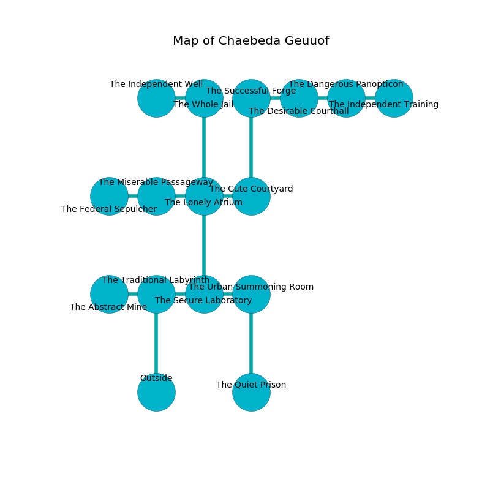

%Ruin Dogs

##Chaebeda Geuuof
###Overview
Chaebeda Geuuof is located on a flooded mountain. Regions of Chaebeda Geuuof are inaccessible. A windstorm is happening outside. It is occupied by Harpies. Thurman Hildreth The Detached, an Assassin is here. The Harpies have been charmed by Thurman Hildreth The Detached. He  is founding a new religion. 

###Artifact
####Fadahhaeum Buicoa

Fadahhaeum Buicoa looks like a warm doll. It smells like dried fruit. When smelled it becomes a shielding force. 

###Locations

####the traditional labyrinth
Green ferns are decaying in cracks in the floor. The metallic walls are unsettled. The air tastes like burnt butter here. 

There is an engraving on a tablet written in common. 

> I lost [Fadahhaeum Buicoa](#Fadahhaeum-Buicoa).
>
> I tried leaving.
>

* [Thurman Hildreth The Detached](#Thurman-Hildreth-The-Detached) is here.
* To the west a dark artery leads to [the abstract mine](#the-abstract-mine).
* To the east a dark passageway leads to [the secure laboratory](#the-secure-laboratory).
* To the south is the entrance.

####the secure laboratory
The air smells like white chocolate here. Gray lichens are decaying in broken urns. 

There is an engraving on a stone written in Harpies Script. 

> Hide here.
>

* To the west a dark passageway opens to [the traditional labyrinth](#the-traditional-labyrinth).
* To the east a torchlit walkway connects to [the urban summoning room](#the-urban-summoning-room).
* To the north a twisted opening leads to [the lonely atrium](#the-lonely-atrium).

####the abstract mine

* To the east a dark artery connects to [the traditional labyrinth](#the-traditional-labyrinth).

####the lonely atrium
The floor is glossy. The stone walls are caving in. Green mushrooms are swaying from the walls. There are a Riding Horse, an Orc War Chief, a Berserker, a Rust Monster, an Ice Mephit, a Goat, an Axe Beak, and a Hell Hound here. 

* To the west a torchlit passageway connects to [the miserable passageway](#the-miserable-passageway).
* To the east a small cave leads to [the cute courtyard](#the-cute-courtyard).
* To the north a torchlit corridor opens to [the whole jail](#the-whole-jail).
* To the south a twisted opening leads to [the secure laboratory](#the-secure-laboratory).

####the whole jail
The floor is flooded with four inch deep lukewarm water. The air tastes like juice here. 

* To the west a small opening opens to [the independent well](#the-independent-well).
* To the south a torchlit corridor leads to [the lonely atrium](#the-lonely-atrium).

####the miserable passageway
The air smells like medicine here. There are nine Harpies here. The floor is sticky. One of the Harpies is working a mechanism that can pour hornets from the ceiling. 

* There is a sword here.
* To the west a windy gap connects to [the federal sepulcher](#the-federal-sepulcher).
* To the east a torchlit passageway leads to [the lonely atrium](#the-lonely-atrium).

####the cute courtyard
The mirrored walls are pristine. The air tastes like turmeric here. The floor is bloodstained. Green mushrooms are decaying from the ceiling. 

* To the west a small cave leads to [the lonely atrium](#the-lonely-atrium).
* To the north a torchlit pathway opens to [the successful forge](#the-successful-forge).

####the independent well
There is a trap here. When activated, a pressure plate will collapse a column. The air tastes like plum here. Red ferns are growing from the walls. 

* To the east a small opening leads to [the whole jail](#the-whole-jail).

####the urban summoning room
Gray moss is swaying from the walls. The floor is bloodstained. There are a Blue Dragon Wyrmling, a Chain Devil, and an Owl here. 

* There is a rail here.
* To the west a torchlit walkway opens to [the secure laboratory](#the-secure-laboratory).
* To the south a narrow corridor leads to [the quiet prison](#the-quiet-prison).

####the successful forge
Red moss is growing from the ceiling. There is a trap here. When activated, a tripwire will make the ceiling slowly lower. The mirrored walls are pristine. 

There is an engraving on a monolith written in common. 

> O sorry fate
>
> intellectual, astonishing, late
>
> ever uncomfortable
>
> the world is late
>

* To the east a long hallway connects to [the desirable courthall](#the-desirable-courthall).
* To the south a torchlit pathway connects to [the cute courtyard](#the-cute-courtyard).

####the federal sepulcher
The air smells like almond here. Gray moss is decaying from the ceiling. 

* To the east a windy gap opens to [the miserable passageway](#the-miserable-passageway).

####the desirable courthall
There are a Galeb Duhr and a Stone Giant here. The floor is smooth. The air smells like custard here. 

* There is a mug here.
* To the west a long hallway leads to [the successful forge](#the-successful-forge).
* To the east a windy path connects to [the dangerous panopticon](#the-dangerous-panopticon).

####the dangerous panopticon
Blue ferns are growing in a patch on the floor. There is a trap here. When activated, a magical rune will fire a scything blade. 

* [Fadahhaeum Buicoa](#Fadahhaeum-Buicoa) is here.
* To the west a windy path opens to [the desirable courthall](#the-desirable-courthall).
* To the east a windy cave connects to [the independent training hall](#the-independent-training-hall).

####the quiet prison
The glass walls are covered in mold. The floor is flooded with six inch deep cold water. Red razorgrass is swaying from the walls. There are nine Harpies here. The Harpies are willing to negotiate. 

There is an engraving on a stone written in Harpies Script. 

> Dear me! dire fate
>
> terminal, current, great
>
> it is never optimistic
>
> hope is artistic
>

* To the north a narrow corridor connects to [the urban summoning room](#the-urban-summoning-room).

####the independent training hall

* There is a nail here.
* There is a portrait here.
* To the west a windy cave connects to [the dangerous panopticon](#the-dangerous-panopticon).

