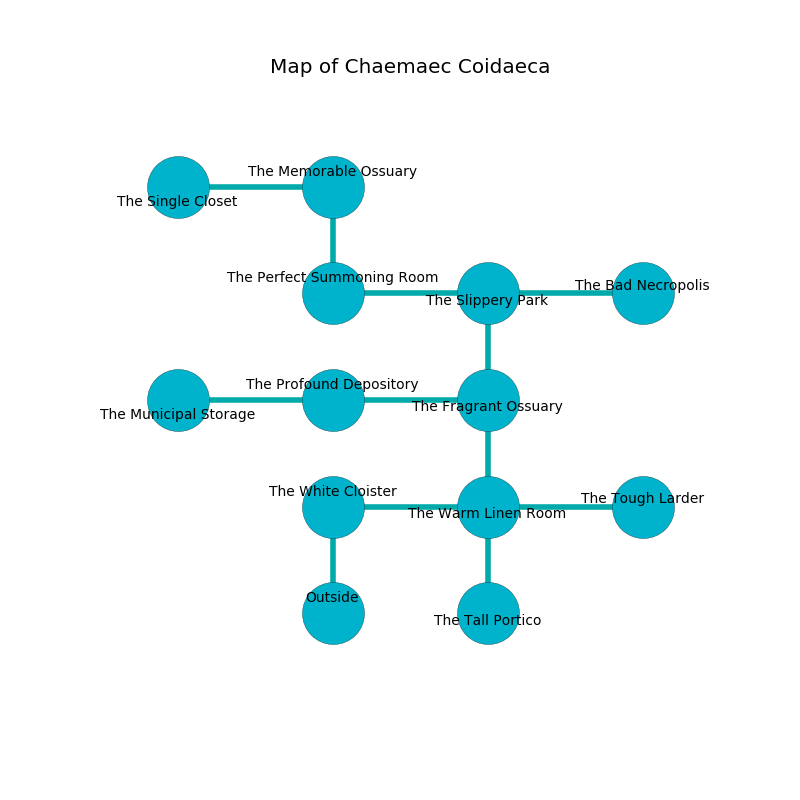

%Ruin Dogs

##Chaemaec Coidaeca
###Overview
Chaemaec Coidaeca is located in a cursed mountain. Some rooms of it are flooded. A battle between raiders is happening outside. It is occupied by Vampires. Joshua Franks The Moody, a Fire Giant is here. The Vampires are ruled by Joshua Franks The Moody. He  is founding a new religion. 

###Artifact
####Ioddufd Fecaeib

Ioddufd Fecaeib is a powerful artifact in the shape of a wet figurine. It is a shifting purple color. When touched it becomes lost. 

###Locations

####the white cloister
There are two Vampire Spawns here. The wooden walls are ruined. The Vampires are performing a ritual. If not interrupted, the ruin dogs will be weakened. 

* There is a gold coin here.
* To the east a windy cave connects to [the warm linen room](#the-warm-linen-room).
* To the south is the entrance.

####the warm linen room
Blue lichens are sprouting from the walls. The air tastes like cranberry here. The floor is glossy. 

* There is a carriage here.
* There is a bell here.
* [Ioddufd Fecaeib](#Ioddufd-Fecaeib) is here.
* To the west a windy cave leads to [the white cloister](#the-white-cloister).
* To the east a small pathway opens to [the tough larder](#the-tough-larder).
* To the north a flooded opening opens to [the fragrant ossuary](#the-fragrant-ossuary).
* To the south a hazy artery connects to [the tall portico](#the-tall-portico).

####the fragrant ossuary
There are a Tiger and a Treant here. The floor is glossy. The air tastes like leather here. 

* To the west a flooded cave opens to [the profound depository](#the-profound-depository).
* To the north a twisted corridor opens to [the slippery park](#the-slippery-park).
* To the south a flooded opening leads to [the warm linen room](#the-warm-linen-room).

####the tough larder
There are a Giant Scorpion, a Merrow, a Scout, a Sea Horse, a Giant Crocodile, a Kobold, and a Pegasus here. The floor is flooded with three inch deep hot water. 

* To the west a small pathway connects to [the warm linen room](#the-warm-linen-room).

####the slippery park
The floor is sticky. 

* There is a skull here.
* There is a nail here.
* [Joshua Franks The Moody](#Joshua-Franks-The-Moody) is here.
* To the west a twisted opening leads to [the perfect summoning room](#the-perfect-summoning-room).
* To the east a windy walkway leads to [the bad necropolis](#the-bad-necropolis).
* To the south a twisted corridor opens to [the fragrant ossuary](#the-fragrant-ossuary).

####the profound depository
There are two Vampire Spawns here. The floor is cluttered with shells. The Vampires are defending this room from intruders. 

* To the west a narrow threshold leads to [the municipal storage](#the-municipal-storage).
* To the east a flooded cave connects to [the fragrant ossuary](#the-fragrant-ossuary).

####the municipal storage
The floor is bloodstained. Blue moss is decaying from the walls. The air tastes like fungus here. There is a trap here. When activated, a magical proximity detector will close a portcullis. The glass walls are ruined. 

* To the east a narrow threshold opens to [the profound depository](#the-profound-depository).

####the perfect summoning room
Gray moss is swaying in broken urns. The metallic walls are unsettled. There are a Quaggoth and an Oni here. 

* To the east a twisted opening connects to [the slippery park](#the-slippery-park).
* To the north a windy hall leads to [the memorable ossuary](#the-memorable-ossuary).

####the memorable ossuary
Green ferns are growing in cracks in the floor. There are two Vampire Spawns here. The air smells like unripe banana here. The floor is flooded with three inch deep scalding water. There is a trap here. When activated, a tripwire will open a large pit in the floor. The Vampires are celebrating. 

There is an engraving on a stone written in common. 

> O sad you
>
> it is never new
>
> yet never young
>
> everything is due
>

* There is a dress here.
* To the west a small hall leads to [the single closet](#the-single-closet).
* To the south a windy hall connects to [the perfect summoning room](#the-perfect-summoning-room).

####the bad necropolis
The crystal walls are scratched. The air tastes like wormwood here. The floor is bloodstained. 

* To the west a windy walkway opens to [the slippery park](#the-slippery-park).

####the single closet
White razorgrass is growing from the walls. The air tastes like grease here. There are two Vampire Spawns here. The floor is glossy. One of the Vampires is pointing a ballista at the entrance. 

* There is a ring here.
* To the east a small hall opens to [the memorable ossuary](#the-memorable-ossuary).

####the tall portico
Gray lichens are decaying from the walls. The air smells like lavender here. The brick walls are pristine. The floor is flooded with six inch deep hot water. 

* There is a goblin here.
* To the north a hazy artery leads to [the warm linen room](#the-warm-linen-room).

