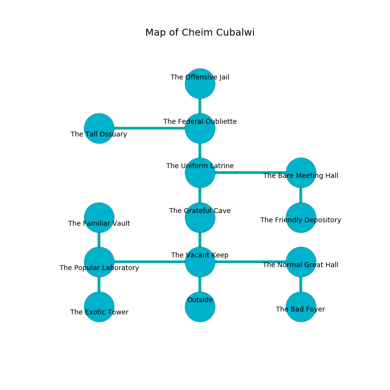

%Ruin Dogs

##Cheim Cubalwi
###Overview
Cheim Cubalwi is located in a giant tree. Some rooms of it are unbearably hot. The ruin is flooding. It is occupied by Lizardfolk. Elvin Najera The Domineering, a Frost Giant is here. The Lizardfolk are the slaves of Elvin Najera The Domineering. He  is founding a new religion. 

###Artifact
####The Universal Suite

The Universal Suite looks like a mushy spear. It is a light pink color. Fire flows from it. It smells like pimenta. When worn it becomes a deadly projectile. 

###Locations

####the vacant keep
The air smells like orange peel here. The floor is cluttered with ashes. 

There is an engraving on the ceiling written in common. 

> Oh my! dire god
>
> passionate, multiple, odd
>
> yet firsthand
>
> nothing is grand
>

* To the west a twisted passageway opens to [the popular laboratory](#the-popular-laboratory).
* To the east a twisted pathway opens to [the normal great hall](#the-normal-great-hall).
* To the north a twisted artery connects to [the grateful cave](#the-grateful-cave).
* To the south is the entrance.

####the popular laboratory
The air smells like saffron here. 

* To the east a twisted passageway opens to [the vacant keep](#the-vacant-keep).
* To the north a long path leads to [the familiar vault](#the-familiar-vault).
* To the south a torchlit threshold connects to [the exotic tower](#the-exotic-tower).

####the exotic tower

* There is an orange here.
* To the north a torchlit threshold opens to [the popular laboratory](#the-popular-laboratory).

####the grateful cave
White moss is decaying in cracks in the floor. The floor is smooth. There are three Lizardfolk Shamans and four Lizardfolk here. The Lizardfolk are willing to negotiate. 

There is an engraving on the wall written in Lizardfolk Script. 

> I am lost in Cheim Cubalwi.
>
> Try leaving.
>

* There is a picture here.
* To the north a narrow passageway opens to [the uniform latrine](#the-uniform-latrine).
* To the south a twisted artery connects to [the vacant keep](#the-vacant-keep).

####the uniform latrine
There are an Incubus, an Ogre, and a Priest here. Red moss is sprouting in cracks in the floor. The air smells like lamb here. There is a trap here. When activated, a pressure plate will shoot a lightning bolt. 

* There is a heart here.
* To the east a torchlit walkway connects to [the bare meeting hall](#the-bare-meeting-hall).
* To the north a hazy gap leads to [the federal oubliette](#the-federal-oubliette).
* To the south a narrow passageway connects to [the grateful cave](#the-grateful-cave).

####the normal great hall
Gray razorgrass is growing from the ceiling. The air tastes like grease here. The brick walls are pristine. 

* To the west a twisted pathway leads to [the vacant keep](#the-vacant-keep).
* To the south a twisted walkway opens to [the bad foyer](#the-bad-foyer).

####the bad foyer
Green razorgrass is decaying in broken urns. The air smells like ocean here. The wooden walls are pristine. There is a trap here. When activated, a magical sound detector will close a portcullis. 

* There is a treasure here.
* [Elvin Najera The Domineering](#Elvin-Najera-The-Domineering) is here.
* To the north a twisted walkway opens to [the normal great hall](#the-normal-great-hall).

####the bare meeting hall
There are a Githyanki Warrior, a Hook Horror, a Sea Hag, and a Priest here. The mirrored walls are scratched. The air tastes like rosemary here. 

* [The Universal Suite](#The-Universal-Suite) is here.
* To the west a torchlit walkway connects to [the uniform latrine](#the-uniform-latrine).
* To the south a twisted walkway opens to [the friendly depository](#the-friendly-depository).

####the familiar vault
Yellow lichens are decaying in cracks in the floor. The air tastes like alfalfa here. There are three Lizardfolk Shamans and four Lizardfolk here. The floor is cluttered with shells. If the Lizardfolk notice the Ruin Dogs, one of them will retreat and alert the others. 

* There is a monkey here.
* To the south a long path opens to [the popular laboratory](#the-popular-laboratory).

####the federal oubliette
The floor is bloodstained. The mirrored walls are unsettled. Red razorgrass is swaying in cracks in the floor. 

* To the west a hazy cavern connects to [the tall ossuary](#the-tall-ossuary).
* To the north a torchlit hall connects to [the offensive jail](#the-offensive-jail).
* To the south a hazy gap leads to [the uniform latrine](#the-uniform-latrine).

####the offensive jail
Gray razorgrass is growing from the walls. There are four Lizardfolk Shamans and a Lizardfolk here. The stone walls are ruined. The floor is sticky. The Lizardfolk are willing to negotiate. 

* To the south a torchlit hall connects to [the federal oubliette](#the-federal-oubliette).

####the tall ossuary
The floor is smooth. The metallic walls are pristine. 

* To the east a hazy cavern connects to [the federal oubliette](#the-federal-oubliette).

####the friendly depository
Blue lichens are sprouting from the walls. The floor is bloodstained. There are a Doppelganger, a Giant Crocodile, and a Bat here. 

* To the north a twisted walkway leads to [the bare meeting hall](#the-bare-meeting-hall).

