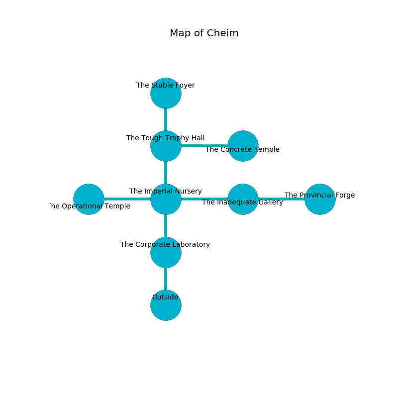

%Ruin Dogs

##Cheim
###Overview
Cheim is constructed on a haunted city. Some rooms of Cheim are foggy. A solar eclipse is happening outside. It is occupied by Gnolls. Steve Li The Vain, a Bulette is here. The Gnolls worship Steve Li The Vain. He  is trying to exploit [Eduhuhwi Iodcacd](#Eduhuhwi-Iodcacd). 

###Artifact
####Eduhuhwi Iodcacd

Eduhuhwi Iodcacd is a powerful artifact in the shape of a smooth spear. When gazed upon it changes probabilities. 

###Locations

####the corporate laboratory
Blue razorgrass is decaying in a patch on the floor. The floor is glossy. There is a trap here. When activated, a magical rune will cast a curse. 

* To the north a dark cavern leads to [the imperial nursery](#the-imperial-nursery).
* To the south is the entrance.

####the imperial nursery
Gray lichens are growing in broken urns. The mirrored walls are scratched. There are a Gnoll Fang of Yeenoghu and two Gnolls here. The Gnolls are performing a ritual. If not interrupted, a powerful monster will be summoned. 

* To the west a dripping opening leads to [the operational temple](#the-operational-temple).
* To the east a long threshold connects to [the inadequate gallery](#the-inadequate-gallery).
* To the north a narrow walkway connects to [the tough trophy hall](#the-tough-trophy-hall).
* To the south a dark cavern connects to [the corporate laboratory](#the-corporate-laboratory).

####the tough trophy hall
Gray mushrooms are sprouting in a patch on the floor. 

There is an engraving on the ceiling written in Gnolls Script. 

> Poor me! sorry fate
>
> financial and straight
>
> but tall
>
> all is small
>

* [Steve Li The Vain](#Steve-Li-The-Vain) is here.
* To the east a flooded hallway leads to [the concrete temple](#the-concrete-temple).
* To the north a dripping hall leads to [the stable foyer](#the-stable-foyer).
* To the south a narrow walkway opens to [the imperial nursery](#the-imperial-nursery).

####the operational temple
There are a Spined Devil and a Gnoll Pack Lord here. 

There is an engraving on a tablet written in Gnolls Script. 

> Do not try fighting.
>

* To the east a dripping opening leads to [the imperial nursery](#the-imperial-nursery).

####the stable foyer
The brick walls are unsettled. The floor is glossy. White moss is growing in a patch on the floor. 

* To the south a dripping hall connects to [the tough trophy hall](#the-tough-trophy-hall).

####the inadequate gallery
The air smells like boysenberry here. There are a Sprite, a Lizardfolk Shaman, a Swarm of Ravens, a Magmin, and a Worg here. 

* [Eduhuhwi Iodcacd](#Eduhuhwi-Iodcacd) is here.
* To the west a long threshold opens to [the imperial nursery](#the-imperial-nursery).
* To the east a small artery opens to [the provincial forge](#the-provincial-forge).

####the concrete temple
The floor is flooded with six inch deep cool water. There are a Gargoyle and a Gibbering Mouther here. 

* There is a lyre here.
* To the west a flooded hallway connects to [the tough trophy hall](#the-tough-trophy-hall).

####the provincial forge
The floor is bloodstained. The obsidion walls are ruined. There is a trap here. When activated, a magical proximity detector will fire an acid arrow. 

* There is a chest here.
* There is a map here.
* To the west a small artery leads to [the inadequate gallery](#the-inadequate-gallery).

