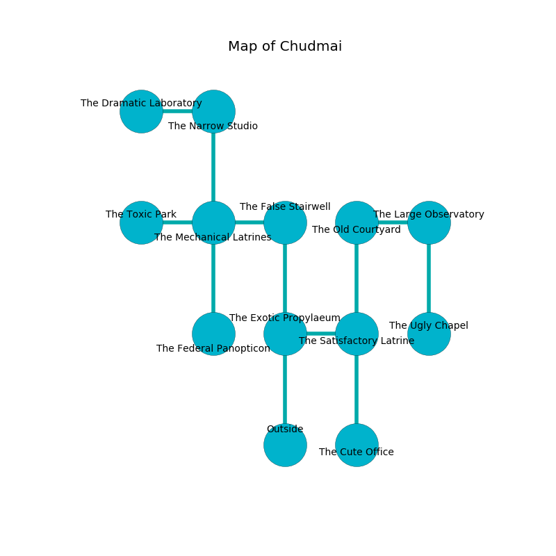

%Ruin Dogs

##Chudmai
###Overview
Chudmai is located under a flooded mountain. Parts of Chudmai are incredibly hot. The ruin is sinking into the earth. It is occupied by Ogres. Neida Starks The Fussy, a Drow Priestess of Lolth is here. The Ogres are battling Neida Starks The Fussy. She  is trying to destroy [The Civilian Exile](#The-Civilian-Exile). 

###Artifact
####The Civilian Exile

The Civilian Exile is a powerful artifact in the shape of a mushy cube. Power shifts away from it. It smells like myrrh. When rubbed it projects energy. 

###Locations

####the exotic propylaeum
Red mushrooms are growing from the ceiling. There is a trap here. When activated, a tripwire will blast flames. There are three Half-Ogres and three Ogres here. The floor is cluttered with debris. The air smells like cotton candy here. The Ogres are willing to negotiate. 

* To the east a narrow hall leads to [the satisfactory latrine](#the-satisfactory-latrine).
* To the north a hazy path opens to [the false stairwell](#the-false-stairwell).
* To the south is the entrance.

####the false stairwell
The glass walls are covered in mold. Green mushrooms are sprouting from the ceiling. The air smells like mustard here. 

* To the west a dark pathway leads to [the mechanical latrines](#the-mechanical-latrines).
* To the south a hazy path leads to [the exotic propylaeum](#the-exotic-propylaeum).

####the mechanical latrines
The air smells like berry here. The concrete walls are pristine. 

There is an engraving on the ceiling written in Ogres Script. 

> I am worshipping this place.
>
> Run away.
>

* To the west a flooded walkway opens to [the toxic park](#the-toxic-park).
* To the east a dark pathway leads to [the false stairwell](#the-false-stairwell).
* To the north a windy corridor connects to [the narrow studio](#the-narrow-studio).
* To the south a narrow threshold opens to [the federal panopticon](#the-federal-panopticon).

####the satisfactory latrine
The floor is sticky. The metallic walls are ruined. There are a Minotaur, a Yuan-Ti Abomination, a Harpy, and a Myconid Adult here. 

* To the west a narrow hall connects to [the exotic propylaeum](#the-exotic-propylaeum).
* To the north a flooded cavern leads to [the old courtyard](#the-old-courtyard).
* To the south a twisted hall opens to [the cute office](#the-cute-office).

####the federal panopticon
The air tastes like chemicals here. The floor is cluttered with broken glass. 

There is an engraving on a monolith written in common. 

> O meak you
>
> continuous and rare
>
> it is never true
>
> cruelty is aware
>

* There is a stick here.
* There is a brooch here.
* To the north a narrow threshold leads to [the mechanical latrines](#the-mechanical-latrines).

####the narrow studio
Gray moss is swaying in a patch on the floor. The obsidion walls are covered in mold. The air smells like oily here. There are a Displacer Beast, a Pony, a Vampire Spawn, a Green Dragon Wyrmling, a Guard, a Giant Bat, and a Pseudodragon here. 

* [The Civilian Exile](#The-Civilian-Exile) is here.
* To the west a flooded corridor connects to [the dramatic laboratory](#the-dramatic-laboratory).
* To the south a windy corridor leads to [the mechanical latrines](#the-mechanical-latrines).

####the old courtyard
The floor is sticky. The concrete walls are unsettled. 

* There is a table here.
* [Neida Starks The Fussy](#Neida-Starks-The-Fussy) is here.
* To the east a windy artery connects to [the large observatory](#the-large-observatory).
* To the south a flooded cavern connects to [the satisfactory latrine](#the-satisfactory-latrine).

####the cute office
The air smells like mulberry here. There are a Pteranodon, a Scorpion, a Drow Elite Warrior, an Intellect Devourer, a Hawk, a Violet Fungus, and a Grick here. The obsidion walls are bloodstained. 

* To the north a twisted hall connects to [the satisfactory latrine](#the-satisfactory-latrine).

####the toxic park
The mirrored walls are unsettled. The floor is flooded with three inch deep cold water. Gray moss is sprouting in broken urns. There are three Half-Ogres and three Ogres here. One of the Ogres is on watch, the rest are feasting. 

* To the east a flooded walkway opens to [the mechanical latrines](#the-mechanical-latrines).

####the large observatory
The air smells like vetiver here. There are a Darkmantle, a Giant Constrictor Snake, a Veteran, a Tribal Warrior, a Spectator, and a Gibbering Mouther here. 

* To the west a windy artery leads to [the old courtyard](#the-old-courtyard).
* To the south a torchlit opening leads to [the ugly chapel](#the-ugly-chapel).

####the ugly chapel
The floor is smooth. The wooden walls are scratched. 

There is an engraving on a monolith written in common. 

> Maybe try fighting.
>

* To the north a torchlit opening opens to [the large observatory](#the-large-observatory).

####the dramatic laboratory
The floor is flooded with nine inch deep cool water. The air tastes like black currant here. Blue lichens are swaying in a patch on the floor. 

* To the east a flooded corridor leads to [the narrow studio](#the-narrow-studio).

