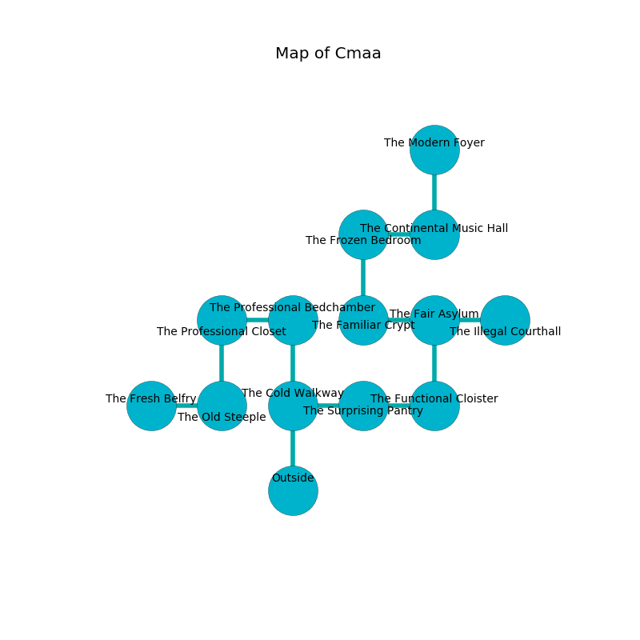

%Ruin Dogs

##Cmaa
###Overview
Cmaa is located under an alien plain. Some areas of it are flooded. The ruin is flooding. It is occupied by Kenku. Clemente Shelton The Bone-Idle, a Mind Flayer Arcanist is here. The Kenku are battling Clemente Shelton The Bone-Idle. He  is founding a new religion. 

###Artifact
####The Helpless Owner

The Helpless Owner has the form of a mushy figurine. When carried it dissappears. 

###Locations

####the cold walkway
Gray moss is swaying from the ceiling. There are a Cyclops, a Shadow Demon, a Gold Dragon Wyrmling, and a Goblin Boss here. 

There is an engraving on the wall written in common. 

> Oh pitiful god
>
> it is never premature
>
> ever odd
>
> all is poor
>

* There is a match here.
* To the east a long hallway connects to [the surprising pantry](#the-surprising-pantry).
* To the north a long gap connects to [the professional bedchamber](#the-professional-bedchamber).
* To the south is the entrance.

####the surprising pantry
The mirrored walls are bloodstained. There are a Death Dog, a Mind Flayer, a Gray Ooze, a Violet Fungus, and a Panther here. 

* To the west a long hallway leads to [the cold walkway](#the-cold-walkway).
* To the east a dripping artery opens to [the functional cloister](#the-functional-cloister).

####the professional bedchamber
The air tastes like bouillon here. 

* There is a door here.
* To the west a small path leads to [the professional closet](#the-professional-closet).
* To the south a long gap connects to [the cold walkway](#the-cold-walkway).

####the functional cloister
Red ferns are swaying from the walls. There are thirty six Kenkus here. One of the Kenku is on watch, the rest are caring for babies. 

* There is a girl here.
* To the west a dripping artery leads to [the surprising pantry](#the-surprising-pantry).
* To the north a small opening opens to [the fair asylum](#the-fair-asylum).

####the professional closet
Blue mushrooms are decaying from the ceiling. The brick walls are pristine. The air smells like pomegranate here. The floor is glossy. There is a trap here. When activated, a magical proximity detector will close a portcullis. 

* There is a stocking here.
* To the east a small path connects to [the professional bedchamber](#the-professional-bedchamber).
* To the south a dark gap connects to [the old steeple](#the-old-steeple).

####the fair asylum
The air smells like mulberry here. There are two Barlguras here. The floor is smooth. Green ferns are sprouting from the walls. 

* To the west a windy path connects to [the familiar crypt](#the-familiar-crypt).
* To the east a windy threshold leads to [the illegal courthall](#the-illegal-courthall).
* To the south a small opening opens to [the functional cloister](#the-functional-cloister).

####the familiar crypt
Red ferns are decaying in broken urns. 

* There is a hare here.
* To the east a windy path leads to [the fair asylum](#the-fair-asylum).
* To the north a small opening opens to [the frozen bedroom](#the-frozen-bedroom).

####the frozen bedroom
Red ferns are growing from the walls. The glass walls are unsettled. 

* There is a cheese here.
* To the east a dark opening leads to [the continental music hall](#the-continental-music-hall).
* To the south a small opening opens to [the familiar crypt](#the-familiar-crypt).

####the continental music hall
Yellow razorgrass is growing from the ceiling. The floor is flooded with five inch deep scalding water. There are thirty six Kenkus here. One of the Kenku is on watch, the rest are drunk. 

There is an engraving on the ceiling written in Kenku Script. 

> I could not try digging.
>

* To the west a dark opening connects to [the frozen bedroom](#the-frozen-bedroom).
* To the north a dripping gap leads to [the modern foyer](#the-modern-foyer).

####the illegal courthall
There are a Blink Dog, an Earth Elemental, an Air Elemental, and a Worg here. The mirrored walls are unsettled. Red lichens are swaying in a patch on the floor. 

There is an engraving on the ceiling written in common. 

> Leave at once.
>

* To the west a windy threshold leads to [the fair asylum](#the-fair-asylum).

####the modern foyer
The floor is glossy. 

* To the south a dripping gap leads to [the continental music hall](#the-continental-music-hall).

####the old steeple
There are thirty six Kenkus here. The wooden walls are bloodstained. One of the Kenku is working a mechanism that can flood the room. 

* There is a button here.
* [The Helpless Owner](#The-Helpless-Owner) is here.
* To the west a flooded walkway connects to [the fresh belfry](#the-fresh-belfry).
* To the north a dark gap opens to [the professional closet](#the-professional-closet).

####the fresh belfry
The air tastes like sand here. The concrete walls are bloodstained. The floor is bloodstained. 

* [Clemente Shelton The Bone-Idle](#Clemente-Shelton-The-Bone-Idle) is here.
* To the east a flooded walkway leads to [the old steeple](#the-old-steeple).

