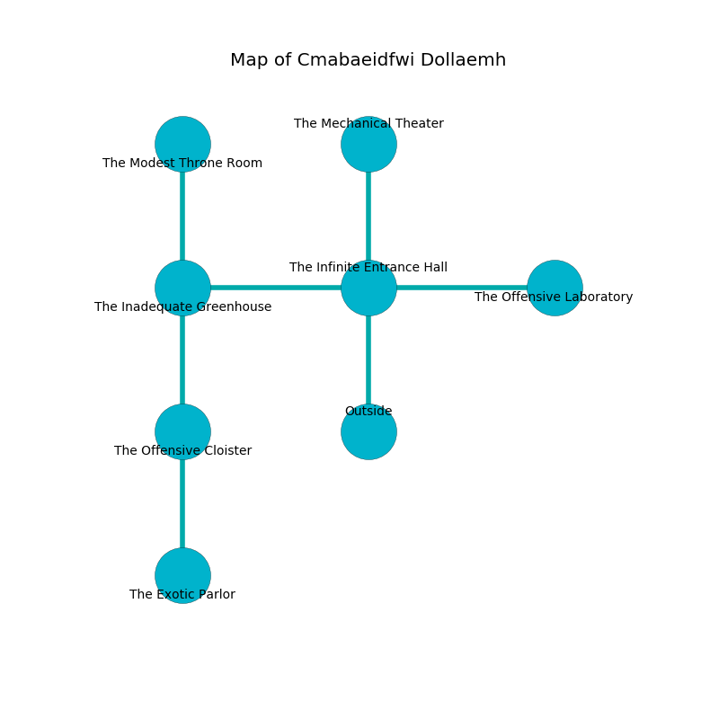

%Ruin Dogs

##Cmabaeidfwi Dollaemh
###Overview
Cmabaeidfwi Dollaemh is constructed on a poisoned rift. Some areas of Cmabaeidfwi Dollaemh are flooded. The ruin is sinking into the earth. It is occupied by Yuan-Ti. Johnathon Butts The Untidy, a Veteran is here. The Yuan-Ti are the minions of Johnathon Butts The Untidy. He  is trying to recover [Mufuicuda](#Mufuicuda). 

###Artifact
####Mufuicuda

Mufuicuda is a powerful artifact in the shape of a warm figurine. It is a pale white color. Fire flows towards it. When worn it levitates surrounding objects. 

###Locations

####the infinite entrance hall
There are an Elk, a Ghoul, a Giant Owl, a Gargoyle, and a Zombie here. The air tastes like earth here. The glass walls are scratched. 

* To the west a narrow artery opens to [the inadequate greenhouse](#the-inadequate-greenhouse).
* To the east a windy pathway opens to [the offensive laboratory](#the-offensive-laboratory).
* To the north a dripping gap opens to [the mechanical theater](#the-mechanical-theater).
* To the south is the entrance.

####the mechanical theater
The floor is sticky. There are two Yuan-Ti Purebloods here. The Yuan-Ti are celebrating. 

There is an engraving on a tablet written in Yuan-Ti Script. 

> I tried hiding.
>

* To the south a dripping gap connects to [the infinite entrance hall](#the-infinite-entrance-hall).

####the inadequate greenhouse
Green mushrooms are growing from the ceiling. The floor is glossy. There are a Goblin, a Giant Octopus, a Rust Monster, and a Worg here. 

* [Johnathon Butts The Untidy](#Johnathon-Butts-The-Untidy) is here.
* To the east a narrow artery connects to [the infinite entrance hall](#the-infinite-entrance-hall).
* To the north a hazy threshold opens to [the modest throne room](#the-modest-throne-room).
* To the south a windy hallway leads to [the offensive cloister](#the-offensive-cloister).

####the offensive laboratory

* There is a coat here.
* There is an amulet here.
* To the west a windy pathway connects to [the infinite entrance hall](#the-infinite-entrance-hall).

####the offensive cloister
The concrete walls are caving in. Red lichens are sprouting from the ceiling. There are two Yuan-Ti Purebloods here. The Yuan-Ti are willing to fight to the death. 

* [Mufuicuda](#Mufuicuda) is here.
* To the north a windy hallway opens to [the inadequate greenhouse](#the-inadequate-greenhouse).
* To the south a small passageway leads to [the exotic parlor](#the-exotic-parlor).

####the modest throne room
The air smells like seafood here. The obsidion walls are bloodstained. There are two Yuan-Ti Purebloods here. One of the Yuan-Ti is pointing a ballista at the entrance. 

* To the south a hazy threshold leads to [the inadequate greenhouse](#the-inadequate-greenhouse).

####the exotic parlor
The air smells like cantaloupe here. The mirrored walls are ruined. There are two Yuan-Ti Purebloods here. The Yuan-Ti are performing a ritual. If not interrupted, a powerful monster will be summoned. 

* To the north a small passageway leads to [the offensive cloister](#the-offensive-cloister).

